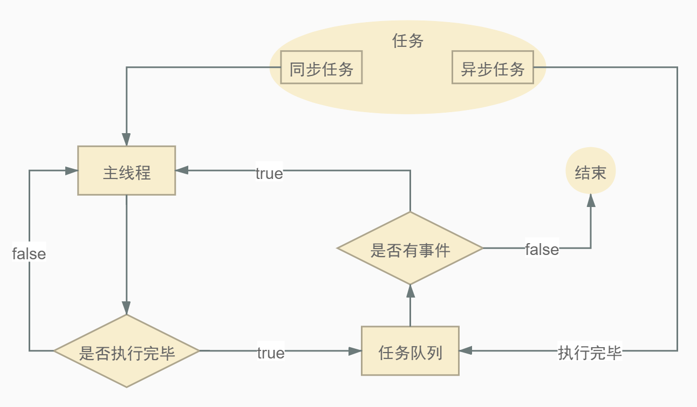

# 事件循环机制

### 1. JavaScript 的单线程
---
JavaScript 的最大特点就是单线程，即同一时间只能做一件事情

**为什么 JavaScript 不能有多个线程呢？**
> JavaScript 的主要用途是与用户互动，以及操作 DOM。这决定了它只能是单线程，否则会带来很复杂的同步问题。比如，假定 JavaScript 同时有两个线程，一个线程在某个 DOM 节点上添加内容，另一个线程删除了这个节点，这时浏览器应该以哪个线程为准？所以，JavaScript 是单线程事出有因

HTML5 提出 Web Worker 标准，允许 JavaScript 脚本创建多个线程，但是子线程完全受主线程控制。所以，这个新标准并没有改变JavaScript单线程的本质
### 2. 任务队列
---
单线程意味着，所有任务都要排队，前一个任务结束，才会执行后一个任务。为了避免耗时任务阻碍后续任务的执行，于是 JavaScript 任务分为两种：

- **同步任务** —— 在主线程上排队执行的任务，只有前一个任务执行完毕，才能执行后一个任务

- **异步任务** —— 不进入主线程、而进入"任务队列"（task queue）的任务，只有"任务队列"通知主线程，某个异步任务可以执行了，该任务才会进入主线程执行

::: tip 事件执行流程
1. 所有同步任务都在主线程上执行，形成一个执行栈
2. 异步任务有了运行结果，就在任务队列中放置一个事件
3. 一旦执行栈中的同步任务执行完毕，系统就会读取任务队列是否有已经准备好的事件，有则结束等待状态，进入执行栈，开始执行
4. 主线程不断重复上面的第三步
:::



<br/>

除了广义的同步任务和异步任务，我们对任务有更精细的定义：
- macro-task(宏任务)：包括整体代码script，setTimeout，setInterval
- micro-task(微任务)：Promise(指的是then、catch回调)，process.nextTick

先看看下面代码打印的顺序
```js
console.log('1');

setTimeout(function() {
    console.log('2');

    new Promise(function(resolve) {
        console.log('3');
        resolve();
    }).then(function() {
        console.log('4')
    })
})

new Promise(function(resolve) {
    console.log('5');
    resolve();
}).then(function() {
    console.log('6')
})

setTimeout(function() {
    console.log('7');
    new Promise(function(resolve) {
        console.log('8');
        resolve();
    }).then(function() {
        console.log('9')
    })
})
```
> 结果：1、5、6、2、3、4、7、8、9
- 整体代码script作为宏任务，进入主线程，并执行
- 打印 **1**；第一个setTimeout进入宏任务(*记为setTimeout1*)；执行 new Promise 打印 **5**，then回调函数进入微任务；第二个setTimeout进入宏任务(*记为setTimeout2*)；整体代码的宏任务执行完毕
- 执行整体代码script宏任务下的微任务；打印 **6**；第一轮事件循环结束
- 开始第二轮事件循环，从宏任务队列读取任务，执行setTimeout1，打印 **2**；执行 new Promise 打印 **3**，then回调函数进入微任务
- 执行setTimeout1宏任务下的微任务；打印 **4**；第二轮事件循环结束
- setTimeout2执行流程和setTimeout1一样，打印结果：**7**、**8**、**9**；全部代码执行完毕，结束

::: tip 总结
主线程从"任务队列"中读取事件，这个过程是循环不断的，所以整个的这种运行机制又称为Event Loop（事件循环）。
:::