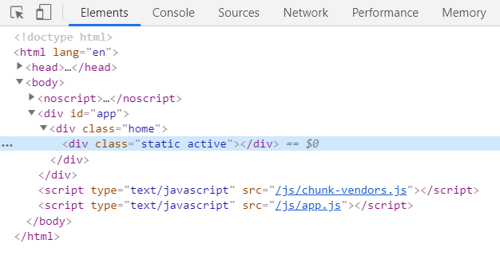
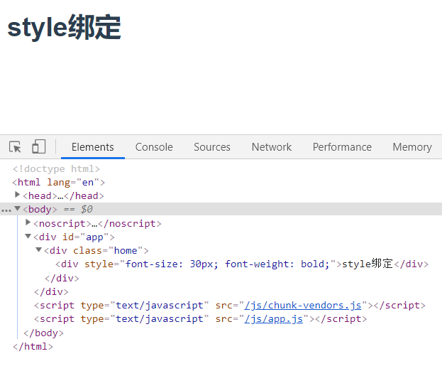
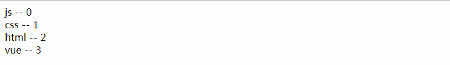
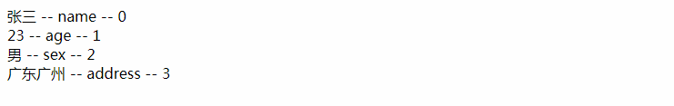
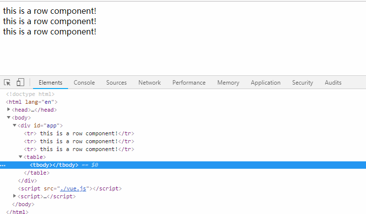
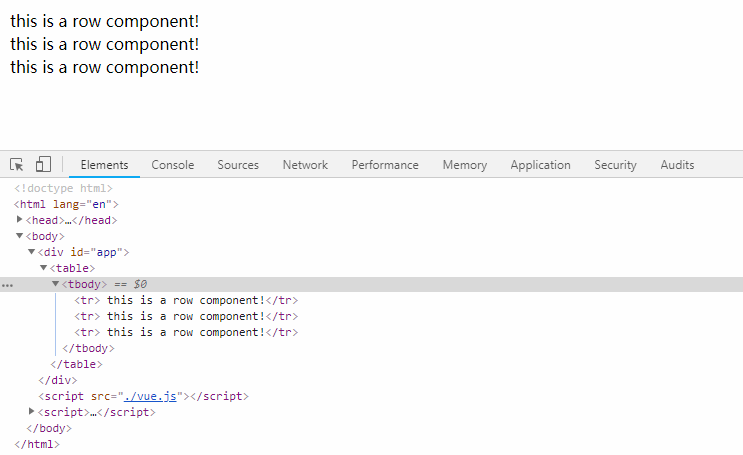
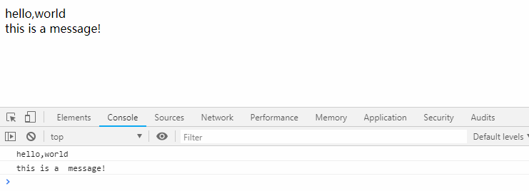
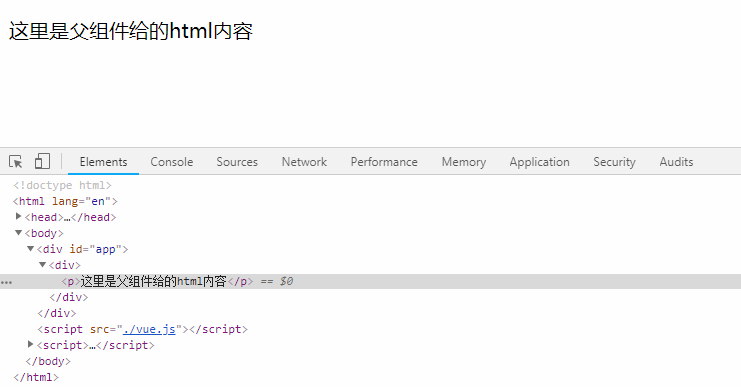
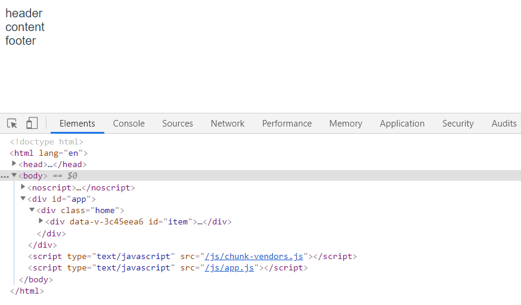

# Vue
## Vue 基础知识
### Vue实例
- 每一个Vue应用都会通过new Vue()的方式构造一个Vue实例
- 一个大型的Vue项目，往往由一个Vue根实例和一些可选组件实例所构成
```js
// 根实例
└─ TodoList
   ├─ TodoItem
   │  ├─ DeleteTodoButton
   │  └─ EditTodoButton
   └─ TodoListFooter
      ├─ ClearTodosButton
      └─ TodoListStatistics
```

#### 1. 数据与方法
- Vue 实例被创建时，将 Vue 实例 data 对象中的所有数据加入到 Vue 的响应式系统
- 只有当实例被创建时就已经存在于 data 中的属性才是响应式的
```js
var vm = new Vue({
  el: '#app',
  data() {
    return {
      age: 23,
    }
  }
})

// 只有在data中声明的属性才是响应式的·
vm.address = '广州'; // 这个属性不是响应式的
vm.age = 32; // 这个属性是响应式的
```
##### 没有初始值的响应式属性
```js
// 最好是在 data 里先定义准备用到的属性，例：
data: {
  newTodoText: '',
  visitCount: 0,
  hideCompletedTodos: false,
  todos: [],
  error: null
}
```

##### Object.freeze() 冻结响应式数据
一个巨大的数组或者对象，并且确定数据不会修改，性能大幅度提升
```js
data() {
  return {
    obj:  Object.freeze({
      foo: 1,
      baz: {
        a: 4
      }
    })
  }
},
created () {
  this.obj.foo = 2;      // 不能改对象的属性，会报错
  this.obj = {foo: 3};   // 可以改对象的引用      
  this.obj.baz.a = 5;    // 可以改多维对象的深层属性
}
```

#### 2. 实例生命周期函数
Vue 实例被创建时的初始化过程中会运行一些**生命周期钩子**的函数
:::tip
- `beforeCreate` 和 `created` 这两个钩子函数，会在Vue实例被创建之前和创建后分别调用
- `beforeMount` 和 `mounted` 这两个钩子函数，会在模板和数据相结合被挂载到页面之前和之后分别调用
- `beforeUpdate` 和 `updated` 这两个钩子函数，会在数据发生变化之前和之后分别调用
- `beforeDestory` 和 `destory` 这两个钩子函数，会在Vue实例被销毁之前和销毁之后分别调用
- `activated` 和 `deactivated` 这两个钩子函数，会在keep-alive组件激活和停用时分别调用
- `errorCaptured`会在捕获子组件、孙组件发生错误时触发(2.5.0+版本新增)
:::


### 模板语法
---
#### 1. 插值
数据绑定最常见的形式就是使用“Mustache”语法 (双大括号) 的文本插值，Mustache 标签可以是：
- 数据对象 data 上的属性
- JavaScript 表达式
```js
// msg 是 data 里的一个属性
<span>Message: {{ msg }}</span>

{{ number + 1 }}

{{ ok ? 'YES' : 'NO' }}

{{ message.split('').reverse().join('') }}
```
##### 双大括号不能输出HTML
双大括号会将数据解释为普通文本，需要使用 v-html 指令
```js
// rawHtml的值为：<span style="color: red">真正的HTML</span>
<p>{{ rawHtml }}</p>
<span v-html="rawHtml"></span>

// 输出
// <span style="color: red">真正的HTML</span>
// 真正的HTML
```
##### 双大括号不能用在 HTML 属性上
```js
// 这样是写法是错误的


// 应该使用 v-bind 指令

```

#### 2. 指令
当表达式的值改变时，将其产生的连带影响，响应式地作用于 DOM
:::tip 常见的指令
- `v-bind`：它的作用是绑定一个html标签属性，例如：`<button v-bind:id='btn'></button>`
- `v-on`: 它的作用是绑定一个html标签的事件，例如：`<button v-on:click='handleBtnClick'></button>`
- `v-if`：它的作用是根据某个变量的boolean值，判断此元素是否在html文档上显示
- `v-show`：它的作用同v-if类似，不过两者之间最本质的差别是，v-show是通过css属性display:none来控制元素是否显示。`v-if` 是控制元素是否在DOM上渲染
:::

```html
<!-- v-bind -->
<button v-bind:id="submitBtn">按钮</button>

<!-- v-on -->
<button v-on="handleBtnClick">按钮</button>

<!-- v-if -->
<p v-if="isShow">v-if元素标签</p> 

<!-- v-show -->
<p v-show="isShow">v-show元素标签</p> 
```

```js
var app = new Vue({
  el: '#app',
  data() {
    return {
      isShow: false
    }
  },
  methods: {
    handleBtnClick() {
      console.log('v-on click');
    }
  }
})
```


##### 参数与动态参数

```html
<!-- 这里 href 是参数，该元素的 href 与表达式 url 的值绑定 -->
<a v-bind:href="url">...</a>
```

```html
<!-- 动态参数 -->
<!-- attributeName 会被作为一个 JavaScript 表达式进行动态求值，求得的值将会作为最终的参数来使用 -->
<a v-bind:[attributeName]="url"> ... </a>
```

##### 修饰符

#### 3. 缩写
##### `v-bind` 缩写
```html
<!-- 完整语法 -->
<a v-bind:href="url">...</a>

<!-- 缩写 -->
<a :href="url">...</a>

<!-- 动态参数的缩写 (2.6.0+) -->
<a :[key]="url"> ... </a>
```

##### `v-on` 缩写
```html
<!-- 完整语法 -->
<a v-on:click="doSomething">...</a>

<!-- 缩写 -->
<a @click="doSomething">...</a>

<!-- 动态参数的缩写 (2.6.0+) -->
<a @[event]="doSomething"> ... </a>
```

### 计算属性与侦听器
---
#### 1. 计算属性
- 模板内的表达式非常便利，但是设计它们的初衷是用于简单运算的。在模板中放入太多的逻辑会让模板过重且难以维护
- 复杂逻辑，应当使用**计算属性**
```html
<div id="app">
  {{ name.split('').reverse().join('') }}
  {{ reverseName }}
</div>
```
```js
var app = new Vue({
  el: '#app',
  data() {
    return {
      name: 'Hello',
    }
  },
  computed: {
    reverseName() {
      return this.name.split('').reverse().join('');
    }
  }
})
```

##### 计算属性缓存 vs 方法
计算属性能够做到的事情，使用方法同样能够做到
```html
<div id="app">
  计算属性：{{ reverseName }}
  方法：{{ reverseNameFn() }}
</div>
```
```js
var app = new Vue({
  el: '#app',
  data() {
    return {
      name: 'Hello',
    }
  },
  methods: {
    reverseNameFn: function () {
      return this.name.split('').reverse().join('');
    }
  },
  computed: {
    reverseName() {
      return this.name.split('').reverse().join('');
    }
  }
})
```
**运行结果：**


:::tip 区别
- 计算属性：**是基于它们的响应式依赖进行缓存的**，只在相关响应式依赖发生改变时它们才会重新求值
- 方法：每当触发重新渲染时，调用方法将总会再次执行函数

对于一些开销较大的逻辑，我们更推荐使用计算属性而不是方法
:::

#### 2. 计算属性与侦听属性
:::tip
侦听属性watch：当监听的属性发生改变时，会执行异步或开销较大的操作
计算属性computed：当依赖发生改变，该依赖所绑定的计算属性也会更新
:::

```html
<div id="app">
  计算属性：{{fullName}}<br/>
  监听属性：{{fullNameWatch}}
</div>
```
```js
var app = new Vue({
  el: '#app',
  data() {
    return {
      firstName: 'foo',
      lastName: 'bar',
      fullNameWatch: 'foo bar'
    }
  },
  computed: {
    fullName() {
      return this.firstName + ' ' + this.lastName;
    }
  },
  watch: {
    firstName(val) {
      this.fullNameWatch = val + ' ' + this.lastName;
    },
    lastName(val) {
      this.fullNameWatch = this.firstName + ' ' + val;
    }
  }
})
```


#### 3. 计算属性的setter
读取计算属性会调用getter，可以设置一个setter，在计算属性被设置时调用
```js
var app = new Vue({
  el: '#app',
  data() {
    return {
      firstName: 'foo',
      lastName: 'bar',
    }
  },
  computed: {
    fullName: {
      // getter
      get: function () {
        return this.firstName + ' ' + this.lastName
      },
      // setter
      set: function (newValue) {
        var names = newValue.split(' ')
        this.firstName = names[0]
        this.lastName = names[names.length - 1]
      }
    }
  }
})
```

### Class与Style绑定
---
通过v-bind为元素动态绑定class列表和内联样式style，表达式可以是：
- 计算出的字符串
- 对象或数组

#### 1. Class绑定
##### 对象语法
```html
<!-- 
  1.可以动态切换多个class
  2.可以与不同的class共存
 -->
<div
  class="static"
  :class="{ active: isActive, 'text-danger': hasError }"
></div>
```
```js
var app = new Vue({
  el: '#app',
  data() {
    return {
      isActive: true,
      hasError: false
    }
  },
})
```
**运行结果：**<br/>


##### 数组语法
- 数组中的值对应data中的属性，属性的值渲染为class
- 可以使用三元表达式动态切换class
```html
<div :class="[activeClass, errorClass]"></div>
<div :class="[isActive ? activeClass : '', errorClass]"></div>
```
```js
var app = new Vue({
  el: '#app',
  data() {
    return {
      activeClass: 'active',
      errorClass: 'text-danger'
    }
  },
})
```

#### 2. Style绑定
##### CSS 属性名可以用驼峰式 (camelCase) 或短横线分隔 (kebab-case) 来命名
```html
<div :style="{ 'font-size': fontSize + 'px', fontWeight: fontWeight }">style绑定</div>
```
```js
var app = new Vue({
  el: '#app',
  data() {
    return {
      fontSize: 30,
      fontWeight: 'bold'
    }
  },
})
```
**运行结果：**<br/>


##### 直接绑定到一个样式对象或数组通常更好，这会让模板更清晰
```html
<span :style="styleObj">对象形式绑定style</span><br/>
<span :style="[styleOne,styleTwo]">数组形式绑定style</span>
```
```js
var app = new Vue({
  el: '#app',
  data() {
    return {
      styleObj: {
        fontSize: '30px',
        color: 'red',
      },
      styleOne: {
        color: '#f60',
      },
      styleTwo: {
        fontSize: '20px'
      }
    }
  },
})
```
**运行结果：**<br/>


### 条件渲染
---
#### 1. v-if
- `v-if` 指令用于条件性地渲染一块内容。只有当指令的表达式为真值是才显示到页面上
- `v-if` 还可以和 `v-else`、`v-else-if` 混合一起使用
```html
<h1 v-if="type =='A'">this is B</h1>
<h1 v-else-if="type =='B'"> this is B </h1>
<h1 v-else>Oh no 😢</h1>
```

#### 2. v-if 渲染分组
如果多个元素标签要依赖同一个变量的值，控制是否在页面中显示，可以使用 template 进行渲染分组
```html
<!-- 渲染分组 -->
<template v-if="isLogin">
  <p>用户名：{{ username }}</p>
  <p>手机号：{{ phone }}</p>
  <p>收获地址：{{ address }}</p>
</template>
```
```js
data() {
  return {
    isLogin: false,
    username: 'abc',
    phone: '18800188000',
    address: '广东广州'
  }
}
```

#### 3. v-if 管理可复用的元素
##### 不加key
Vue 会尽可能高效地渲染元素，`<input>` 不会被替换掉，仅仅是替换了它的 placeholder
```html
<template v-if="loginType">
  <label>Username</label>
  <input placeholder="Enter your username">
</template>
<template v-else>
  <label>Email</label>
  <input placeholder="Enter your email address">
</template>
```

##### 加key
通过添加一个具有唯一值的 key 来表达两个元素是完全独立的，不需要复用
```html
<template v-if="loginType">
  <label>Username</label>
  <input key="username-input" placeholder="Enter your username">
</template>
<template v-else>
  <label>Email</label>
  <input  key="email-input" placeholder="Enter your email address">
</template>
```

#### 3. v-show
v-show 指令与 v-if 用法大致一样，不同的是：
- v-show 的元素始终会被渲染并保留在 DOM 中。v-show 只是简单地切换元素的 CSS 样式 display
- v-show 不支持 `<template>` 元素，也不支持 `v-else`
- v-if 有更高的切换开销，而 v-show 有更高的初始渲染开销

### 列表渲染
---
- `v-for` 指令基于一个数组或对象渲染一个列表
- `v-for` 指令需要使用 `item in items` 或 `item of items` 形式的特殊语法

#### 1. 数组渲染列表
- item代表循环渲染时，数组中的每一项
- key代表循环渲染时，当前的索引值 
```html
<!-- 数组渲染 -->
<div v-for="(item,index) in items" :key="item.id">
  {{item.text}} -- {{index}}
</div>
```
```js
data() {
  return {
    items: [
      {id: '0001', text: 'js'},
      {id: '0002', text: 'css'},
      {id: '0003', text: 'html'},
      {id: '0004', text: 'vue'}
    ]
  }
}
```
**运行结果：**<br/>


#### 2. 对象渲染列表
- item代表循环渲染时，对象的值
- key代表循环渲染时，对象的键
- index代表循环渲染时，当前的索引值

```html
<!-- 对象渲染 -->
<div v-for="(item,key,index) in student" :key="index">
  {{item}} -- {{key}} -- {{index}}
</div>
```
```js
data() {
  return {
    student: {
      name: '张三',
      age: 23,
      sex: '男',
      address: '广东广州'
    }
  }
}
```
**运行结果：**<br/>


#### 3. v-for 与 v-if 一同使用
- v-for 的优先级比 v-if 更高，这意味着 v-if 将分别重复运行于每个 v-for 循环中
- 当目的是有条件地跳过循环的执行，可以将 `v-if` 置于外层元素 或 `<template>`
```html
<ul v-if="todos.length">
  <li v-for="todo in todos">
    {{ todo }}
  </li>
</ul>
<p v-else>No todos left!</p>
```


### 数组、对象更新检测
---
#### 1. 数组更新检测
由于 Vue 是响应式的，利用数组的下标去更改值或者更改数组的长度，是无法触发视图更新的
```js
var vm = new Vue({
  data: {
    items: ['a', 'b', 'c']
  }
})
// 不是响应性的
vm.items[1] = 'd';
vm.items.length = 2;
```

:::tip 数组变异方法
Vue 包含一组观察数组的变异方法，当使用它们会触发视图更新。这些方法如下：
- shift
- unshift
- push
- pop
- splice
- sort
- reverse
:::
修改数组触发视图更新，除了使用变异的方法，还可以使用 Vue 的全局 API `vue.set()`
- 第一个参数为要更改的数组
- 第二个参数为要更改项的索引
- 第三个参数为待更改的值

```js
Vue.set(vm.items,1,'d')
```

#### 2. 对象更新检测
只有在 data 中定义的对象属性，在值更改时，才会触发视图更新，新添加一个属性是不会触发视图更新的

```js
var vm = new Vue({
  data: {
    student: {
      name: '张三',
      age: 23,
      sex: '男',
    }
  }
})
// 不是响应性的
vm.student.address = '广东广州';
```
##### 也是使用全局 API `vue.set()`
```js
// 这是响应性的
Vue.set(vm.student,'address','广东广州')
```

### 修饰符
---
#### 1. 事件修饰符
:::tip 在JavaScript的代码编写的过程中，使用event.preventDefault()和event.stopPropagation()两个方法是非常常见的需求，为此Vue内置了几种事件修饰符：
- `.stop`：阻止冒泡
- `.prevent`：阻止浏览器的默认行为、
- `.capture`：事件捕获模式
- `.self`：只有触发元素是自身时才执行的事件
- `.once`：只执行一次的事件
- `.passive`：事件行为立即触发，而不会等待
:::

```html
<!-- 阻止冒泡 -->
<a @click.stop="doThis"></a>

<!-- 阻止浏览器的默认行为 -->
<form @submit.prevent="onSubmit"></form>

<!-- 事件捕获模式 -->
<div @click.capture="doThis">...</div>

<!-- 只有触发元素是自身时才执行的事件 -->
<div @click.self="doThis">...</div>

<!-- 只执行一次的事件 -->
<div @click.once="doThis">...</div>

<!-- 事件行为立即触发，而不会等待 -->
<div @scroll.passive="onScroll">...</div>

<!-- 修饰符可以串联 -->
<a @click.stop.prevent="doThis"></a>
```

#### 2. 事件修饰符
:::tip 在监听键盘事件时，我们经常需要检查详细的按键。Vue 允许为v-on在监听键盘事件时添加按键修饰符，常见的按钮修饰符有：
- `.enter`：回车键
- `.tab`：tab键
- `.delete`：删除键或者退格键
- `.esc`：esc键
- `.space`：空格键
- `.up`：上方向键
- `.down`：下方向键
- `.left`：左方向键
- `.right`：右方向键
- `.ctrl`：ctrl键
- `.alt`：alt键
- `.shift`：shift键
:::
```html
<!-- 回车键 -->
<div @keyup.enter="doThis">...</div>

<!-- esc键 -->
<div @keyup.esc="doThis">...</div>

<!-- 左方向键 -->
<div @keyup.left="doThis">...</div>

<!-- ctrl键 -->
<div @keyup.ctrl="doThis">...</div>
```

:::tip .exact 修饰符
`.exact` 修饰符允许你使用精确的按键组合来控制事件的触发
:::
```html
<!-- 即使 Alt 或 Shift 被一同按下时也会触发 -->
<button v-on:click.ctrl="onClick">A</button>

<!-- 有且只有 Ctrl 被按下的时候才触发 -->
<button v-on:click.ctrl.exact="onCtrlClick">A</button>

<!-- 没有任何系统修饰符被按下的时候才触发 -->
<button v-on:click.exact="onClick">A</button>
```

## Vue 组件

### 基本示例
```js
// 定义一个名为 button-counter 的新组件
Vue.component('button-counter', {
  data: function () {
    return {
      count: 0
    }
  },
  template: '<button v-on:click="count++">You clicked me {{ count }} times.</button>'
})
```

### 使用组件的一些细节
:::tip is属性解决标签正确嵌套的问题
当在使用一些特定的标签中嵌套组件的时候，有时候可能报错，这个时候可以给组件添加 `is` 属性来解决
:::
```html
<table>
  <tbody>
    <row></row>
    <row></row>
    <row></row>
  </tbody>
</table>
```

```js
Vue.component('row', {
  template: '<tr> this is a row component!</tr>'
})
var app = new Vue({
  el: '#app'
})
```
**运行结果：**<br/>


**使用is属性**
```html
<table>
  <tbody>
    <tr is="row"></tr>
    <tr is="row"></tr>
    <tr is="row"></tr>
  </tbody>
</table>
```
**运行结果：**<br/>


:::tip ref引用
在某些情况下，我们不得不选择操作DOM，Vue提供了 `ref` 特性来让我们直接操作DOM。`ref` 再不同的情况下，有不同的返回结果：

- 在普通的标签上，它返回元素标签本身
- 在组件上，它返回组件的引用
:::
```html
<div ref="hello" @click="handleHelloClick">hello,world</div>
<item ref="item" @item-change="handleItemChange"></item>
```
```js
Vue.component('item', {
  data() {
    return {
      message: 'this is a  message!'
    }
  },
  methods: {
    handleItemClick() {
      this.$emit('item-change');
    }
  },
  template: '<div @click="handleItemClick">{{message}}</div>'
})
var app = new Vue({
  el: '#app',
  methods: {
    handleHelloClick() {
      console.log(this.$refs.hello.innerHTML);
    },
    handleItemChange() {
      console.log(this.$refs.item.message);
    }
  }
})
```
**运行结果：**<br/>


### props
---
`props`选项包含在组件上注册的，该组件可以接受的 prop 列表

```html
<blog-post title="My journey with Vue"></blog-post>
```

```js
Vue.component('blog-post', {
  props: ['title'],
  template: '<h3>{{ title }}</h3>'
})
```

#### 1. props 类型
##### 数组形式
```js
props: ['title', 'likes', 'isPublished', 'commentIds', 'author']
```

##### 对象形式
- props 的键是父组件传过来的值
- props 的值是类型

```js
props: {
  title: String,
  likes: Number,
  isPublished: Boolean,
  commentIds: Array,
  author: Object,
  callback: Function,
  contactsPromise: Promise // or any other constructor
}
```
#### 2. 传递静态或动态 Prop
```html
<!-- 静态的值 -->
<blog-post title="My journey with Vue"></blog-post>

<!-- 动态赋予一个变量的值 -->
<blog-post v-bind:title="post.title"></blog-post>

<!-- 动态赋予一个复杂表达式的值 -->
<blog-post
  v-bind:title="post.title + ' by ' + post.author.name"
></blog-post>
```

#### 3. 单向数据流
:::tip 单向下行绑定
父级 prop 的更新会向下流动到子组件中，子组件中所有的 prop 都将会刷新为最新的值，但是反过来则不行
:::

##### 常见变更 prop 的情形：
**prop 作为本地数据来使用**
```js
// 在 data 中定义一个属性，并将这个 prop 作为其初始值
props: ['initialCounter'],
data: function () {
  return {
    counter: this.initialCounter
  }
}
```
<br/>

**prop 需要进行转换**
```js
// 使用这个 prop 的值来定义一个计算属
props: ['size'],
computed: {
  normalizedSize: function () {
    return this.size.trim().toLowerCase()
  }
}
```
:::warning
在 JavaScript 中对象和数组是通过引用传入的，所以对于一个数组或对象类型的 prop 来说，在子组件中改变变更这个对象或数组本身**将会影响到父组件的状态**。
:::

### 父子组件通信
---
:::tip 通信原则
- 父组件能向子组件传递任何类型的值，子组件通过props属性接受。
- 子组件不能修改父组件传递过来的值，子组件通过this.$emit()方法向父组件派发事件，并且这个事件可以携带参数。
:::
<br/>

**父组件**
```html
<counter :count="0" @change="handleChange"></counter>
```
```js
var app = new Vue({
  el: '#app',
  data() {
    return {
      total: 0
    }
  },
  methods: {
    handleChange(step) {
      this.total += step;
    }
  }
})
```
<br/>

**子组件**
```html
<div @click="handleCounterClick">{{number}}</div>
```
```js
var app = new Vue({
  props: ['count'],
  data() {
    return {
      number: this.count
    }
  },
  methods: {
    handleCounterClick() {
      this.number++;
      this.$emit('change', 1);
    }
  }
})
```
当触发子组件的 handleCounterClick 事件时，通过 $emit 


### 组件插槽
---
:::tip Vue 中组件的 slot 插槽，简单理解就是：父组件可以向子组件传递一段 html 内容，子组件在 slot 标签的位置接受。插槽有三种情况：
- 普通的slot插槽
- 具名slot插槽
- 作用域插槽slot-scope
:::

#### 1. 普通插槽
```html
<item>
  <p>这里是父组件给的html内容</p>
</item>
```
```js
Vue.component('item', {
  template: '<div><slot></slot></div>'
})
```
**运行结果：**<br/>


#### 2. 具名插槽
当父组件需要传递多模块的内容给子组件时，子组件需要写多个slot插槽，这个时候需要给每一个插槽起一个名字
```html
<item>
  <template v-slot="header">
    <div>header</div>
  </template>
  <template v-slot="footer">
    <div>footer</div>
  </template>
</item>
```
```js
Vue.component('item', {
  template: `<div>
              <slot name="header"></slot>
              <div>content</div>
              <slot name="footer"></slot>
            </div>`
})
```
**运行结果：**<br/>


#### 3. 作用域插槽
作用域插槽能让插槽中的内容能够访问子组件中的数据
```html
<!-- 父组件 -->
<item>
  <template v-slot:nameSlot="slotProps">
    {{ slotProps.slotProps.user }}
  </template>
</item>

<!-- 子组件 -->
<slot name="nameSlot" :slotProps='slotProps'></slot>
```

```js
// 子组件
data() {
  return {
    slotProps: {
      user: '作用域插槽'
    },
  }
},
```

### 动态组件
---
使用`component`组件，再配合此组件的is属性能够实现组件的动态切换
```html
<component :is="type"></component>
<button @click="handleChange">change</button>
```

```js
Vue.component('child-one', {
  template: '<div>child-one</div>'
})
Vue.component('child-two', {
  template: '<div>child-two</div>'
})
var app = new Vue({
  el: '#app',
  data() {
    return {
      type: 'child-one'
    }
  },
  methods: {
    handleChange() {
      this.type = (this.type=='child-one'?'child-two':'child-one');
    }
  }
})
```
:::tip v-once指令配合动态组件
在动态组件的切换过程中，会不断的销毁和重建子组件，如果组件的内容是相对固定的，可以在子组件上使用v-once指令来缓存。
:::
```js
Vue.component('child-one', {
  template: '<div v-once>child-one</div>'
})
Vue.component('child-two', {
  template: '<div v-once>child-two</div>'
})
```

:::tip keep-alive保持动态组件的状态
相同的道理，由于在动态组件的切换过程中，会不断的销毁和重建组件，如果你想保持一些组件的状态时，可以使用keep-alive组件来进行组件缓存
:::

```html
<keep-alive>
  <component :is="type"></component>
</keep-alive>
<button @click="handleChange">change</button>
```


## 持续更新中...