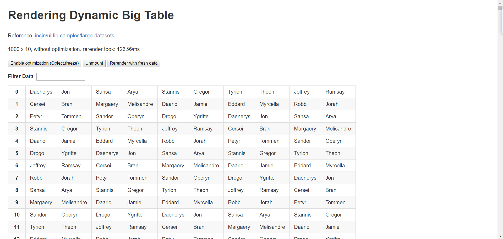
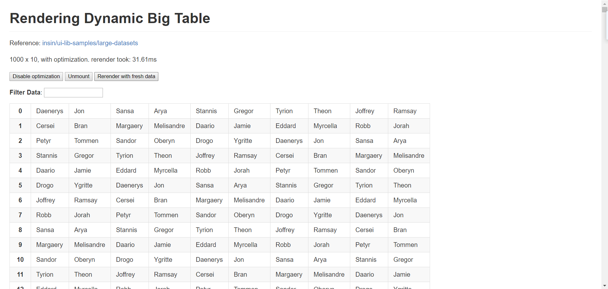
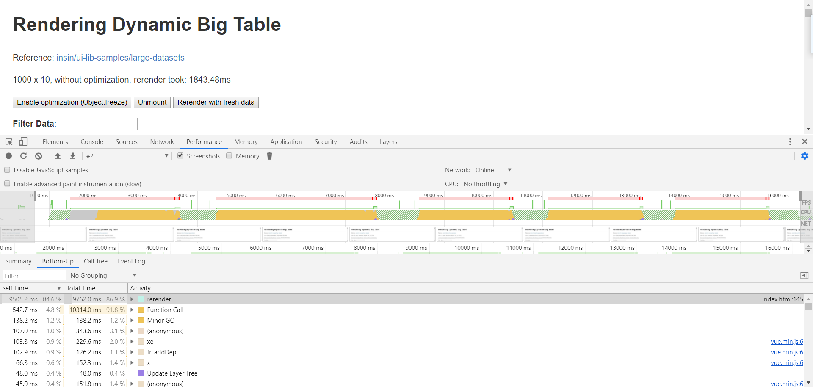
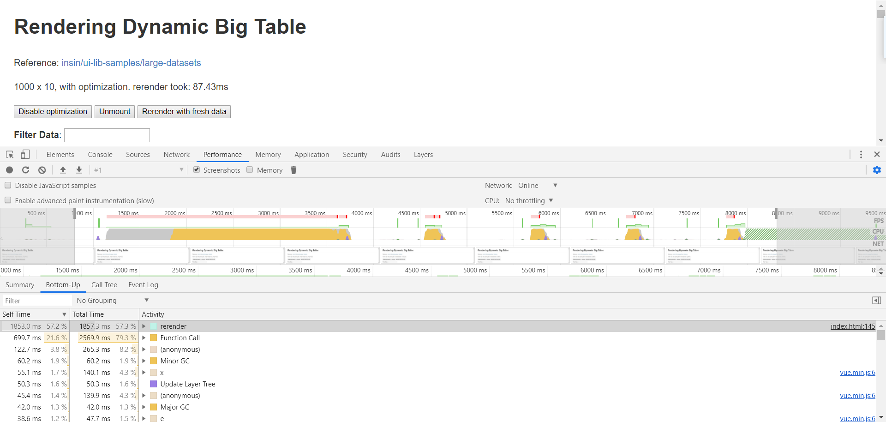

# Vue性能优化

## 1. 如何定位 Vue 应用性能问题
Vue 应用的性能问题可以分为两个部分：
- 第一部分是 **运行时性能问题**
- 第二部分是 **加载性能问题**

和其他 web 应用一样，定位 Vue 应用性能问题最好的工具是 Chrome Devtool，通过 Performance 工具可以用来录制一段时间的 CPU 占用、内存占用、FPS 等运行时性能问题，通过 Network 工具可以用来分析加载性能问题

## 2. Vue 应用运行时性能优化
运行时性能主要关注 Vue 应用初始化之后对 CPU、内存、本地存储等资源的占用，以及对用户交互的及时响应。下面是一些有用的优化手段：

### 2-1. 引入生产环境的 Vue 文件
开发环境下，Vue 会提供很多警告来帮你对付常见的错误与陷阱。而在生产环境下，这些警告语句没有用，反而会增加应用的体积。有些警告检查还有一些小的运行时开销。
<br/>

当使用 `webpack` 或 `Browserify` 类似的构建工具时，`Vue` 源码会根据 `process.env.NODE_ENV` 决定是否启用生产环境模式，默认情况为开发环境模式。在 `webpack` 与 `Browserify` 中都有方法来覆盖此变量，以启用 `Vue` 的生产环境模式，同时在构建过程中警告语句也会被压缩工具去除。

详细的做法请参阅 [生产环境部署](https://cn.vuejs.org/v2/guide/deployment.html)

### 2-2. Vue 应用运行时性能优化建议
当使用 `DOM` 内模板或 `JavaScript` 内的字符串模板时，模板会在运行时被编译为渲染函数。通常情况下这个过程已经足够快了，但对性能敏感的应用还是最好避免这种用法。
<br/>

预编译模板最简单的方式就是使用单文件组件——相关的构建设置会自动把预编译处理好，所以构建好的代码已经包含了编译出来的渲染函数而不是原始的模板字符串。

详细的做法请参阅 [预编译模板](https://cn.vuejs.org/v2/guide/deployment.html#%E6%A8%A1%E6%9D%BF%E9%A2%84%E7%BC%96%E8%AF%91)

### 2-3. 提取组件的 CSS 到单独到文件
当使用单文件组件时，组件内的 CSS 会以 `<style>` 标签的方式通过 JavaScript 动态注入。这有一些小小的运行时开销，将所有组件的 CSS 提取到同一个文件可以避免这个问题，也会让 CSS 更好地进行压缩和缓存。

查阅这个构建工具各自的文档来了解更多：

- [webpack + vue-loader](https://vue-loader-v14.vuejs.org/zh-cn/configurations/extract-css.html) (vue-cli 的 webpack 模板已经预先配置好)
- [Browserify + vueify](https://github.com/vuejs/vueify#css-extraction)
- [Rollup + rollup-plugin-vue](https://vuejs.github.io/rollup-plugin-vue/#/en/2.3/?id=custom-handler)

### 2-4 利用Object.freeze()提升性能
`Object.freeze()` 可以冻结一个对象，冻结之后不能向这个对象添加新的属性，不能修改其已有属性的值，不能删除已有属性，以及不能修改该对象已有属性的可枚举性、可配置性、可写性。该方法返回被冻结的对象。

#### 2-4-1. 性能提升效果对比
在基于 Vue 的一个 [big table benchmark](https://github.com/vuejs/vue/blob/v2.5.17/benchmarks/big-table/index.html?1535282017690) 里，可以看到在渲染一个一个 1000 x 10 的表格的时候，开启 `Object.freeze()` 前后重新渲染的对比

**开启优化之前：**


**开启优化之后：**


在这个例子里，使用了 `Object.freeze()` 比不使用快了 4 倍

### 2.4.2 为什么Object.freeze() 的性能会更好
不使用 `Object.freeze()` 的CPU开销


使用 `Object.freeze()` 的CPU开销


对比可以看出，使用了 `Object.freeze()` 之后，减少了 `observer` 的开销。重复渲染节省了很多时间

### 2.5 扁平化 Store 数据结构
很多时候，我们会发现接口返回的信息是如下的深层嵌套的树形结构：
```js
{
  "id": "123",
  "author": {
    "id": "1",
    "name": "Paul"
  },
  "title": "My awesome blog post",
  "comments": [
    {
      "id": "324",
      "commenter": {
        "id": "2",
        "name": "Nicole"
      }
    }
  ]
}
```
假如直接把这样的结构存储在 store 中，如果想修改某个 commenter 的信息，我们需要一层层去遍历找到这个用户的信息，同时有可能这个用户的信息出现了多次，还需要把其他地方的用户信息也进行修改，每次遍历的过程会带来额外的性能开销。

假设我们把用户信息在 store 内统一存放成 `users[id]` 这样的结构，修改和读取用户信息的成本就变得非常低。

你可以手动去把接口里的信息通过类似数据的表一样像这样存起来，也可以借助一些工具，这里就需要提到一个概念叫做 `JSON数据规范化（normalize）`, normalize 是一个开源的工具，可以将上面的深层嵌套的 JSON 对象通过定义好的 schema 转变成使用 id 作为字典的实体表示的对象。

举个例子，针对上面的 JSON 数据，我们定义 users comments articles 三种 schema：
```js
import {normalize, schema} from 'normalizr';

// 定义 users schema
const user = new schema.Entity('users');

// 定义 comments schema
const comment = new schema.Entity('comments', {
  commenter: user,
});

// 定义 articles schema
const article = new schema.Entity('articles', {
  author: user,
  comments: [comment],
});

const normalizedData = normalize(originalData, article);
```
normalize 之后就可以得到下面的数据，我们可以按照这种形式存放在 store 中，之后想修改和读取某个 id 的用户信息就变得非常高效了，时间复杂度降低到了 O(1)。
```js
{
  result: "123",
  entities: {
    "articles": {
      "123": {
        id: "123",
        author: "1",
        title: "My awesome blog post",
        comments: [ "324" ]
      }
    },
    "users": {
      "1": { "id": "1", "name": "Paul" },
      "2": { "id": "2", "name": "Nicole" }
    },
    "comments": {
      "324": { id: "324", "commenter": "2" }
    }
  }
}
```
需要了解更多请参考 [normalizr 的文档](https://github.com/paularmstrong/normalizr)

### 2.6 避免持久化 Store 数据带来的性能问题
当你有让 Vue App 离线可用，或者有接口出错时候进行灾备的需求的时候，你可能会选择把 Store 数据进行持久化，这个时候需要注意以下几个方面：

#### 2-6-1. 持久化时写入数据的性能问题
Vue 社区中比较流行的 `vuex-persistedstate`，利用了 stor e的 subscribe 机制，来订阅 Store 数据的 mutation，如果发生了变化，就会写入 storage 中，默认用的是 localstorage 作为持久化存储。

也就是说默认情况下 **每次 `commit` 都会向 `localstorage` 写入数据**，localstorage 写入是同步的，而且存在不小的性能开销，如果你想打造 60fps 的应用，就必须避免频繁写入持久化数据

我们应该尽量减少直接写入 Storage 的频率：
- 多次写入操作合并为一次，比如采用函数节流或者将数据先缓存在内存中，最后在一并写入
- 只有在必要的时候才写入，比如只有关心的模块的数据发生变化的时候才写入

#### 2.6.2 避免持久化存储的容量持续增长
由于持久化缓存的容量有限，比如 `localstorage` 的缓存在某些浏览器只有 `5M`，我们不能无限制的将所有数据都存起来，这样很容易达到容量限制，同时数据过大时，读取和写入操作会增加一些性能开销，同时内存也会上涨。

尤其是将 API 数据进行 normalize 数据扁平化后之后，会将一份数据散落在不同的实体上，下次请求到新的数据也会散落在其他不同的实体上，这样会带来持续的存储增长。

因此，当设计了一套持久化的数据缓存策略的时候，同时应该设计旧数据的缓存清除策略，例如请求到新数据的时候将旧的实体逐个进行清除

### 2.7 优化无限列表性能
如果你的应用存在非常长或者无限滚动的列表，那么采用 窗口化 的技术来优化性能，只需要渲染少部分区域的内容，减少重新渲染组件和创建 dom 节点的时间。

[vue-virtual-scroll-list](https://github.com/tangbc/vue-virtual-scroll-list) 和 [vue-virtual-scroller](https://github.com/Akryum/vue-virtual-scroller) 都是解决这类问题的开源项目。你也可以参考 Google 工程师的文章[Complexities of an Infinite Scroller](https://developers.google.com/web/updates/2016/07/infinite-scroller) 来尝试自己实现一个虚拟的滚动列表来优化性能，主要使用到的技术是 DOM 回收、墓碑元素和滚动锚定。

## 3. Vue 应用加载性能优化建议

### 3.1 通过组件懒加载优化超长应用内容加载性能
上面提到的无限列表的场景，比较适合列表内元素非常相似的情况，不过有时候，你的 Vue 应用的超长列表内的内容往往不尽相同，例如在一个复杂的应用的主界面中，整个主界面由非常多不同的模块组成，而用户看到的往往只有首屏一两个模块。在初始渲染的时候不可见区域的模块也会执行和渲染，带来一些额外的性能开销。

**使用组件懒加载在不可见时只需要渲染一个骨架屏，不需要真正渲染组件**

你可以对组件直接进行懒加载，对于不可见区域的组件内容，直接不进行加载和初始化，避免初始化渲染运行时的开销。

### 3.2 利用服务端渲染（SSR）和预渲染（Prerender）来优化加载性能
在一个单页应用中，往往只有一个 html 文件，然后根据访问的 url 来匹配对应的路由脚本，动态地渲染页面内容。单页应用比较大的问题是首屏可见时间过长。

单页面应用显示一个页面会发送多次请求，第一次拿到 html 资源，然后通过请求再去拿数据，再将数据渲染到页面上。而且由于现在微服务架构的存在，还有可能发出多次数据请求才能将网页渲染出来，每次数据请求都会产生 RTT（往返时延），会导致加载页面的时间拖的很长。

服务端渲染（SSR）可以考虑使用 Nuxt 或者按照 Vue 官方提供的 Vue SSR 指南来一步步搭建