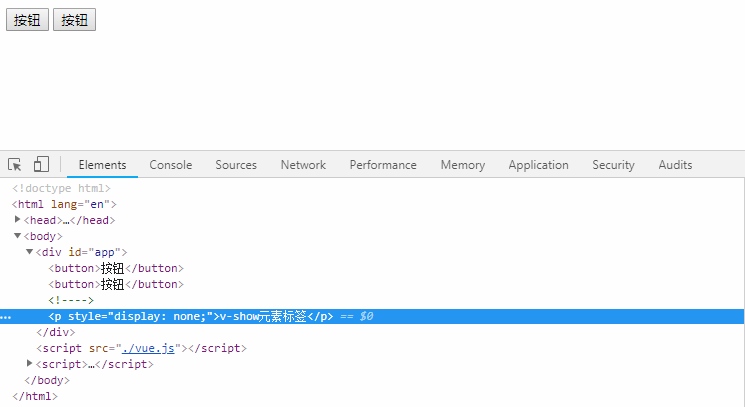
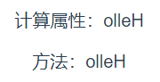
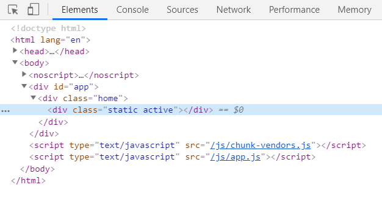
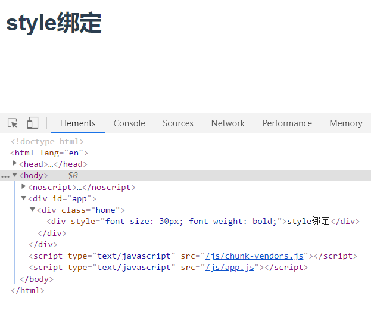
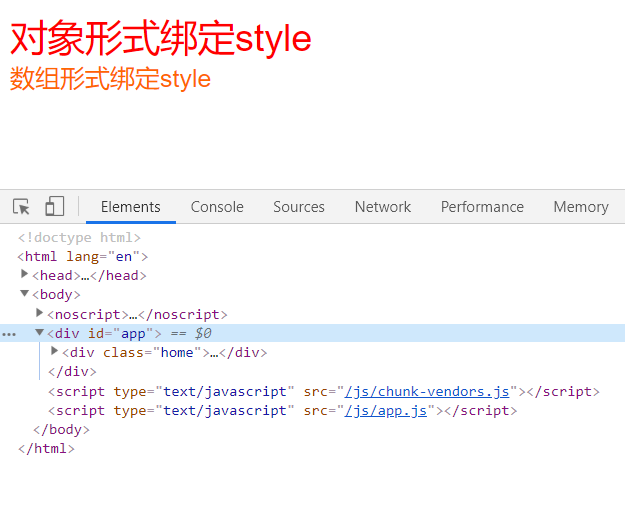

# Vue
## Vue 基础知识
### Vue实例
- 每一个Vue应用都会通过new Vue()的方式构造一个Vue实例
- 一个大型的Vue项目，往往由一个Vue根实例和一些可选组件实例所构成
```js
// 根实例
└─ TodoList
   ├─ TodoItem
   │  ├─ DeleteTodoButton
   │  └─ EditTodoButton
   └─ TodoListFooter
      ├─ ClearTodosButton
      └─ TodoListStatistics
```

#### 1. 数据与方法
- Vue 实例被创建时，将 Vue 实例 data 对象中的所有数据加入到 Vue 的响应式系统
- 只有当实例被创建时就已经存在于 data 中的属性才是响应式的
```js
var vm = new Vue({
  el: '#app',
  data() {
    return {
      age: 23,
    }
  }
})

// 只有在data中声明的属性才是响应式的·
vm.address = '广州'; // 这个属性不是响应式的
vm.age = 32; // 这个属性是响应式的
```
##### 没有初始值的响应式属性
```js
// 最好是在 data 里先定义准备用到的属性，例：
data: {
  newTodoText: '',
  visitCount: 0,
  hideCompletedTodos: false,
  todos: [],
  error: null
}
```

##### Object.freeze() 冻结响应式数据
一个巨大的数组或者对象，并且确定数据不会修改，性能大幅度提升
```js
data() {
  return {
    obj:  Object.freeze({
      foo: 1,
      baz: {
        a: 4
      }
    })
  }
},
created () {
  this.obj.foo = 2;      // 不能改对象的属性，会报错
  this.obj = {foo: 3};   // 可以改对象的引用      
  this.obj.baz.a = 5;    // 可以改多维对象的深层属性
}
```

#### 2. 实例生命周期函数
Vue 实例被创建时的初始化过程中会运行一些**生命周期钩子**的函数
:::tip
- `beforeCreate` 和 `created` 这两个钩子函数，会在Vue实例被创建之前和创建后分别调用
- `beforeMount` 和 `mounted` 这两个钩子函数，会在模板和数据相结合被挂载到页面之前和之后分别调用
- `beforeUpdate` 和 `updated` 这两个钩子函数，会在数据发生变化之前和之后分别调用
- `beforeDestory` 和 `destory` 这两个钩子函数，会在Vue实例被销毁之前和销毁之后分别调用
- `activated` 和 `deactivated` 这两个钩子函数，会在keep-alive组件激活和停用时分别调用
- `errorCaptured`会在捕获子组件、孙组件发生错误时触发(2.5.0+版本新增)
:::


### 模板语法
---
#### 1. 插值
数据绑定最常见的形式就是使用“Mustache”语法 (双大括号) 的文本插值，Mustache 标签可以是：
- 数据对象 data 上的属性
- JavaScript 表达式
```js
// msg 是 data 里的一个属性
<span>Message: {{ msg }}</span>

{{ number + 1 }}

{{ ok ? 'YES' : 'NO' }}

{{ message.split('').reverse().join('') }}
```
##### 双大括号不能输出HTML
双大括号会将数据解释为普通文本，需要使用 v-html 指令
```js
// rawHtml的值为：<span style="color: red">真正的HTML</span>
<p>{{ rawHtml }}</p>
<span v-html="rawHtml"></span>

// 输出
// <span style="color: red">真正的HTML</span>
// 真正的HTML
```
##### 双大括号不能用在 HTML 属性上
```js
// 这样是写法是错误的


// 应该使用 v-bind 指令

```

#### 2. 指令
当表达式的值改变时，将其产生的连带影响，响应式地作用于 DOM
:::tip 常见的指令
- `v-bind`：它的作用是绑定一个html标签属性，例如：`<button v-bind:id='btn'></button>`
- `v-on`: 它的作用是绑定一个html标签的事件，例如：`<button v-on:click='handleBtnClick'></button>`
- `v-if`：它的作用是根据某个变量的boolean值，判断此元素是否在html文档上显示
- `v-show`：它的作用同v-if类似，不过两者之间最本质的差别是，v-show是通过css属性display:none来控制元素是否显示。`v-if` 是控制元素是否在DOM上渲染
:::

```html
<!-- v-bind -->
<button v-bind:id="submitBtn">按钮</button>

<!-- v-on -->
<button v-on="handleBtnClick">按钮</button>

<!-- v-if -->
<p v-if="isShow">v-if元素标签</p> 

<!-- v-show -->
<p v-show="isShow">v-show元素标签</p> 
```

```js
var app = new Vue({
  el: '#app',
  data() {
    return {
      isShow: false
    }
  },
  methods: {
    handleBtnClick() {
      console.log('v-on click');
    }
  }
})
```


##### 参数与动态参数

```html
<!-- 这里 href 是参数，该元素的 href 与表达式 url 的值绑定 -->
<a v-bind:href="url">...</a>
```

```html
<!-- 动态参数 -->
<!-- attributeName 会被作为一个 JavaScript 表达式进行动态求值，求得的值将会作为最终的参数来使用 -->
<a v-bind:[attributeName]="url"> ... </a>
```

##### 修饰符

#### 3. 缩写
##### `v-bind` 缩写
```html
<!-- 完整语法 -->
<a v-bind:href="url">...</a>

<!-- 缩写 -->
<a :href="url">...</a>

<!-- 动态参数的缩写 (2.6.0+) -->
<a :[key]="url"> ... </a>
```

##### `v-on` 缩写
```html
<!-- 完整语法 -->
<a v-on:click="doSomething">...</a>

<!-- 缩写 -->
<a @click="doSomething">...</a>

<!-- 动态参数的缩写 (2.6.0+) -->
<a @[event]="doSomething"> ... </a>
```

### 计算属性与侦听器
---
#### 1. 计算属性
- 模板内的表达式非常便利，但是设计它们的初衷是用于简单运算的。在模板中放入太多的逻辑会让模板过重且难以维护
- 复杂逻辑，应当使用**计算属性**
```html
<div id="app">
  {{ name.split('').reverse().join('') }}
  {{ reverseName }}
</div>
```
```js
var app = new Vue({
  el: '#app',
  data() {
    return {
      name: 'Hello',
    }
  },
  computed: {
    reverseName() {
      return this.name.split('').reverse().join('');
    }
  }
})
```

##### 计算属性缓存 vs 方法
计算属性能够做到的事情，使用方法同样能够做到
```html
<div id="app">
  计算属性：{{ reverseName }}
  方法：{{ reverseNameFn() }}
</div>
```
```js
var app = new Vue({
  el: '#app',
  data() {
    return {
      name: 'Hello',
    }
  },
  methods: {
    reverseNameFn: function () {
      return this.name.split('').reverse().join('');
    }
  },
  computed: {
    reverseName() {
      return this.name.split('').reverse().join('');
    }
  }
})
```
**运行结果：**


:::tip 区别
- 计算属性：**是基于它们的响应式依赖进行缓存的**，只在相关响应式依赖发生改变时它们才会重新求值
- 方法：每当触发重新渲染时，调用方法将总会再次执行函数

对于一些开销较大的逻辑，我们更推荐使用计算属性而不是方法
:::

#### 2. 计算属性与侦听属性
:::tip
侦听属性watch：当监听的属性发生改变时，会执行异步或开销较大的操作
计算属性computed：当依赖发生改变，该依赖所绑定的计算属性也会更新
:::

```html
<div id="app">
  计算属性：{{fullName}}<br/>
  监听属性：{{fullNameWatch}}
</div>
```
```js
var app = new Vue({
  el: '#app',
  data() {
    return {
      firstName: 'foo',
      lastName: 'bar',
      fullNameWatch: 'foo bar'
    }
  },
  computed: {
    fullName() {
      return this.firstName + ' ' + this.lastName;
    }
  },
  watch: {
    firstName(val) {
      this.fullNameWatch = val + ' ' + this.lastName;
    },
    lastName(val) {
      this.fullNameWatch = this.firstName + ' ' + val;
    }
  }
})
```


#### 3. 计算属性的setter
读取计算属性会调用getter，可以设置一个setter，在计算属性被设置时调用
```js
var app = new Vue({
  el: '#app',
  data() {
    return {
      firstName: 'foo',
      lastName: 'bar',
    }
  },
  computed: {
    fullName: {
      // getter
      get: function () {
        return this.firstName + ' ' + this.lastName
      },
      // setter
      set: function (newValue) {
        var names = newValue.split(' ')
        this.firstName = names[0]
        this.lastName = names[names.length - 1]
      }
    }
  }
})
```

### Class与Style绑定
---
通过v-bind为元素动态绑定class列表和内联样式style，表达式可以是：
- 计算出的字符串
- 对象或数组

#### 1. Class绑定
##### 对象语法
```html
<!-- 
  1.可以动态切换多个class
  2.可以与不同的class共存
 -->
<div
  class="static"
  :class="{ active: isActive, 'text-danger': hasError }"
></div>
```
```js
var app = new Vue({
  el: '#app',
  data() {
    return {
      isActive: true,
      hasError: false
    }
  },
})
```
**运行结果：**<br/>


##### 数组语法
- 数组中的值对应data中的属性，属性的值渲染为class
- 可以使用三元表达式动态切换class
```html
<div :class="[activeClass, errorClass]"></div>
<div :class="[isActive ? activeClass : '', errorClass]"></div>
```
```js
var app = new Vue({
  el: '#app',
  data() {
    return {
      activeClass: 'active',
      errorClass: 'text-danger'
    }
  },
})
```

#### 2. Style绑定
##### CSS 属性名可以用驼峰式 (camelCase) 或短横线分隔 (kebab-case) 来命名
```html
<div :style="{ 'font-size': fontSize + 'px', fontWeight: fontWeight }">style绑定</div>
```
```js
var app = new Vue({
  el: '#app',
  data() {
    return {
      fontSize: 30,
      fontWeight: 'bold'
    }
  },
})
```
**运行结果：**<br/>


##### 直接绑定到一个样式对象或数组通常更好，这会让模板更清晰
```html
<span :style="styleObj">对象形式绑定style</span><br/>
<span :style="[styleOne,styleTwo]">数组形式绑定style</span>
```
```js
var app = new Vue({
  el: '#app',
  data() {
    return {
      styleObj: {
        fontSize: '30px',
        color: 'red',
      },
      styleOne: {
        color: '#f60',
      },
      styleTwo: {
        fontSize: '20px'
      }
    }
  },
})
```
**运行结果：**<br/>



## 持续更新中...