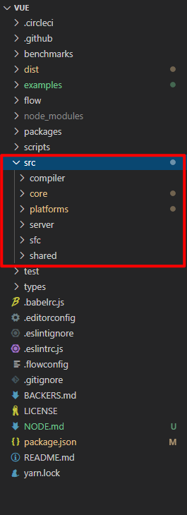

# Vue源码目录

## 1. 目录结构
源码位于src目录下，下面对src下的目录进行介绍

### compiler
该目录是编译相关的代码，即将 template 模板转化成 render 函数的代码

### core
这部分代码是 vue 的核心代码
- **components**：内置组件的代码，即 keep-alive 代码
- **global-api**：全局API代码，mixin，extend 等 api 在这里实现
- **instance**：vue实例化相关代码，包括初始化，事件，生命周期，渲染等部分的代码
- **observer**：响应式数据相关代码
- **util**：工具方法
- **vdom**：虚拟 dom 的代码

### platforms
platforms下包含两个子目录，web 和 weex。

分别代表可以打包生成在web端使用的 vue 代码和在native端使用的 weex 代码

