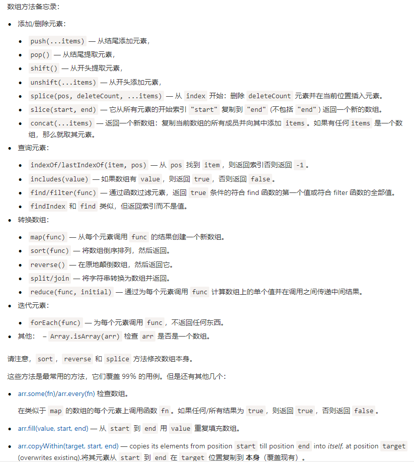

# 你应该知道的一些JS数组技巧
> 作者：幻灵尔依——[链接](https://juejin.im/post/5d71fff5f265da03e4678328)

## 数组常用方法


## array.includes() 和 array.indexOf()
`indexOf` 通常在需要用到**索引值**的情况下使用。
- `array.includes()` 返回`布尔值`，
- `array.indexOf()` 返回数组`子项的索引`。

## array.find() 、 array.findIndex() 和 array.some()
三个方法都是 **短路操作**，即找到符合条件的之后就不在继续遍历
- `array.find()`: 
  - 返回值：是第一个符合条件的数组 `子项`
  - 在需要 **数组的子项** 的时候使用
- `array.findIndex()`
  - 返回值：第一个符合条件的数组 `子项的下标`
  - 需要 **子项的索引值** 的时候使用
- `array.some()`
  - 返回值：有无符合条件的子项，如有返回 `true`
  - 需要知道 **有无符合条件的子项**
```js
const arr = [{label: '男', value: 0}, {label: '女', value: 1}, {label: '不男不女', value: 2}]

const index = arr.findIndex(item => item.value === 2)
const item = arr.find(item => item.value === 2)
const isExist = arr.some(item => item.value === 2)

console.log(index)      // 2
console.log(item)       // {label: "不男不女", value: 2}
console.log(isExist)    // true
```
建议在只需要布尔值的时候和数组子项是字符串或数字的时候使用 `array.some()`
```js
// 当子包含数字0的时候可能出错
const arr = [0, 1, 2, 3, 4]

// 正确
const isExist = arr.some(item => item === 0)
if (isExist) {
 console.log('存在要找的子项，很舒服~')
}

// 错误
const isExist = arr.find(item => item === 0)
if (isExist) { // isExist此时是0，隐式转换为布尔值后是false
 console.log('执行不到这里~')
}


// 当子项包含空字符串的时候也可能出错
const arr = ['', 'asdf', 'qwer', '...']

// 正确
const isExist = arr.some(item => item === '')
if (isExist) {
 console.log('存在要找的子项，很舒服~')
}

// 错误
const isExist = arr.find(item => item === '')
if (isExist) { // isExist此时是''，隐式转换为布尔值后是false
 console.log('执行不到这里~')
}
```

## array.find() 和 array.filter()
- `array.filter()`：回的是所有符合条件的子项组成的数组，会遍历所有数组
- `array.find()`：返回第一个符合条件的子项，是短路操作

## 强大的reduce


## 数组浅拷贝
```js
const arr1 = [1, 2, 3]
const arr2 = [4, 5, 6]
const arr3 = [7, 8, 9]
const arr = [...arr1, ...arr2, ...arr3]
```

## 数组去重
```js
const arr = [1, 1, 2, 2, 3, 4, 5, 5]
const newArr = [...new Set(arr)]
```

## 数组取交集
```js
const a = [0, 1, 2, 3, 4, 5]
const b = [3, 4, 5, 6, 7, 8]
const duplicatedValues = [...new Set(a)].filter(item => b.includes(item))
duplicatedValues // [3, 4, 5]
```

## 数组取差集
```js
const a = [0, 1, 2, 3, 4, 5]
const b = [3, 4, 5, 6, 7, 8]
const diffValues = [...new Set([...a, ...b])].filter(item => !b.includes(item) || !a.includes(item)) // [0, 1, 2, 6, 7, 8]
```

### 数组转对象
```js

const arr = [1, 2, 3, 4]
const newObj = {...arr} // {0: 1, 1: 2, 2: 3, 3: 4}
const obj = {0: 0, 1: 1, 2: 2, length 3}
// 对象转数组不能用展开操作符，因为展开操作符必须用在可迭代对象上
let newArr = [...obj] // Uncaught TypeError: object is not iterable...
// 可以使用Array.form()将类数组对象转为数组
let newArr = Array.from(obj) // [0, 1, 2]
```

### 找到第一个符合条件的元素/下标
```js
const arr = [1, 2, 3, 4, 5]
const findItem = arr.find(item => item === 3) // 返回子项
const findIndex = arr.findIndex(item => item === 3) // 返回子项的下标
```

## 合理使用 Set 数据结构
由于 `es6` 原生提供了 `Set` 数据结构，而 `Set` 可以保证子项不重复，且和数组转换十分方便，所以在一些可能会涉及重复添加的场景下可以直接使用 `Set` 代替 `Array`，避免了多个地方重复判断是否已经存在该子项。
```js
const set = new Set()
set.add(1)
set.add(1)
set.add(1)
set.size // 1
const arr = [...set] // arr: [1]
```


