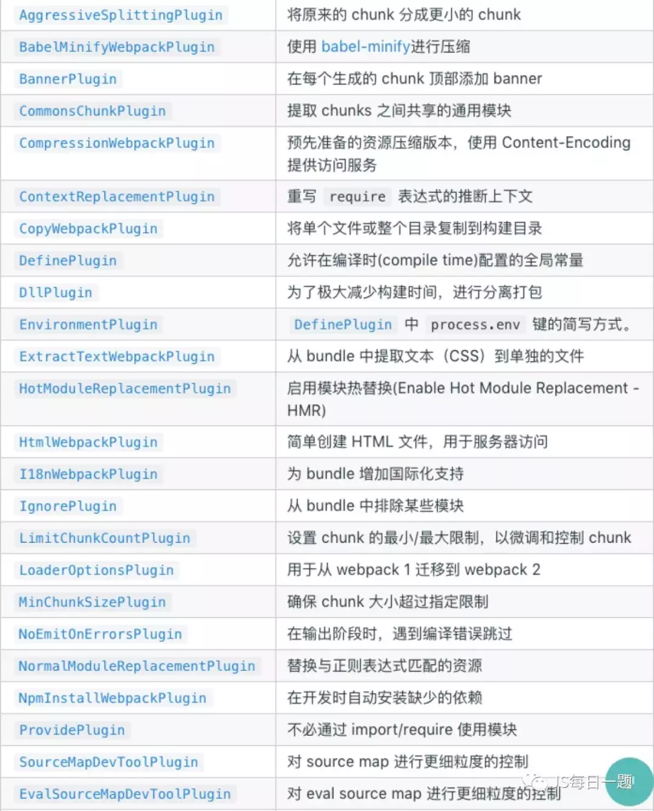

# 构建工具相关面试题
[[toc]]
## 什么是 webpack
`webpack` 是一个静态模块处理器，当它处理应用程序时，它会递归地构建一个关系依赖图，其中包含应用程序需要的每个模块，然后把所有这些模块打包成一个或多个包。

是一个打包工具，使用 webpack 可以将各种资源模块进行打包合并成一个或多个包

## webpack 的核心概念

## Loader和Plugin的区别
- `loader`：是一个转换器，将A文件进行编译成B文件，比如：将A.less转换为A.css，单纯的文件转换过程。
- `plugin`：是一个扩展器，它丰富了 `webpack` 本身，针对是 `loader` 结束后，`webpack` 打包的整个过程，它并不直接操作文件，而是基于事件机制工作，会监听 `webpack` 打包过程中的某些节点，执行广泛的任务

## 有哪些常⻅的Loader和Plugin，简单聊⼀聊各⾃的作⽤

### loader 
常见 `loader`：
- `style-loader`：将 `CSS` 添加到DOM的内联样式标签style里
- `css-loader`：允许将 `CSS` 文件通过 `require` 的方式引入，并返回 `CSS` 代码
- `less-loader`：处理 `less`
- `sass-loader`：处理 `sass`
- `postcss-loader`：用 `postcss` 来处理 `CSS`
- `file-loader`：分发文件到output目录并返回相对路径
- `url-loader`： 和 `file-loader` 类似，但是当文件小于设定的 `limit` 时可以返回一个 `Data Url`
- `html-minify-loader`：压缩HTML文件
- `babel-loader`：把 `ES6` 文件转换成 `ES5` 文件

`loader` 特性：
- `loader` 从右到左地取值(evaluate)/执行(execute)
- `loader` 支持链式传递
- `loader` 可以内联显示指定
- `loader` 可以是同步的，也可以是异步的
- `loader` 运行在 `Node.js`中，并且能够执行任何 `Node.js` 能做到的操作
- `loader` 可以通过 options 对象配置
- 除了常见的通过 `package.json` 的 `main` 来将一个 `npm` 模块导出为 `loader`，还可以在 module.rules 中使用 `loader` 字段直接引用一个模块
- `loader` 能够产生额外的任意文件

### plugin

`plugin` 特性：
- 是一个独立的模块
- 模块对外暴露一个 js 函数
- 函数的原型 (prototype) 上定义了一个注入 `compiler` 对象的 `apply` 方法
- apply 函数中需要有通过 `compiler` 对象挂载的 `webpack` 事件钩子，钩子的回调中能拿到当前编译的 `compilation` 对象，如果是异步编译插件的话可以拿到回调 `callback`
- 完成自定义子编译流程并处理 `complition` 对象的内部数据
- 如果异步编译插件的话，数据处理完成后执行 `callback` 回调 