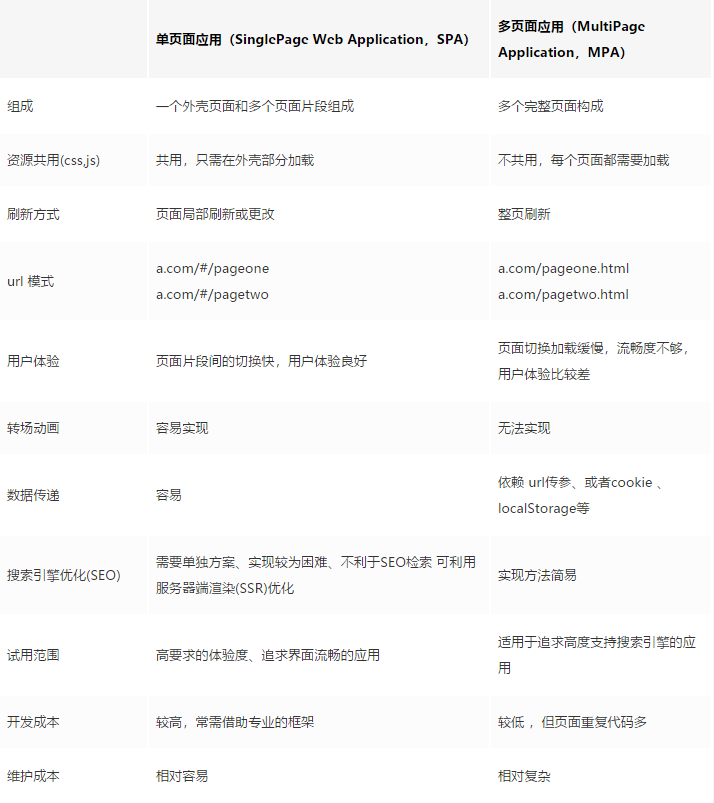
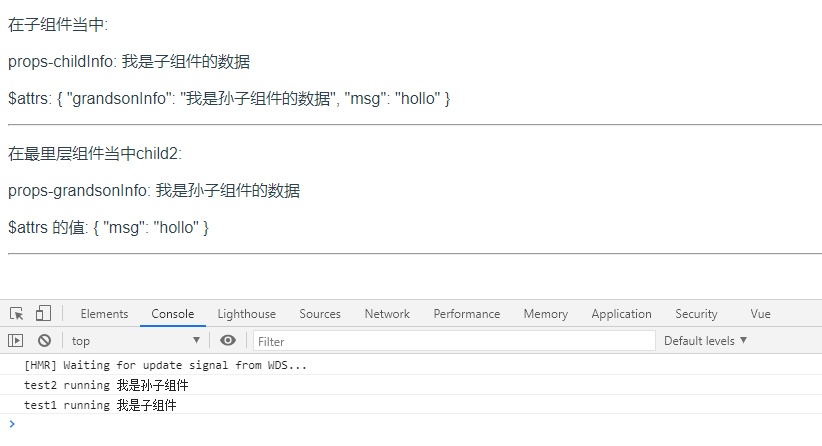
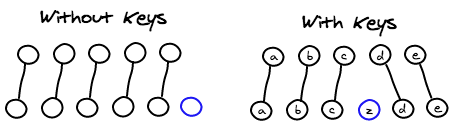

# Vue 相关面试题
[[toc]]
## ● 说说你对 Vue 的理解
Vue 是一套用于构建用户界面的**渐进式框架**，Vue 的核心库只关注视图层

### Vue 核心特性
#### 数据驱动（MVVM)
MVVM表示的是 Model-View-ViewModel
- Model：模型层，负责处理业务逻辑以及和服务器端进行交互
- View：视图层：负责将数据模型转化为UI展示出来，可以简单的理解为HTML页面
- ViewModel：视图模型层，用来连接Model和View，是Model和View之间的通信桥梁

#### 组件化
组件化：就是把各种逻辑抽象为一个统一的概念（组件）来实现开发的模式，在 `Vue` 中每一个 `.vue` 文件都可以视为一个组件

组件化的优势:
- 降低整个系统的耦合度，在保持接口不变的情况下，我们可以替换不同的组件快速完成需求，例如输入框，可以替换为日历、时间、范围等组件作具体的实现
- 调试方便，由于整个系统是通过组件组合起来的，在出现问题的时候，可以用排除法直接移除组件，或者根据报错的组件快速定位问题，之所以能够快速定位，是因为每个组件之间低耦合，职责单一，所以逻辑会比分析整个系统要简单
- 提高可维护性，由于每个组件的职责单一，并且组件在系统中是被复用的，所以对代码进行优化可获得系统的整体升级


#### 指令系统
解释：指令 (Directives) 是带有 v- 前缀的特殊属性

作用：当表达式的值改变时，将其产生的连带影响，响应式地作用于 DOM
- 常用的指令
    - 条件渲染指令 `v-if`
    - 列表渲染指令 `v-for`
    - 属性绑定指令 `v-bind`
    - 事件绑定指令 `v-on`
    - 双向数据绑定指令 `v-model`

## ● 什么是 MVVM？
Model–View–ViewModel （MVVM） 是一个软件架构设计模式，由微软 WPF 和 Silverlight 的架构师 Ken Cooper 和 Ted Peters 开发，是一种简化用户界面的事件驱动编程方式。由 John Gossman（同样也是 WPF 和 Silverlight 的架构师）于2005年在他的博客上发表

**MVVM源于经典的 MVC (Model-view-controller) 模式，`MVVM` 的出现促进了前端开发和后端业务逻辑的分离**，极大地提高了前端的开发效率，MVVM 的核心是 ViewModel 层，它就是一个中转站(value converter)，该层向上与view层进行双向数据绑定，向下与 model 层通过接口请求进行数据交互，起到承上启下的作用

**`Model` 表示数据模型层。 `view` 表示视图层， `ViewModel` 是 `View` 和 `Model` 层的桥梁，数据绑定到 `viewModel` 层并自动渲染到页面中，视图变化通知 `viewModel` 层更新数据。**


### view 层
View 是视图层，也就是用户界面，前端主要用 HTML 和 css 构建

### Model 层
Model 是指数据模型，泛指后端进行的各种业务逻辑处理和数据操控，对于前端来说就是后端提供的 API 接口

### ViewModel 层
ViewModel 是由前端开发人员组织生成和维护的视图数据层，在这一层，前端开发人员从后端获取到 Model 数据进行转换处理，做二次封装，生成 View 层预期使用的视图数据模型，ViewModel 所封装出来的数据模型包括了视图的状态和行为，而 Model 层的数据模型只包含了视图的状态，比如页面的这一块展示什么，而页面加载进来发生什么，点击发生什么，滚动发生什么，这些都属于视图的行为(交互)，视图的状态和行为都封装在了 ViewModel 层，这样的封装让 ViewModel 可以完整地描述 View 层

## ● 说说你对 SPA 单页面的理解，它的优缺点分别是什么？
SPA（ single-page application ）仅在 Web 页面初始化时加载相应的 HTML、JavaScript 和 CSS。一旦页面加载完成，SPA 不会因为用户的操作而进行页面的重新加载或跳转；取而代之的是利用路由机制实现 HTML 内容的变换，用户与 UI 的交互，避免页面的重新加载。
### 优点
- 用户体验好、快，内容的改变不需要重新加载整个页面，避免了不必要的跳转和重复渲染；
- 基于上面一点，SPA 相对对服务器压力小；
- 前后端职责分离，架构清晰，前端进行交互逻辑，后端负责数据处理；
### 缺点
- **初次加载耗时多：** 为实现单页 Web 应用功能及显示效果，需要在加载页面的时候将 JavaScript、CSS 统一加载，部分页面按需加载；
- **前进后退路由管理：** 由于单页应用在一个页面中显示所有的内容，所以不能使用浏览器的前进后退功能，所有的页面切换需要自己建立堆栈管理；
- **SEO 难度较大：** 由于所有的内容都在一个页面中动态替换显示，所以在 SEO 上其有着天然的弱势

## ● SPA（单页应用）首屏加载速度慢怎么解决
### 加载慢的原因
在页面渲染的过程，导致加载速度慢的因素可能如下：
- 网络延时问题
- 资源文件体积是否过大
- 资源是否重复发送请求去加载了
- 加载脚本的时候，渲染内容堵塞了

### 解决方案
常见的几种SPA首屏优化方式
- 减小入口文件体积
- 静态资源本地缓存
- UI框架按需加载
- 图片资源的压缩
- 重复组件打包
- 开启GZip压缩
- 使用SSR

#### 减小入口文件体积
常用的手段是路由懒加载，把不同路由对应的组件分割成不同的代码块，在进行路由跳转时才会加载相应的组件，使得入口文件变小，加载速度大大增加

在 vue-router 配置路由的时候，采用动态加载路由的形式：
```js
routes:[ 
    path: 'Blogs',
    name: 'ShowBlogs',
    component: () => import('./components/ShowBlogs.vue')
]
```
也可以把某个路由下的所有组件都打包在同个异步块 (chunk) 中。只需要使用命名 `chunk`
```js
const Foo = () => import(/* webpackChunkName: "group-foo" */ './Foo.vue')
const Bar = () => import(/* webpackChunkName: "group-foo" */ './Bar.vue')
const Baz = () => import(/* webpackChunkName: "group-foo" */ './Baz.vue')
```

#### 静态资源本地缓存
后端返回资源问题：

采用HTTP缓存，设置` Cache-Control`、`Last-Modified`、`Etag`等响应头

采用 `Service Worker` 离线缓存

前端合理利用 `localStorage`

#### UI 框架按需加载
在日常使用 UI 框架，例如 `element-UI`、或者`antd`，我们经常性直接引用整个 UI 库
```js
import ElementUI from 'element-ui'
Vue.use(ElementUI)
```
但实际上我用到的组件只有按钮，分页，表格，输入与警告 所以我们要按需引用
```js
import { Button, Input, Pagination, Table, TableColumn, MessageBox } from 'element-ui';
Vue.use(Button)
Vue.use(Input)
Vue.use(Pagination)
```

#### 组件重复打包
假设 `A.js` 文件是一个常用的库，现在有多个路由使用了 `A.js` 文件，这就造成了重复下载

解决方案：在 `webpack` 的 `config` 文件中，修改 `CommonsChunkPlugin` 的配置
```webpack
minChunks: 3
```
`minChunks` 为 3 表示会把使用3次及以上的包抽离出来，放进公共依赖文件，避免了重复加载组件

#### 图片资源的压缩
图片资源虽然不在编码过程中，但它却是对页面性能影响最大的因素

对于所有的图片资源，我们可以进行适当的压缩

对页面上使用到的 icon，可以使用在线字体图标，或者雪碧图，将众多小图标合并到同一张图上，用以减轻http请求压力。

#### 开启GZip压缩
拆完包之后，我们再用 `gzip` 做一下压缩 安装 `compression-webpack-plugin`
```js 
cnmp i compression-webpack-plugin -D
```

在 `vue.congig.js` 中引入并修改 `webpack` 配置
```js
const CompressionPlugin = require('compression-webpack-plugin')

configureWebpack: (config) => {
    if (process.env.NODE_ENV === 'production') {
        // 为生产环境修改配置...
        config.mode = 'production'
        return {
            plugins: [new CompressionPlugin({
                test: /\.js$|\.html$|\.css/, //匹配文件名
                threshold: 10240, //对超过10k的数据进行压缩
                deleteOriginalAssets: false //是否删除原文件
            })]
        }
    }
}
```
在服务器我们也要做相应的配置 如果发送请求的浏览器支持 gzip，就发送给它 `gzip` 格式的文件

#### 使用 SSR
**SSR**（Server side ），也就是服务端渲染，组件或页面通过服务器生成 `html` 字符串，再发送到浏览器

从头搭建一个服务端渲染是很复杂的，`vue` 应用建议使用 `Nuxt.js` 实现服务端渲染

## 说说 Vue 的事件绑定原理


## ● 单页面应用和多页面应用区别及优缺点


**单页面(SPA)**

只有一个主页面的应用，所有的页面内容都包含在这个所谓的主页面中，用路由动态载入，单页面的页面跳转仅刷新局部资源

- 优点
  - 用户体验好，速度快，内容的改变不需要重新加载整个页面，SPA 对服务器压力较小
- 缺点
  - 不利于SEO
  - 初次加载时相对耗时多

**多页面MPA**

一个应用中有多个页面，页面跳转时是整页刷新

- 优点
  - SEO 实现方法简单
- 缺点
  - 页面重复代码较多
  - 初次加载时相对耗时多

## ● v-show 与 v-if 有什么区别？
**v-if**：切换过程中条件块内的事件监听器和子组件适当地被销毁和重建

**v-show**：不管初始条件是什么，元素总是会被渲染，并且只是简单地基于 CSS 的 “display” 属性进行切换

所以，`v-if` 适用于在运行时很少改变条件，不需要频繁切换条件的场景；`v-show` 则适用于需要非常频繁切换条件的场景。

## ● Class 与 Style 如何动态绑定？
Class 可以通过对象语法和数组语法进行动态绑定：

**对象语法**
```js
<div v-bind:class="{ active: isActive, 'text-danger': hasError }"></div>

data: {
  isActive: true,
  hasError: false
}
```
**数组语法**
```js
<div v-bind:class="[isActive ? activeClass : '', errorClass]"></div>

data: {
  activeClass: 'active',
  errorClass: 'text-danger'
}
```

Style 也可以通过对象语法和数组语法进行动态绑定：

**对象语法**
```js
<div v-bind:style="{ color: activeColor, fontSize: fontSize + 'px' }"></div>

data: {
  activeColor: 'red',
  fontSize: 30
}
```
**数组语法**
```js
<div v-bind:style="[styleColor, styleSize]"></div>

data: {
  styleColor: {
     color: 'red'
   },
  styleSize:{
     fontSize:'23px'
  }
}
```

## ● 怎样理解 Vue 的单向数据流？
所有的 prop 都使得其父子 prop 之间形成了一个单向下行绑定：父级 prop 的更新会向下流动到子组件中，但是反过来则不行。这样会防止从子组件意外改变父级组件的状态，从而导致你的应用的数据流向难以理解。

额外的，每次父级组件发生更新时，子组件中所有的 prop 都将会刷新为最新的值。这意味着你不应该在一个子组件内部改变 prop。如果你这样做了，Vue 会在浏览器的控制台中发出警告。子组件想修改时，只能通过 $emit 派发一个自定义事件，父组件接收到后，由父组件修改。

有两种常见的试图改变一个 prop 的情形:
- **prop作为子组件的初始值使用**
在这种情况下，最好定义一个本地的 data 属性并将这个 prop 用作其初始值：
```js
props: ['initialCounter'],
data: function () {
  return {
    counter: this.initialCounter
  }
}
```

- **prop进行转换**
在这种情况下，最好使用这个 prop 的值来定义一个计算属性
```js
props: ['size'],
computed: {
  normalizedSize: function () {
    return this.size.trim().toLowerCase()
  }
}
```

## ● computed 和 watch 的区别和运用的场景？
- **computed**：是计算属性：
  - 名称不能与 data 里的对象重复
  - 依赖于其他值，是多个值变化引起一个值变化，是多对一 
  - 并且可以进行缓存，当依赖的值发生改变时，在下一次获取 `computed` 时，才会重新计算 `computed` 值
  - 必须有 return
  - 只能是同步
- **watch**：类似于数据监听的回调：
  - 名称必须和 data 里对象一样
  - 监听一个值，一个值变化引起多个值的变化
  - 没有 return
  - 可以异步
### 运用场景：
- **computed**：当我们需要数值计算、依赖于其他数据时，应该使用computed，因为可以利用 computed 的缓存特性，避免每次获取值时，都要重新计算；
- **watch**：当我们需要在数据变化时执行异步或开销较大的操作时，应该使用 watch，使用 watch 选项允许我们执行异步操作

## ● Vue中给对象添加新属性界面不刷新?
`vue2` 是用过 `Object.defineProperty` 实现数据响应式，新添加的对象属性并没有通过 `Object.defineProperty` 设置成响应式数据
### 解决方案
若想实现数据与视图同步更新，可采取下面三种解决方案：
- Vue.set()
- Object.assign()
- $forcecUpdated()

#### Vue.set()
Vue.set( target, propertyName/index, value )

参数

- `{Object | Array} target`
- `{string | number} propertyName/index`
- `{any} value`

返回值：设置的值

#### Object.assign()
直接使用 `Object.assign()` 添加到对象的新属性不会触发更新

应创建一个新的对象，合并原对象和混入对象的属性
```js
this.someObject = Object.assign({},this.someObject,{newProperty1:1,newProperty2:2 ...})
```
#### $forceUpdate
如果你发现你自己需要在 Vue中做一次强制更新，`99.9%` 的情况，是你在某个地方做错了事

`$forceUpdate`迫使 `Vue` 实例重新渲染

PS：仅仅影响实例本身和插入插槽内容的子组件，而不是所有子组件。

#### 小结
- 如果为对象添加少量的新属性，可以直接采用`Vue.set()`

- 如果需要为新对象添加大量的新属性，则通过`Object.assign()`创建新对象

- 如果你需要进行强制刷新时，可采取`$forceUpdate()` (不建议)


## ● 谈谈你对 Vue 生命周期的理解？
### 1. 生命周期是什么？
Vue 实例有一个完整的生命周期，也就是从开始创建、初始化数据、编译模版、挂载 Dom -> 渲染、更新 -> 渲染、卸载等一系列过程，我们称这是 Vue 的生命周期。
| 生命周期    | 描述    |
| -------    | :-----  |
| beforeCreate   | 组件实例被创建之初，组件的属性生效之前 |
| created        | 组件实例已经完全创建，属性也绑定，但真实 dom 还没有生成，$el 还不可用 |
| beforeMount    | 在挂载开始之前被调用：相关的 render 函数首次被调用 |
| mounted        | vm.$el 挂载到实例上去之后调用该钩子 |
| beforeUpdate   | 组件数据更新之前调用，发生在虚拟 DOM 打补丁之前 |
| update         | 组件数据更新之后 |
| activated      | keep-alive 专属，组件被激活时调用 |
| deactivated    | keep-alive 专属，组件被销毁时调用 |
| beforeDestroy  | 组件销毁前调用 |
| destroyed      | 组件销毁后调用 |

## ● Vue 的父组件和子组件生命周期钩子函数执行顺序？
Vue 的父组件和子组件生命周期钩子函数执行顺序可以归类为以下 4 部分：
- 加载渲染过程
父 beforeCreate -> 父 created -> 父 beforeMount -> 子 beforeCreate -> 子 created -> 子 beforeMount -> 子 mounted -> 父 mounted

- 子组件更新过程
父 beforeUpdate -> 子 beforeUpdate -> 子 updated -> 父 updated

- 父组件更新过程
父 beforeUpdate -> 父 updated

- 销毁过程
父 beforeDestroy -> 子 beforeDestroy -> 子 destroyed -> 父 destroyed

## ● 在哪个生命周期内调用异步请求？
可以在钩子函数 `created`、`beforeMount`、`mounted` 中进行调用，因为在这三个钩子函数中，`data` 已经创建，可以将服务端端返回的数据进行赋值。但是本人推荐在 `created` 钩子函数中调用异步请求，因为在 **created 钩子函数**中调用异步请求有以下优点：
- 能更快获取到服务端数据，减少页面 `loading` 时间；
- `ssr` 不支持 `beforeMount` 、`mounted` 钩子函数，所以放在 `created` 中有助于一致性

## ● 在什么阶段才能访问操作DOM？
在钩子函数 `mounted` 被调用前，`Vue` 已经将编译好的模板挂载到页面上，所以在 `mounted` 中可以访问操作 `DOM`。

## ● 父组件可以监听到子组件的生命周期吗？
### $emit
通过 `$emit` 实例方法在子组件的生命周期钩子函数中向父组件派发一个事件来实现 
```js
// Parent.vue
<Child @mounted="doSomething"/>
    
// Child.vue
mounted() {
  this.$emit("mounted");
}
```
### @hook
```js
//  Parent.vue
<Child @hook:mounted="doSomething" ></Child>

doSomething() {
   console.log('父组件监听到 mounted 钩子函数 ...');
},
    
//  Child.vue
mounted(){
   console.log('子组件触发 mounted 钩子函数 ...');
},    
    
// 以上输出顺序为：
// 子组件触发 mounted 钩子函数 ...
// 父组件监听到 mounted 钩子函数 ...     
```
当然 `@hook` 方法不仅仅是可以监听 `mounted`，其它的生命周期事件，例如：`created`，`updated` 等都可以监听

## ● 谈谈你对 keep-alive 的了解
`keep-alive` 是 `Vue` 内置的一个组件，可以使被包含的组件保留状态，防止多次渲染 ，其有以下特性：
- 一般结合路由和动态组件一起使用，用于缓存组件；
- 提供 `include` 和 `exclude` 属性，两者都支持字符串或正则表达式， `include` 表示只有名称匹配的组件会被缓存，`exclude` 表示任何名称匹配的组件都不会被缓存 ，其中 `exclude` 的优先级比 `include` 高；
- 对应两个钩子函数 `activated` 和 `deactivated` ，被 `keep-alive` 缓存的组件激活时调用。 `activated`；被 `keep-alive` 缓存的组件停用时调用 `deactivated`

## ● Vue 有哪些内置组件
- component
- transition
- transition-group
- keep-alive
- slot

## ● 组件中 data 为什么是一个函数
因为组件是用来复用的，且 JS 里对象是引用关系，如果组件中 `data` 是一个对象，子组件中的 `data` 属性值会相互影响，如果组件中 `data` 选项是一个函数，那么每个实例可以维护一份独立的对象拷贝，组件实例之间的 `data` 属性不会互相影响；而 `new Vue` 的实例，是不会被复用的，因此不存在引用对象的问题

- 根实例对象 `data` 可以是对象也可以是函数（根实例是单例），不会产生数据污染情况
- 组件实例对象 `data` 必须为函数，目的是为了防止多个组件实例对象之间共用一个 `data`，产生数据污染。采用函数的形式，`initData` 时会将其作为工厂函数都会返回全新 `data` 对象
```js
// data
data() {
  return {
	message: "子组件",
	childName:this.name
  }
}

// new Vue
new Vue({
  el: '#app',
  router,
  template: '<App/>',
  components: {App}
})

```


## ● v-model 的原理？
`v-model` 指令在表单元素 `<input>`、`<textarea>`、`<select>` 实现双向数据绑定，可以看成是 `value + input` 方法的语法糖，`v-model` 在内部对不同的元素使用不同的属性并抛出不同的事件 
- `input` 的 `type` 为 `checkbox` 和 `radio` 使用 `check` 属性 和 `change` 事件
- `text` 和 `textarea` 元素使用 `value` 属性 和 `input` 事件
- `select` 元素将 `value` 作为 `prop` 并将 `change` 作为事件

## ● 为什么Vue采用异步渲染呢？
因为不采用异步更新，在每次更新数据都会对当前组件进行重新渲染，所以为了性能考虑，`Vue` 会在本轮数据更新后，再去异步更新视图，核心的方法就是 `nextTick`

#### 原理
1. 当数据变化后会调用 `Dep` 类中的 `notify` 方法，该方法将 `watcher` 遍历，调用 `update` 方法通知 `watcher` 进行更新，这时候 `watcher` 并不会立即去执行

2. 在 `update` 中会调用 `queueWatcher` 方法将 `watcher` 去重放到了一个队列里

3. 最后通过 `nextTick` 方法异步执行 `flushSchedulerQueue` 方法刷新 `watcher` 队列

::: details 点击看源码
`src\core\observer\dep.js`
```js
notify () { // 通知存储的依赖更新
    const subs = this.subs.slice()
    if (process.env.NODE_ENV !== 'production' && !config.async) {
        subs.sort((a, b) => a.id - b.id)
    }
    // 循环watcher，发布订阅模式
    for (let i = 0, l = subs.length; i < l; i++) {
        subs[i].update() // 调用watcher中的update方法
    }
}
```
`src\core\observer\watcher.js`
```js
update () {
    if (this.lazy) { // 计算属性
      this.dirty = true
    } else if (this.sync) { // 同步watcher
      this.run()
    } else {
      queueWatcher(this) // 将watcher放入队列，this就是当前的watcher
    }
}
```
`src\core\observer\scheduler.js`
```js
export function queueWatcher (watcher: Watcher) {
    const id = watcher.id // 过滤watcher，每个watcher有一个id，多个属性依赖同一个watcher
    if (has[id] == null) { // 如果没有就会添加进去
        has[id] = true
        if (!flushing) {
            queue.push(watcher) // 并且将watcher放到队列中去
        } else {
            let i = queue.length - 1
            while (i > index && queue[i].id > watcher.id) {
            i--
            }
            queue.splice(i + 1, 0, watcher)
        }
        if (!waiting) {
            waiting = true

            if (process.env.NODE_ENV !== 'production' && !config.async) {
            flushSchedulerQueue() // 会做一个清空queue的操作
            return
            }
            nextTick(flushSchedulerQueue) // 在下一个tick中刷新watcher队列
        }
    }
}
```
:::

## ● Vue中的 $nextTick 怎么理解?
在下次 DOM 更新循环结束之后执行延迟回调。`nextTick` 主要使用了宏任务和微任务。根据执行环境分别尝试采用

- Promise.then
- MutationObserver
- setImmediate
- setTimeout

原生方法执行回调函数

### 实现原理
1. 将传入实例方法 `$nextTick` 的回调函数，压入 `callbacks` 数组，也就是异步队列，然后执行 `timerFunc` 函数
::: details 点击看源码
```js
export function nextTick (cb?: Function, ctx?: Object) {
  let _resolve
  callbacks.push(() => {
    if (cb) {
      try {
        cb.call(ctx)
      } catch (e) {
        handleError(e, ctx, 'nextTick')
      }
    } else if (_resolve) {
      _resolve(ctx)
    }
  })
  if (!pending) {
    pending = true
    timerFunc()
  }
  // $flow-disable-line
  if (!cb && typeof Promise !== 'undefined') {
    return new Promise(resolve => {
      _resolve = resolve
    })
  }
}
```
:::

2. `timerFunc` 函数会依次尝试使用原生的 `Promise.then`、`MutationObserver` 、`setImmediate` 、`setTimeout(fn, 0) `，执行 `flushCallbacks` 函数
::: details 点击看源码
```js
if (typeof Promise !== 'undefined' && isNative(Promise)) {
  const p = Promise.resolve()
  timerFunc = () => {
    p.then(flushCallbacks)
    // In problematic UIWebViews, Promise.then doesn't completely break, but
    // it can get stuck in a weird state where callbacks are pushed into the
    // microtask queue but the queue isn't being flushed, until the browser
    // needs to do some other work, e.g. handle a timer. Therefore we can
    // "force" the microtask queue to be flushed by adding an empty timer.
    if (isIOS) setTimeout(noop)
  }
  isUsingMicroTask = true
} else if (!isIE && typeof MutationObserver !== 'undefined' && (
  isNative(MutationObserver) ||
  // PhantomJS and iOS 7.x
  MutationObserver.toString() === '[object MutationObserverConstructor]'
)) {
  // Use MutationObserver where native Promise is not available,
  // e.g. PhantomJS, iOS7, Android 4.4
  // (#6466 MutationObserver is unreliable in IE11)
  let counter = 1
  const observer = new MutationObserver(flushCallbacks)
  const textNode = document.createTextNode(String(counter))
  observer.observe(textNode, {
    characterData: true
  })
  timerFunc = () => {
    counter = (counter + 1) % 2
    textNode.data = String(counter)
  }
  isUsingMicroTask = true
} else if (typeof setImmediate !== 'undefined' && isNative(setImmediate)) {
  // Fallback to setImmediate.
  // Technically it leverages the (macro) task queue,
  // but it is still a better choice than setTimeout.
  timerFunc = () => {
    setImmediate(flushCallbacks)
  }
} else {
  // Fallback to setTimeout.
  timerFunc = () => {
    setTimeout(flushCallbacks, 0)
  }
}
```
::: 

3. `flushCallbacks` 函数，依次执行 `callbacks` 里面的回调函数
::: details 点击看源码
```js
function flushCallbacks () {
  pending = false
  const copies = callbacks.slice(0)
  callbacks.length = 0
  for (let i = 0; i < copies.length; i++) {
    copies[i]()
  }
}
```
:::

## ● Vue 组件间通信有哪几种方式？
### 1. props/$emit
父组件通过 props 向子组件传递数据，子组件通过 $emit 向父组件派发一个事件，并且可以传递数据

### 2. $emit/$on
通过创建一个空的vue实例作为事件中心，用来触发监听事件和触发事件，`$on` 监听事件；`$emit` 触发事件
::: details 点击看例子
创建一个空的 Vue 实例作为事件总线
```js
// main.js
Vue.prototype.$player = new Vue();
```
在父组件中监听事件
```vue
<!-- parent.vue -->
<template>
    <div class="home">
        <child></child>
    </div>
</template>

<script>
import child from "./child";

export default {
    name: "Home",
    data() {
        return {
        };
    },
    components: {
        child,
    },
    created() {
        this.$player.$on('test', res => {
            console.log(res)
        });
    },

};
</script>
```
在子组件中触发事件
```vue
<!--child.vue-->
<template>
    <div id="child">
        <button @click="add">按钮</button>
    </div>
</template>

<script>
export default {
    name: "child",
    data() {
        return {
            msg: 'hello'
        };
    },
    methods: {
        add() {
            this.$player.$emit("test", this.msg);
        },
    },

};
</script>
```
:::

### 3. $attrs/$listeners
`$attrs` 里存放的是父组件中绑定的非 `props` 属性，`$listeners` 存放的是父组件中绑定的非原生事件，一般配合`inheritAttrs`
::: details 点击看例子
```vue
<!-- 父组件 -->
<template>
    <div class="home">
        <child 
            :childInfo="childData" 
            :grandsonInfo="grandsonData" 
            :msg="msg" 
            v-on:test1="onTest1" 
            v-on:test2="onTest2"
        ></child>
    </div>
</template>

<script>
import child from "./child";

export default {
    name: "Home",
    data() {
        return {
            childData:"我是子组件的数据",
            grandsonData:"我是孙子组件的数据",
            msg: "hollo"
        };
    },
    components: {
        child,
    },
    methods: {
        onTest1(param) {
            console.log('test1 running',param);
        },
        onTest2(param) {
            console.log('test2 running',param);
        }
    },
};
</script>
```
```vue
<!-- 子组件 -->
<template>
    <div id="child">
        <p>在子组件当中:</p>
        <p>props-childInfo: {{childInfo}}</p>
        <p>$attrs: {{$attrs}}</p>
        <button @click="add">按钮</button>
        <hr>
        <grandson v-bind="$attrs" v-on="$listeners"></grandson>
    </div>
</template>

<script>
import grandson from "./grandson";
export default {
    name: "child",
    components: {
        grandson
    },
    props: ['childInfo'],
    data() {
        return {
        };
    },
    methods: {
        add() {
            this.$listeners.test1('我是子组件')
        },
    },
};
</script>
```
```vue
<!-- 孙子组件 -->
<template>
    <div id="child">
        <p>在最里层组件当中child2:</p>
        <p>props-grandsonInfo: {{grandsonInfo}}</p>
        <p> $attrs 的值: {{$attrs}}</p>
        <button @click="btnLog">按钮</button>
        <hr>
    </div>
</template>

<script>
export default {
    name: "child",
    props: ['grandsonInfo'],
    data() {
        return {
            msg: 'hello'
        };
    },
    methods: {
        btnLog() {
            this.$listeners.test2('我是孙子组件');
        }
    },
    mounted() {
    }
};
</script>
```
运行结果：



上面的例子中，`$attrs` 里存放的是父组件中绑定的非 `props` 属性，可以通过 `v-bind` 绑定 `$attrs` 继续向下传递，`$listeners` 存放的是父组件中绑定的非原生事件，也可以通过 `v-on="$listeners"`，将事件监听器继续向下传递
:::

### 4. provide/inject
这对选项需要一起使用，以允许一个祖先组件向其所有子孙后代注入一个依赖，不论组件层次有多深

祖先组件通过 `provide` 提供变量，子孙组件通过 `inject` 注入变量

::: details
```vue
<!--父组件-->
<template>
    <div id="parent">
        <child></child>
    </div>
</template>

<script>
import Child from './child.vue';
export default {
    name: "parent",
    components: {
        Child
    },
    provide: {
        foo: "bar",
    }
};
</script>
```
```vue
<!-- 子组件 -->
<template>
  <div id="child">
      <h1>{{foo}}</h1>
  </div>
</template>

<script>
export default {
  name: "child",
  inject:['foo']
}
</script>
```
:::

### 5. $parent/$children
`$parent` 可以访问父组件的实例，`$children` 可以访问子组件的实例

## ● 使用过 Vue SSR 吗？说说 SSR？
SSR大致的意思就是 vue 在客户端将标签渲染成的整个 html 片段的工作在服务端完成，服务端形成的html 片段直接返回给客户端这个过程就叫做服务端渲染。
1. 服务端渲染的优点
- **更好的 SEO**：因为 SPA 页面的内容是通过 Ajax 获取，而搜索引擎爬取工具并不会等待 Ajax 异步完成后再抓取页面内容，所以在 SPA 中是抓取不到页面通过 Ajax 获取到的内容；而 SSR 是直接由服务端返回已经渲染好的页面（数据已经包含在页面中），所以搜索引擎爬取工具可以抓取渲染好的页面；
- **首屏加载更快**：SPA 会等待所有 Vue 编译后的 js 文件都下载完成后，才开始进行页面的渲染，文件下载等需要一定的时间等，所以首屏渲染需要一定的时间；SSR 直接由服务端渲染好页面直接返回显示，无需等待下载 js 文件及再去渲染等，所以 SSR 首屏加载更快

2. 服务端渲染的缺点
- **开发条件限制**：服务端渲染只支持 beforCreate 和 created 两个钩子函数，这会导致一些外部扩展库需要特殊处理，才能在服务端渲染应用程序中运行
- **服务器负载问题**：在 Node.js 中渲染完整的应用程序，显然会比仅仅提供静态文件的 server 更加大量占用 CPU 资源，因此如果应用是在高流量环境下使用，需要准备相应的服务器负载

如果没有 SSR 开发经验的同学，可以参考本文作者的另一篇 SSR 的实践文章[《Vue SSR 踩坑之旅》](https://juejin.im/post/6844903824956588040)，里面 SSR 项目搭建以及附有项目源码。

## ● 说说 vue 的组件封装
在我用 vue 开发项目的时候，一般我都会用到组件封装，采用组件化的思想进行项目开发，我会创建不同的目录来放不同的组件
- `views` 目录：放页面级的组件
- `common` 目录：放公共组件，例如，head(公共头组件)、foot(公共底部组件)等
- `feature` 目录：放功能组件，例如 swiper(轮播功能组件)、tabbar(切换功能组件)、list(上拉加载功能组件)等等

## ● Vue 是如何实现数据双向绑定的？
Vue 数据双向绑定主要是指：数据变化更新视图，视图变化更新数据：

其中，`View` 变化更新 `Data` ，可以通过事件监听的方式来实现，所以 `Vue` 的数据双向绑定的工作主要是如何根据 `Data` 变化更新 `View`。

Vue 主要通过以下 4 个步骤来实现数据双向绑定的：
- 实现一个监听器 Observer：对数据对象进行递归遍历，利用 `Object.defineProperty()` 对属性定义 `get` 和 `set` 方法。这样的话，给这个对象的某个值赋值，就会触发 `setter`，那么就能监听到了数据变化。

- 实现一个解析器 Compile：解析 `Vue` 模板指令，将模板中的变量都替换成数据，然后初始化渲染页面视图，并将对应指令的节点绑定更新函数，添加订阅者 `Watcher` 监听数据，一旦数据有变动，收到通知，调用更新函数进行数据更新

- 实现一个订阅者 Watcher：主要的任务是订阅 `Observer` 中的数据变化的消息，当收到数据变化的消息时，触发对应的更新函数

- 实现一个订阅器 Dep：用来收集 `Watcher` 和 在属性变化的时候执行对应订阅者的更新函数

## ● vue 是如何实现响应式数据
遍历对象为每个属性使用 `object.definProperty` 定义 `get` 和 `set` 方法对数据进行拦截， `get` 方法拦截属性的获取操作，进行依赖收集，`set` 方法拦截属性的更新操作，通知更新

### 具体过程
初始化 `data` 数据时，使用 `new Observer` 对数据进行的观测，如果数据是一个对象，会使用 `walk` 方法进行处理，这个方法会循环对象属性，并调用 `definReactive` 方法，为每个属性使用 `object.definProperty` 定义 `get` 和 `set` 方法
- `get` 方法使用 `Dep` 类的 `depend` 方法进行依赖收集 
- `set` 方法使用 `Dep` 类的 `notify` 方法进行通知更新

## ● 直接给一个数组项赋值，Vue 能检测到变化吗？
Vue 不能检测到以下数组的变动：
- 当你利用索引直接设置一个数组项时，例如：`vm.items[indexOfItem] = newValue`
- 当你修改数组的长度时，例如：`vm.items.length = newLength`
为了解决第一个问题，Vue 提供了以下操作方法：
```js
// Vue.set
Vue.set(vm.items, indexOfItem, newValue)
// vm.$set，Vue.set的一个别名
vm.$set(vm.items, indexOfItem, newValue)
// Array.prototype.splice
vm.items.splice(indexOfItem, 1, newValue)
```
为了解决第二个问题，Vue 提供了以下操作方法：
```js
// Array.prototype.splice
vm.items.splice(newLength)
```

## ● vue 2.x 中如何检测数组的变化的
使用函数劫持的方式，将数组原型上的方法指向自己定义的方法，这样当调用数组 `api` 时，可以通知依赖更新

使用函数劫持的方式，重写数组的方法，`Vue` 将 `data` 中的数组进行了原型链重写，指向了自己定义的数组原型方法，这样当调用数组 `api` 时，可以通知依赖更新，如果数组中包含引用类型，会对数组中的引用类型再次递归遍历进行监控，这样就实现了监测数组的变化

## ● vue 常用的修饰符
在 `Vue` 中，修饰符处理了许多 `DOM` 事件的细节，让我们不再需要花大量的时间去处理这些烦恼的事情，而能有更多的精力专注于程序的逻辑处理
vue中修饰符分为以下五种：
- 表单修饰符
- 事件修饰符
- 鼠标按键修饰符
- 键值修饰符
- v-bind修饰符

### 表单修饰符
- `.lazy`：转为在 `change` 事件之后进行数据同步
- `.trim`：自动过滤用户输入的首尾空格字符，而中间的空格不会过滤
- `.number`：自动将用户的输入值转为数值类型

### 事件修饰符
- `.stop`：阻止了事件冒泡，相当于调用了 `event.stopPropagation` 方法
- `.prevent`：提交事件不再重载页面，阻止了事件的默认行为，相当于调用了 `event.preventDefault` 方法
- `.self`: 当事件发生在该元素本身的时候会触发
- `.once`：点击事件将只会触发一次
- `.capture`：使事件触发从包含这个元素的顶层开始往下触发
- `.passive`：等待滚动事件完成才会触发事件

### 鼠标按钮修饰符
- `left`：左键点击
- `right`：右键点击
- `middle`：中键点击

### 键盘修饰符
- `.enter`
- `.tab`
- `.delete` (捕获“删除”和“退格”键)
- `.esc`
- `.space`
- `.up`
- `.down`
- `.left`
- `.right`

### v-bind修饰符
- `async`：能对 `props` 进行一个双向绑定
- `prop`y
- `camel`： 将 `kebab-case attribute` 名转换为 `camelCase`

## ● vue 中 key 值的作用
vue 中 key 值的作用可以分为两种情况来考虑。

### v-if 中使用 key
由于 `vue` 会尽可能高效地渲染元素，通常会复用已有元素而不是从新渲染，因此当我们使用 `v-if` 来实现元素切换的时候，如果切换前后含有相同类型的元素，那么这个元素就会被复用，如果是 `input` 元素，那么切换前后用户的输入不会被清除掉，这样是不符合需求的。因此我们可以通过使用 `key` 标识一个元素，这个情况下，使用 `key` 的元素不会被复用。**这个时候 `key` 的作用是用来标识一个独立的元素**
```html
<template v-if="loginType">
    <label>Username</label>
    <input placeholder="Enter your username" key="username-input">
</template>

<template v-else>
    <label>Email</label>
    <input placeholder="Enter your email address" key="email-input">
</template>
```

### v-for 中使用 key
更新用 `v-for` 已渲染过的元素列表时，它默认使用 **就地复用** 的策略。如果数据项的顺序发生了改变，`Vue` 不会移动 `DOM` 元素来匹配数据项的顺序，而是简单复用此处的每个元素。因此通过为每个列表项提供一个 `key` 值，便于 `Vue` 跟踪元素，从而高效的实现复用。**这个时候 `key` 的作用是为了高效的更新渲染虚拟 DOM**

:::tip 
默认的模式是高效的，但是只适用于 `不依赖子组件状态或临时 DOM 状态 (例如：表单输入值) ` 的列表渲染输出
:::


## ● vue 中，子组件为何不可以修改父组件传递的 `Prop`
`Vue` 提倡单向数据流，即父级 `props` 的更新会流向子组件，但是反过来则不行，这是为了防止意外的改变父组件状态，使得应用的数据流变得难以理解，
需要特别注意的是:
- 当你从子组件修改的 `prop` 属于基础类型时会触发提示。这种情况下，你是无法修改父组件的数据源的，因为基础类型赋值时是值拷贝
- 当你修改引用类型值(Object、Array)时不会触发提示，并且会修改父组件数据源的数据

## ● Vue 事件绑定原理说一下
- 原生事件绑定是通过 `addEventListener` 绑定给真实元素的
- 组件事件绑定是通过 `Vue` 自定义的 `$on` 实现的

## ● Vue 模板编译原理说一下
简单说，`Vue` 的编译过程就是将 `template` 转化为 `render` 函数的过程，会经历以下阶段
- 将 `模板字符串` 生成 `AST` 树(解析器)
    - 使用大量的正则表达式对模板进行解析，遇到标签、文本的时候都会执行对应的钩子进行相关处理
- 对 `AST` 进行静态节点标记，主要用来做虚拟 DOM 的渲染优化(优化器)
- 使用 `AST` 生成 `render` 函数代码字符串(代码生成器)

参考文章：[Vue模板编译原理](https://segmentfault.com/a/1190000013763590)

<!-- ## 28、Vue2.x和Vue3.x渲染器的diff算法分别说一下 -->

## ● vue 中 mixin 和 mixins 区别
- `mixin`: 全局注册一个混入，影响注册之后所有的创建的每个 Vue 实例，
- `mixins`: 选项接受一个混入对象的数组，当组件使用混入对象时，所有混入对象的选项将被 “混合” 进该组件本身的选项
    - 数据发生冲突时以组件数据优先
    - 同名钩子函数将合并为一个数组，因此都将被调用，另外，**混入对象的钩子将在组件自身钩子之前调用**
    - 值为对象的选项(methods、components、directives)，将被合并为同一个对象。两个对象键名冲突时，取 **组件对象** 的键值对。

## ● 说说你对 vue 的 mixin 的理解，有哪些应用场景？
**mixin（混入）**，提供了一种非常灵活的方式，来分发 `Vue` 组件中的可复用功能。本质其实就是一个 `js` 对象，它可以包含我们组件中任意功能选项，如 `data`、`components`、`methods`、`created`、`computed`等等

## ● vue中相同逻辑如何抽离
用一个对象将相同的逻辑抽离出来，再使用 `mixins` 选项混入到组件

### 局部混入
定义一个 `mixin` 对象，有组件 `options` 的`data`、`methods`属性
```js
var myMixin = {
  created: function () {
    this.hello()
  },
  methods: {
    hello: function () {
        console.log('hello from mixin!')
    }
  }
}
```
组件通过 `mixins` 属性调用 `mixin` 对象
```js
Vue.component('componentA',{
    mixins: [myMixin]
})
```
该组件在使用的时候，混合了 `mixin` 里面的方法

### 全局混入
通过 `Vue.mixin()` 进行全局的混入
```js
Vue.mixin({
  created: function () {
      console.log("全局混入")
    }
})
```
使用全局混入需要特别注意，因为它会影响到每一个组件实例（包括第三方组件）
>PS：全局混入常用于插件的编写

### 源码分析
首先从 `Vue.mixin` 入手

源码位置：`src/core/global-api/mixin.js`
::: details 点击看源码
```js
export function initMixin (Vue: GlobalAPI) {
  Vue.mixin = function (mixin: Object) {
    this.options = mergeOptions(this.options, mixin)
    return this
  }
}
```
:::
> 主要是调用 `merOptions` 方法

`merOptions` 方法，源码位置：`src/core/util/options.js`
::: details 点击看源码
```js
export function mergeOptions(
    parent: Object,
    child: Object,
    vm?: Component
): Object {
    if (process.env.NODE_ENV !== 'production') {
        // 如果有options.components，则判断是否组件名是否合法
        checkComponents(child)
    }

    if (typeof child === 'function') {
        child = child.options
    }
    // 格式化 child 的 props
    normalizeProps(child, vm)

    normalizeInject(child, vm)

    // 格式化child的directives
    normalizeDirectives(child)

    // Apply extends and mixins on the child options,
    // but only if it is a raw options object that isn't
    // the result of another mergeOptions call.
    // Only merged options has the _base property.
    if (!child._base) {
        if (child.extends) {
            parent = mergeOptions(parent, child.extends, vm)
        }
        if (child.mixins) {
            for (let i = 0, l = child.mixins.length; i < l; i++) {
                parent = mergeOptions(parent, child.mixins[i], vm)
            }
        }
    }

    const options = {}
    let key
    for (key in parent) {
        mergeField(key)
    }
    for (key in child) {
        if (!hasOwn(parent, key)) {
            mergeField(key)
        }
    }
    function mergeField(key) {
        const strat = strats[key] || defaultStrat
        options[key] = strat(parent[key], child[key], vm, key)
    }
    return options
}

```
:::
从上面的源码，我们得到以下几点：
- 优先递归处理 `mixins`
- 先遍历合并 `parent` 中的 `key`，调用 `mergeField` 方法进行合并，然后保存在变量 `options`
- 再遍历 `child`，合并补上 `parent` 中没有的 `key`，调用 `mergeField` 方法进行合并，保存在变量 `options`
- 通过 `mergeField` 函数进行了合并

## ● 如何让 CSS 只在当前组件中起作用
在组件的 `style` 标签加上 `scoped` 属性

## ● 渐进式框架的理解
**主张最少**：在不同的场景，使用 `vue` 中不同的功能
框架做分层设计，每层都是可选，不同层可以灵活接入其他方案，当你都想用官方的实现时，会发现也早已准备好，各层之间包括配套工具都能比接入其他方案更便捷地协同工作。

## ● assets 和 static 的区别
区别：`webpack` 处理静态资源的方式不同
相同点：都是存放静态资源的文件夹，比如：图片、字体图标、样式文件
- assets
    - 会走打包流程
    - 要以相对路径的方式引用，`webpack` 会解析成为模板依赖，会使用相应的 `loader` 解析
- static
    - 要以绝对路径的形式引用，该目录下的文件不会被 `webpack` 处理，会直接复制到最终的打包目录下

## ● 如何获取 DOM
1. 直接给相应的元素加 `id`，然后再 document.getElementById('id') 获取，
2. 在 `DOM` 元素或者组件上加 `ref="name"`，通过 `this.$refs.name` 获取到该元素，如果在组件上，会获取到组件实例

## ● 说出几种 vue 当中的指令和它的用法？
- `v-bind`: 绑定元素属性
- `v-on`: 绑定事件监听器
- `v-if`: 根据表达式的真假值，有条件地渲染元素
- `v-show`: 根据表达式的真假值，切换 `css` 的 `display` 属性
- `v-text`: 更新元素的内容
- `v-html`: 更新元素的 `innerHTML`，内容按普通的 `HTML` 插入，不会作为 `Vue` 模板进行编译
- `v-for`: 基于数据源多次渲染元素或模板块
- `v-modul`: 在表单控件或者组件上创建双向数据绑定
- `v-solt`: 提供具名插槽或者需要接收 prop 的插槽
- `v-pre`: 跳过这个元素和它的子元素的编译过程，可以用来显示原始标签，跳过大量没有指令的节点会加快编译
- `v-once`: 只渲染元素和组件一次，随后的重新渲染，元素或组件及其所有的子节点将被视为静态内容并跳过

## ● 请说出 vue.cli 项目中 src 目录每个文件夹和文件的用法？
- `assets` 文件夹是放静态资源
- `components` 是放组件
- `router` 是定义路由相关的配置
- `view` 视图
- `app.vue` 是一个应用主组件
- `main.js` 是入口文件

## ● vm.$set 原理
向响应式对象中添加一个 `属性(property)`，并确保这个新 `属性(property)` 同样是响应式的，且触发视图更新
1. `target(添加的数据)`为数组：利用数组的 `splice` 变异方法触发响应式
2. `target(添加的数据)`为对象：判断属性存在，即为响应式，直接赋值
3. `target(添加的数据)`本身就不是响应式，给`target`创建一个全新的属性，直接赋值，调用 defineReactive 方法进行响应式处理

## ● 为什么Vue中的v-if和v-for不建议一起用
因为 `v-for` 比 `v-if` 的优先级更高，`v-if` 和 `v-for` 同时用在同一个元素上，每次渲染都会先循环再进行条件判断，带来性能方面的浪费

## ● 描述组件渲染和更新过程
- 渲染组件时，会通过 `vue.extend()` 方法构建子组件的构造函数，并进行实例化，最终手动调用 `$mount()` 进行挂载
- 更新组件时，会进行 `patchVnode` 流程，核心就是 `diff` 算法

## ● Vue 中组件和插件有什么区别？
**组件**：组件就是把图形、非图形的各种逻辑均抽象为一个统一的概念（组件）来实现开发的模式，在Vue中每一个.vue文件都可以视为一个组件

**插件**：通常用来为 `Vue` 添加全局功能。插件的功能范围没有严格的限制——一般有下面几种：
- 添加全局方法或者属性。如: `vue-custom-element`
- 添加全局资源：指令/过滤器/过渡等。如 `vue-touch`
- 通过全局混入来添加一些组件选项。如 `vue-router`
- 添加 Vue 实例方法，通过把它们添加到 `Vue.prototype` 上实现。
- 一个库，提供自己的 API，同时提供上面提到的一个或多个功能。如 `vue-router`

两者的区别:
### 1. 编写形式
#### 编写组件
编写一个组件，可以有很多方式，我们最常见的就是 `vue` 单文件的这种格式，每一个 `.vue` 文件我们都可以看成是一个组件
```vue
<template>
</template>
<script>
export default{ 
    ...
}
</script>
<style>
</style>
```
还可以通过 `template` 属性来编写一个组件
```js
<template id="testComponent">     // 组件显示的内容
    <div>component!</div>   
</template>

Vue.component('componentA',{ 
    template: `<div>component</div>`  // 组件内容少可以通过这种形式
})
```

#### 编写插件
`vue` 插件的实现应该暴露一个 `install` 方法。这个方法的第一个参数是 `Vue` 构造器，第二个参数是一个可选的选项对象
```js
MyPlugin.install = function (Vue, options) {
  // 1. 添加全局方法或 property
  Vue.myGlobalMethod = function () {
    // 逻辑...
  }

  // 2. 添加全局资源
  Vue.directive('my-directive', {
    bind (el, binding, vnode, oldVnode) {
      // 逻辑...
    }
    ...
  })

  // 3. 注入组件选项
  Vue.mixin({
    created: function () {
      // 逻辑...
    }
    ...
  })

  // 4. 添加实例方法
  Vue.prototype.$myMethod = function (methodOptions) {
    // 逻辑...
  }
}
```

### 2. 注册形式
#### 组件注册
`vue` 组件注册主要分为全局注册与局部注册

**全局注册**：通过 `Vue.component` 方法，第一个参数为组件的名称，第二个参数为传入的配置项
```js
Vue.component('my-component-name', { /* ... */ })
```

**局部注册**：只需在用到的地方通过 `components` 属性注册一个组件
```js
const component1 = {...} // 定义一个组件

export default {
 components:{
  component1   // 局部注册
 }
}
```

#### 插件注册
插件的注册通过 `Vue.use()` 的方式进行注册（安装），第一个参数为插件的名字，第二个参数是可选择的配置项
```js
Vue.use(插件名字,{ /* ... */} )
```
> 注册插件的时候，需要在调用 `new Vue()` 启动应用之前完成 `Vue.use` 会自动阻止多次注册相同插件，只会注册一次

### 3. 使用场景
**组件** (Component) 是用来构成应用的业务模块，它的目标是 `App.vue`

**插件** (Plugin) 是用来增强你的技术栈的功能模块，它的目标是 `Vue` 本身，简单来说，插件就是指对 `Vue` 的功能的增强或补充


## ● 说说你对 slot 的理解？slot 使用场景有哪些？
`Vue` 实现了一套内容分发的 `API`，将 `<slot>` 元素作为承载分发内容的出口

### 插槽的分类
1. 默认插槽
- 子组件用 `<slot>` 标签确定渲染的位置，
- 当父组件在使用组件起始标签和结束标签之间添加内容时，就会显示该内容
- 当父组件没有在使用组件起始标签和结束标签之间添加内容时，就显示 `<slot>` 标签内的默认内容

```js
// 子组件
<template>
    <div>
        <slot>父组件没内容我就显示</slot>
    </div>
</template>
```

```html
// 父组件
<Child>
  <div>默认插槽</div>  
</Child>
```

### 具名插槽
- 子组件用 `name` 属性来表示插槽的名字，不传为默认插槽
- 父组件中在使用时在默认插槽的基础上使用 `v-slot` 指令，值为子组件插槽 `name` 属性值
```js
// 子组件
<template>
    <slot>插槽后备的内容</slot>
    <slot name="content">插槽后备的内容</slot>
</template>
```
```html
<child>
    <template v-slot:default>具名插槽</template>
    <!-- 具名插槽⽤插槽名做参数 -->
    <template v-slot:content>内容...</template>
</child>
```

### 作用域插槽
- 子组件在`<slot>`元素上绑定属性来将子组件的信息传给父组件使用，这些属性会被挂在父组件 `v-slot` 接受的对象上
- 父组件使用时通过 `v-slot` 获取子组件的信息
```js
// 子组件
<template>
  <div id="item">
    <slot name="head" v-bind:user="user"></slot>
  </div>
</template>
```
```html
// 父组件
<child>
    <template v-slot:head="slotProps">
        {{ slotProps.user.firstName }}
    </template>
</child>

```

### 小结：
- `v-slot` 属性只能在 `<template>` 上使用，但在只有默认插槽时可以在组件标签上使用
- 默认插槽名为`default`，可以省略`default`直接写`v-slot`
- 缩写为#时不能不写参数，写成#default
- 可以通过解构获取v-slot={user}，还可以重命名v-slot="{user: newName}"和定义默认值v-slot="{user = '默认值'}"

## ● 自定义指令的应用场景有哪些？
### 什么是指令
在 `vue` 中提供了一套为数据驱动视图更为方便的操作，这些操作被称为指令系统

### 如何实现
注册一个自定义指令有全局注册与局部注册

#### 全局注册
主要是用过 `Vue.directive` 方法进行注册

`Vue.directive` 第一个参数是指令的名字（不需要写上v-前缀），第二个参数可以是对象数据，也可以是一个指令函数
```js
// 注册一个全局自定义指令 `v-focus`
Vue.directive('focus', {
  // 当被绑定的元素插入到 DOM 中时……
  inserted: function (el) {
    // 聚焦元素
    el.focus()  // 页面加载完成之后自动让输入框获取到焦点的小功能
  }
})
```
局部注册通过在组件 `options` 选项中设置 `directive` 属性
```js
directives: {
  focus: {
    // 指令的定义
    inserted: function (el) {
      el.focus() // 页面加载完成之后自动让输入框获取到焦点的小功能
    }
  }
}
```
然后你可以在模板中任何元素上使用新的 `v-focus` property，如下：
```js
<input v-focus />
```
自定义指令也像组件那样存在钩子函数：
- `bind`：只调用一次，指令第一次绑定到元素时调用。在这里可以进行一次性的初始化设置
- `inserted`：被绑定元素插入父节点时调用 (仅保证父节点存在，但不一定已被插入文档中)
- `update`：在组件的 `VNode` 更新时调用，但是可能发生在其子 `VNode` 更新之前。指令的值可能发生了改变，也可能没有。但是你可以通过比较更新前后的值来忽略不必要的模板更新
- `componentUpdated`：指令所在组件的 `VNode` 及其子 `VNode` 全部更新后调用
- `unbind`：只调用一次，指令与元素解绑时调用

### 应用场景
使用自定义组件组件可以满足我们日常一些场景，这里给出几个自定义组件的案例：
- 防抖
- 图片懒加载
- 一键 Copy 的功能

#### 输入框防抖
::: details 点击看代码
```js
// 1.设置v-throttle自定义指令
Vue.directive('throttle', {
  bind: (el, binding) => {
    let throttleTime = binding.value; // 防抖时间
    if (!throttleTime) { // 用户若不设置防抖时间，则默认2s
      throttleTime = 2000;
    }
    let cbFun;
    el.addEventListener('click', event => {
      if (!cbFun) { // 第一次执行
        cbFun = setTimeout(() => {
          cbFun = null;
        }, throttleTime);
      } else {
        event && event.stopImmediatePropagation();
      }
    }, true);
  },
});
// 2.为button标签设置v-throttle自定义指令
<button @click="sayHello" v-throttle>提交</button>
```
:::
#### 图片懒加载
::: details 点击看代码
```js
const LazyLoad = {
    // install方法
    install(Vue,options){
       // 代替图片的loading图
        let defaultSrc = options.default;
        Vue.directive('lazy',{
            bind(el,binding){
                LazyLoad.init(el,binding.value,defaultSrc);
            },
            inserted(el){
                // 兼容处理
                if('IntersectionObserver' in window){
                    LazyLoad.observe(el);
                }else{
                    LazyLoad.listenerScroll(el);
                }
                
            },
        })
    },
    // 初始化
    init(el,val,def){
        // data-src 储存真实src
        el.setAttribute('data-src',val);
        // 设置src为loading图
        el.setAttribute('src',def);
    },
    // 利用IntersectionObserver监听el
    observe(el){
        let io = new IntersectionObserver(entries => {
            let realSrc = el.dataset.src;
            if(entries[0].isIntersecting){
                if(realSrc){
                    el.src = realSrc;
                    el.removeAttribute('data-src');
                }
            }
        });
        io.observe(el);
    },
    // 监听scroll事件
    listenerScroll(el){
        let handler = LazyLoad.throttle(LazyLoad.load,300);
        LazyLoad.load(el);
        window.addEventListener('scroll',() => {
            handler(el);
        });
    },
    // 加载真实图片
    load(el){
        let windowHeight = document.documentElement.clientHeight
        let elTop = el.getBoundingClientRect().top;
        let elBtm = el.getBoundingClientRect().bottom;
        let realSrc = el.dataset.src;
        if(elTop - windowHeight<0&&elBtm > 0){
            if(realSrc){
                el.src = realSrc;
                el.removeAttribute('data-src');
            }
        }
    },
    // 节流
    throttle(fn,delay){
        let timer; 
        let prevTime;
        return function(...args){
            let currTime = Date.now();
            let context = this;
            if(!prevTime) prevTime = currTime;
            clearTimeout(timer);
            
            if(currTime - prevTime > delay){
                prevTime = currTime;
                fn.apply(context,args);
                clearTimeout(timer);
                return;
            }

            timer = setTimeout(function(){
                prevTime = Date.now();
                timer = null;
                fn.apply(context,args);
            },delay);
        }
    }

}
export default LazyLoad;
```
:::
关于自定义组件还有很多应用场景，如：拖拽指令、页面水印、权限校验等等应用场景

## ● 什么是虚拟DOM？如何实现一个虚拟DOM？
### 什么是虚拟 DOM
`虚拟DOM` 是真实 `DOM` 的抽象，以 JavaScript 对象 (VNode 节点) 作为基础的树，用对象的属性来描述节点，并且最少包含`标签名 (tag)`、`属性 (attrs)` 和`子元素对象 (children)` 三个属性，不同框架对这三个属性的名命可能会有差别，最终可以通过一系列操作使这课树映射到真实环境上

### 为什么需要虚拟 DOM
操作 `DOM` 是很慢的，其元素非常庞大，页面的性能问题，大部分都是由 `DOM` 操作引起的
:::tip 
很多人认为虚拟 `DOM` 最大的优势是 `diff` 算法，减少 `JavaScript` 操作真实 `DOM` 的带来的性能消耗。虽然这一个虚拟 `DOM` 带来的一个优势，但并不是全部。虚拟 `DOM` 最大的优势在于抽象了原本的渲染过程，实现了跨平台的能力，而不仅仅局限于浏览器的 DOM，可以是安卓和 IOS 的原生组件，可以是近期很火热的小程序，也可以是各种GUI
:::

### 如何实现虚拟 DOM
首先可以看看 `vue` 中 `VNode` 的结构

源码位置：`src/core/vdom/vnode.js`
::: details 点击看源码
```js
export default class VNode {
  tag: string | void;
  data: VNodeData | void;
  children: ?Array<VNode>;
  text: string | void;
  elm: Node | void;
  ns: string | void;
  context: Component | void; // rendered in this component's scope
  functionalContext: Component | void; // only for functional component root nodes
  key: string | number | void;
  componentOptions: VNodeComponentOptions | void;
  componentInstance: Component | void; // component instance
  parent: VNode | void; // component placeholder node
  raw: boolean; // contains raw HTML? (server only)
  isStatic: boolean; // hoisted static node
  isRootInsert: boolean; // necessary for enter transition check
  isComment: boolean; // empty comment placeholder?
  isCloned: boolean; // is a cloned node?
  isOnce: boolean; // is a v-once node?

  constructor (
    tag?: string,
    data?: VNodeData,
    children?: ?Array<VNode>,
    text?: string,
    elm?: Node,
    context?: Component,
    componentOptions?: VNodeComponentOptions
  ) {
    /*当前节点的标签名*/
    this.tag = tag
    /*当前节点对应的对象，包含了具体的一些数据信息，是一个VNodeData类型，可以参考VNodeData类型中的数据信息*/
    this.data = data
    /*当前节点的子节点，是一个数组*/
    this.children = children
    /*当前节点的文本*/
    this.text = text
    /*当前虚拟节点对应的真实dom节点*/
    this.elm = elm
    /*当前节点的名字空间*/
    this.ns = undefined
    /*编译作用域*/
    this.context = context
    /*函数化组件作用域*/
    this.functionalContext = undefined
    /*节点的key属性，被当作节点的标志，用以优化*/
    this.key = data && data.key
    /*组件的option选项*/
    this.componentOptions = componentOptions
    /*当前节点对应的组件的实例*/
    this.componentInstance = undefined
    /*当前节点的父节点*/
    this.parent = undefined
    /*简而言之就是是否为原生HTML或只是普通文本，innerHTML的时候为true，textContent的时候为false*/
    this.raw = false
    /*静态节点标志*/
    this.isStatic = false
    /*是否作为跟节点插入*/
    this.isRootInsert = true
    /*是否为注释节点*/
    this.isComment = false
    /*是否为克隆节点*/
    this.isCloned = false
    /*是否有v-once指令*/
    this.isOnce = false
  }

  // DEPRECATED: alias for componentInstance for backwards compat.
  /* istanbul ignore next https://github.com/answershuto/learnVue*/
  get child (): Component | void {
    return this.componentInstance
  }
}
```
:::
更新中...

## ● 说说 vue 中的diff算法
`diff` 算法是一种通过同层的树节点进行比较的高效算法，采用 **深度优先，同层比较**

其中有两个特点：
- 比较只会在同层级进行，不会垮层级比价
- 在 `diff` 比较的过程中，循环从两边向中间比较

## ● Vue项目中有封装过axios吗？怎么封装的？
`axios` 是一个轻量的 `HTTP` 客户端

基于 `XMLHttpRequest` 服务来执行 `HTTP` 请求，支持丰富的配置，支持 `Promise`，支持浏览器端和 `Node.js` 端

### 封装
将一些默认的配置进行二次封装，比如说超时时间、设置请求头、根据项目环境判断使用哪个请求地址、错误处理等等操作

封装的同时，需要和后端协商好一些约定，请求头，状态码，请求超时时间
- 设置接口请求前缀
- 设置请求头与超时时间
- 请求拦截器
- 响应拦截器
- 封装请求方法


#### 设置接口请求前缀
利用 `node` 环境变量来作判断，用来区分开发、测试、生产环境
::: details 点击看代码
```js
if (process.env.NODE_ENV === 'development') {
    axios.defaults.baseURL = 'http://dev.xxx.com'
} else if (process.env.NODE_ENV === 'production') {
    axios.defaults.baseURL = 'http://prod.xxx.com'
}
```
在本地调试的时候，还需要在 `vue.config.js` 文件中配置 `devServer` 实现代理转发，从而实现跨域
```js
devServer: {
    proxy: {
      '/proxyApi': {
        target: 'http://dev.xxx.com',
        changeOrigin: true,
        pathRewrite: {
          '/proxyApi': ''
        }
      }
    }
  }
```
:::

#### 设置请求头与超时时间
大部分情况下，请求头都是固定的，只有少部分情况下，会需要一些特殊的请求头，这里将普适性的请求头作为基础配置。当需要特殊请求头时，将特殊请求头作为参数传入，覆盖基础配置
::: details 点击看代码
```js
const service = axios.create({
    ...
    timeout: 30000,  // 请求 30s 超时
   headers: {
        get: {
          'Content-Type': 'application/x-www-form-urlencoded;charset=utf-8'
          // 在开发中，一般还需要单点登录或者其他功能的通用请求头，可以一并配置进来
        },
        post: {
          'Content-Type': 'application/json;charset=utf-8'
          // 在开发中，一般还需要单点登录或者其他功能的通用请求头，可以一并配置进来
        }
  },
})
```
:::

#### 请求拦截器
请求拦截器可以在每个请求里加上 `token`，做了统一处理后维护起来也方便
::: details 点击看代码
```js
// 请求拦截器
axios.interceptors.request.use(
  config => {
    // 每次发送请求之前判断是否存在token
    // 如果存在，则统一在http请求的header都加上token，这样后台根据token判断你的登录情况，此处token一般是用户完成登录后储存到localstorage里的
    token && (config.headers.Authorization = token)
    return config
  },
  error => {
    return Promise.error(error)
  })
```
:::

#### 响应拦截器
响应拦截器可以在接收到响应后先做一层操作，如根据状态码判断登录状态、授权
::: details 点击看代码
```js
// 响应拦截器
axios.interceptors.response.use(response => {
  // 如果返回的状态码为200，说明接口请求成功，可以正常拿到数据
  // 否则的话抛出错误
  if (response.status === 200) {
    if (response.data.code === 511) {
      // 未授权调取授权接口
    } else if (response.data.code === 510) {
      // 未登录跳转登录页
    } else {
      return Promise.resolve(response)
    }
  } else {
    return Promise.reject(response)
  }
}, error => {
  // 我们可以在这里对异常状态作统一处理
  if (error.response.status) {
    // 处理请求失败的情况
    // 对不同返回码对相应处理
    return Promise.reject(error.response)
  }
})
```
:::

#### 封装请求方法
先引入封装好的方法，在要调用的接口重新封装成一个方法暴露出去
::: details 点击看代码
```js
// get 请求
export function httpGet({
  url,
  params = {}
}) {
  return new Promise((resolve, reject) => {
    axios.get(url, {
      params
    }).then((res) => {
      resolve(res.data)
    }).catch(err => {
      reject(err)
    })
  })
}

// post
// post请求
export function httpPost({
  url,
  data = {},
  params = {}
}) {
  return new Promise((resolve, reject) => {
    axios({
      url,
      method: 'post',
      transformRequest: [function (data) {
        let ret = ''
        for (let it in data) {
          ret += encodeURIComponent(it) + '=' + encodeURIComponent(data[it]) + '&'
        }
        return ret
      }],
      // 发送的数据
      data,
      // url参数
      params

    }).then(res => {
      resolve(res.data)
    })
  })
}
```
把封装的方法放在一个 `api.js` 文件中
```js
import { httpGet, httpPost } from './http'
export const getorglist = (params = {}) => httpGet({ url: 'apps/api/org/list', params })
```
页面中就能直接调用
```js
// .vue
import { getorglist } from '@/assets/js/api'

getorglist({ id: 200 }).then(res => {
  console.log(res)
})
```
:::

## ● 说说 Vue 项目的目录结构
使用 `vue` 构建项目，项目结构清晰会提高开发效率，熟悉项目的各种配置同样会让开发效率更高

在划分项目结构的时候，需要遵循一些基本的原则：
- 文件夹和文件夹内部文件的语义一致性
- 单一入口/出口
- 就近原则，紧耦合的文件应该放到一起，且应以相对路径引用
- 公共的文件应该以绝对路径的方式从根目录引用
- `/src` 外的文件不应该被引入

### 文件夹和文件夹内部文件的语义一致性
我们的目录结构都会有一个文件夹是按照路由模块来划分的，如 `pages` 文件夹，这个文件夹里面应该包含我们项目所有的路由模块，并且仅应该包含路由模块，而不应该有别的其他的非路由模块的文件夹

这样做的好处在于一眼就从 `pages` 文件夹看出这个项目的路由有哪些

### 单一入口/出口
举个例子，在 `pages文件夹` 里面存在一个`seller文件夹`，这时候seller 文件夹应该作为一个独立的模块由外部引入，并且 seller/index.js 应该作为外部引入 seller 模块的唯一入口
```js
// 错误用法
import sellerReducer from 'src/pages/seller/reducer'

// 正确用法
import { reducer as sellerReducer } from 'src/pages/seller'
```
这样做的好处在于，无论你的模块文件夹内部有多乱，外部引用的时候，都是从一个入口文件引入，这样就很好的实现了隔离，如果后续有重构需求，你就会发现这种方式的优点

### 就近原则，紧耦合的文件应该放到一起，且应以相对路径引用
使用相对路径可以保证模块内部的独立性
```js
// 正确用法
import styles from './index.module.scss'
// 错误用法
import styles from 'src/pages/seller/index.module.scss'
```
举个例子

假设我们现在的 `seller` 目录是在 `src/pages/seller`，如果我们后续发生了路由变更，需要加一个层级，变成 `src/pages/user/seller`。

如果我们采用第一种相对路径的方式，那就可以直接将整个文件夹拖过去就好，`seller` 文件夹内部不需要做任何变更。

但是如果我们采用第二种绝对路径的方式，移动文件夹的同时，还需要对每个 `import` 的路径做修改

### 公共的文件应该以绝对路径的方式从根目录引用
公共指的是多个路由模块共用，如一些公共的组件，我们可以放在 `src/components` 下

在使用到的页面中，采用绝对路径的形式引用

```js
// 错误用法
import Input from '../../components/input'
// 正确用法
import Input from 'src/components/input'
```
同样的，如果我们需要对文件夹结构进行调整。将 `/src/components/input` 变成 `/src/components/new/input`，如果使用绝对路径，只需要全局搜索替换

再加上绝对路径有全局的语义，相对路径有独立模块的语义

### /src 外的文件不应该被引入
`vue-cli` 脚手架已经帮我们做了相关的约束了，正常我们的前端项目都会有个 `src` 文件夹，里面放着所有的项目需要的资源，`js`, `css`, `png`, `svg` 等等。`src` 外会放一些项目配置，依赖，环境等文件

这样的好处是方便划分项目代码文件和配置文件

## ● Vue要做权限管理该怎么做？控制到按钮级别的权限怎么做？
权限是对特定资源的访问许可，所谓权限控制，也就是确保用户只能访问到被分配的资源

而前端权限归根结底是请求的发起权，请求的发起可能有下面两种形式触发
- 页面加载触发
- 页面上的控件触发

所以我们可以从这两方面入手，对触发权限的源头进行控制，最终要实现的目标是：

- 路由方面：用户登录后只能看到自己有权访问的导航菜单，也只能访问自己有权访问的路由地址，否则将跳转 4xx 提示页
- 视图方面：用户只能看到自己有权浏览的内容和有权操作的控件
- 最后再加上请求控制作为最后一道防线，路由可能配置失误，按钮可能忘了加权限，这种时候请求控制可以用来兜底，越权请求将在前端被拦截

前端权限控制可以分为四个方面：

- 接口权限
- 按钮权限
- 菜单权限
- 路由权限


### 接口权限
接口权限目前一般采用 `jwt` 的形式来验证，没有通过的话一般返回401，跳转到登录页面重新进行登录

登录完拿到`token`，将 `token` 存起来，通过 `axios` 请求拦截器进行拦截，每次请求的时候头部携带 `token`
```js

axios.interceptors.request.use(config => {
    config.headers['token'] = cookie.get('token')
    return config
})
axios.interceptors.response.use(res=>{},{response}=>{
    if (response.data.code === 40099 || response.data.code === 40098) { //token过期或者错误
        router.push('/login')
    }
})
```

### 路由权限控制
#### 方案一
初始化即挂载全部路由，并且在路由上标记相应的权限信息，每次路由跳转前做校验

这种方式存在以下四种缺点：

- 加载所有的路由，如果路由很多，而用户并不是所有的路由都有权限访问，对性能会有影响。
- 全局路由守卫里，每次路由跳转都要做权限判断。
- 菜单信息写死在前端，要改个显示文字或权限信息，需要重新编译
- 菜单跟路由耦合在一起，定义路由的时候还有添加菜单显示标题，图标之类的信息，而且路由不一定作为菜单显示，还要多加字段进行标识

#### 方案二
初始化的时候先挂载不需要权限控制的路由，比如登录页，404 等错误页。如果用户通过URL进行强制访问，则会直接进入 404，相当于从源头上做了控制

登录后，获取用户的权限信息，然后筛选有权限访问的路由，在全局路由守卫里进行调用 `addRoutes` 添加路由
:::details 点击看代码
```js
import router from './router'
import store from './store'
import { Message } from 'element-ui'
import NProgress from 'nprogress' // progress bar
import 'nprogress/nprogress.css'// progress bar style
import { getToken } from '@/utils/auth' // getToken from cookie

NProgress.configure({ showSpinner: false })// NProgress Configuration

function hasPermission(roles, permissionRoles) {
  if (roles.indexOf('admin') >= 0) return true // admin permission passed directly
  if (!permissionRoles) return true
  return roles.some(role => permissionRoles.indexOf(role) >= 0)
}

const whiteList = ['/login', '/authredirect']// no redirect whitelist

router.beforeEach((to, from, next) => {
  NProgress.start() // start progress bar
  if (getToken()) { // determine if there has token
    /* has token*/
    if (to.path === '/login') {
      next({ path: '/' })
      NProgress.done() // if current page is dashboard will not trigger afterEach hook, so manually handle it
    } else {
      if (store.getters.roles.length === 0) { // 判断当前用户是否已拉取完user_info信息
        store.dispatch('GetUserInfo').then(res => { // 拉取user_info
          const roles = res.data.roles // note: roles must be a array! such as: ['editor','develop']
          store.dispatch('GenerateRoutes', { roles }).then(() => { // 根据roles权限生成可访问的路由表
            router.addRoutes(store.getters.addRouters) // 动态添加可访问路由表
            next({ ...to, replace: true }) // hack方法 确保addRoutes已完成 ,set the replace: true so the navigation will not leave a history record
          })
        }).catch((err) => {
          store.dispatch('FedLogOut').then(() => {
            Message.error(err || 'Verification failed, please login again')
            next({ path: '/' })
          })
        })
      } else {
        // 没有动态改变权限的需求可直接next() 删除下方权限判断 ↓
        if (hasPermission(store.getters.roles, to.meta.roles)) {
          next()//
        } else {
          next({ path: '/401', replace: true, query: { noGoBack: true }})
        }
        // 可删 ↑
      }
    }
  } else {
    /* has no token*/
    if (whiteList.indexOf(to.path) !== -1) { // 在免登录白名单，直接进入
      next()
    } else {
      next('/login') // 否则全部重定向到登录页
      NProgress.done() // if current page is login will not trigger afterEach hook, so manually handle it
    }
  }
})

router.afterEach(() => {
  NProgress.done() // finish progress bar
})

```
:::

### 菜单权限
菜单权限可以理解成将页面与路由进行解耦

#### 方案一
菜单与路由分离，菜单由后端返回

前端定义路由信息
```js
{
    name: "login",
    path: "/login",
    component: () => import("@/pages/Login.vue")
}
```
`name` 字段都不为空，需要根据此字段与后端返回菜单做关联，后端返回的菜单信息中必须要有 `name` 对应的字段，并且做唯一性校验

全局路由守卫里做判断
::: details 点击看代码
```js
function hasPermission(router, accessMenu) {
  if (whiteList.indexOf(router.path) !== -1) {
    return true;
  }
  let menu = Util.getMenuByName(router.name, accessMenu);
  if (menu.name) {
    return true;
  }
  return false;

}

Router.beforeEach(async (to, from, next) => {
  if (getToken()) {
    let userInfo = store.state.user.userInfo;
    if (!userInfo.name) {
      try {
        await store.dispatch("GetUserInfo")
        await store.dispatch('updateAccessMenu')
        if (to.path === '/login') {
          next({ name: 'home_index' })
        } else {
          //Util.toDefaultPage([...routers], to.name, router, next);
          next({ ...to, replace: true })//菜单权限更新完成,重新进一次当前路由
        }
      }  
      catch (e) {
        if (whiteList.indexOf(to.path) !== -1) { // 在免登录白名单，直接进入
          next()
        } else {
          next('/login')
        }
      }
    } else {
      if (to.path === '/login') {
        next({ name: 'home_index' })
      } else {
        if (hasPermission(to, store.getters.accessMenu)) {
          Util.toDefaultPage(store.getters.accessMenu,to, routes, next);
        } else {
          next({ path: '/403',replace:true })
        }
      }
    }
  } else {
    if (whiteList.indexOf(to.path) !== -1) { // 在免登录白名单，直接进入
      next()
    } else {
      next('/login')
    }
  }
  let menu = Util.getMenuByName(to.name, store.getters.accessMenu);
  Util.title(menu.title);
});

Router.afterEach((to) => {
  window.scrollTo(0, 0);
});
```
:::

每次路由跳转的时候都要判断权限，这里的判断也很简单，因为菜单的name与路由的 `name` 是一一对应的，而后端返回的菜单就已经是经过权限过滤的

如果根据路由 `name` 找不到对应的菜单，就表示用户有没权限访问

如果路由很多，可以在应用初始化的时候，只挂载不需要权限控制的路由。取得后端返回的菜单后，根据菜单与路由的对应关系，筛选出可访问的路由，通过 `addRoutes` 动态挂载

#### 方案二
菜单和路由都由后端返回

前端统一定义路由组件
::: details 点击看代码
```js
const Home = () => import("../pages/Home.vue");
const UserInfo = () => import("../pages/UserInfo.vue");
export default {
    home: Home,
    userInfo: UserInfo
};
```
后端路由组件返回以下格式
```js
[
    {
        name: "home",
        path: "/",
        component: "home"
    },
    {
        name: "home",
        path: "/userinfo",
        component: "userInfo"
    }
]
```
:::
在将后端返回路由通过 `addRoutes` 动态挂载之前，需要将数据处理一下，将 `component` 字段换为真正的组件

如果有嵌套路由，后端功能设计的时候，要注意添加相应的字段，前端拿到数据也要做相应的处理

### 按钮权限控制
#### 方案一
按钮权限也可以用 `v-if` 判断

但是如果页面过多，每个页面页面都要获取用户权限 `role` 和路由表里的 `meta.btnPermissions` 然后再做判断

这种方式就不展开举例了

#### 方案二
通过自定义指令进行按钮权限的判断


::: details 点击看代码
首先配置路由
```js
{
    path: '/permission',
    component: Layout,
    name: '权限测试',
    meta: {
        btnPermissions: ['admin', 'supper', 'normal']
    },
    //页面需要的权限
    children: [{
        path: 'supper',
        component: _import('system/supper'),
        name: '权限测试页',
        meta: {
            btnPermissions: ['admin', 'supper']
        } //页面需要的权限
    },
    {
        path: 'normal',
        component: _import('system/normal'),
        name: '权限测试页',
        meta: {
            btnPermissions: ['admin']
        } //页面需要的权限
    }]
}
```
自定义权限鉴定指令
```js

import Vue from 'vue'
/**权限指令**/
const has = Vue.directive('has', {
    bind: function (el, binding, vnode) {
        // 获取页面按钮权限
        let btnPermissionsArr = [];
        if(binding.value){
            // 如果指令传值，获取指令参数，根据指令参数和当前登录人按钮权限做比较。
            btnPermissionsArr = Array.of(binding.value);
        }else{
            // 否则获取路由中的参数，根据路由的btnPermissionsArr和当前登录人按钮权限做比较。
            btnPermissionsArr = vnode.context.$route.meta.btnPermissions;
        }
        if (!Vue.prototype.$_has(btnPermissionsArr)) {
            el.parentNode.removeChild(el);
        }
    }
});
// 权限检查方法
Vue.prototype.$_has = function (value) {
    let isExist = false;
    // 获取用户按钮权限
    let btnPermissionsStr = sessionStorage.getItem("btnPermissions");
    if (btnPermissionsStr == undefined || btnPermissionsStr == null) {
        return false;
    }
    if (value.indexOf(btnPermissionsStr) > -1) {
        isExist = true;
    }
    return isExist;
};
export {has}
```
在使用的按钮中只需要引用 `v-has` 指令
```js
<el-button @click='editClick' type="primary" v-has>编辑</el-button>
```
:::

## ● 跨域是什么？Vue项目中你是如何解决跨域的呢？

### 跨域是什么
跨域本质是浏览器基于同源策略的一种安全手段

同源策略（Sameoriginpolicy），是一种约定，它是浏览器最核心也最基本的安全功能

所谓同源（即指在同一个域）具有以下三个相同点

- 协议相同（protocol）
- 主机相同（host）
- 端口相同（port）

反之非同源请求，也就是协议、端口、主机其中一项不相同的时候，这时候就会产生跨域

### 如何解决
解决跨域的方法有很多，下面列举了三种：

- JSONP
- CORS
- Proxy

#### CORS
`CORS`（Cross-Origin Resource Sharing，跨域资源共享）是一个系统，它由一系列传输的 `HTTP` 头组成，这些 `HTTP` 头决定浏览器是否阻止前端 `JavaScript` 代码获取跨域请求的响应

`CORS` 实现起来非常方便，只需要增加一些 `HTTP` 头，让服务器能声明允许的访问来源

只要后端实现了 `CORS`，就实现了跨域

#### Proxy
代理（Proxy）也称网络代理，是一种特殊的网络服务，允许客户端通过这个服务与另一个网络终端（一般为服务器）进行非直接的连接

##### 方案一

如果是通过 `vue-cli` 脚手架工具搭建项目，我们可以通过 `webpack` 为我们起一个本地服务器作为请求的代理对象

通过该服务器转发请求至目标服务器，得到结果再转发给前端，但是最终发布上线时如果web应用和接口服务器不在一起仍会跨域

在 `vue.config.js` 文件，新增以下代码
```js
amodule.exports = {
    devServer: {
        host: '127.0.0.1',
        port: 8084,
        open: true,// vue项目启动时自动打开浏览器
        proxy: {
            '/api': { // '/api'是代理标识，用于告诉node，url前面是/api的就是使用代理的
                target: "http://xxx.xxx.xx.xx:8080", //目标地址，一般是指后台服务器地址
                changeOrigin: true, //是否跨域
                pathRewrite: { // pathRewrite 的作用是把实际Request Url中的'/api'用""代替
                    '^/api': "" 
                }
            }
        }
    }
}
```

##### 方案二

此外，还可通过服务端实现代理请求转发

以 `express` 框架为例
```js
var express = require('express');
const proxy = require('http-proxy-middleware')
const app = express()
app.use(express.static(__dirname + '/'))
app.use('/api', proxy({ target: 'http://localhost:4000', changeOrigin: false}));
module.exports = app
```

##### 方案三

通过配置 `nginx` 实现代理
```js
server {
    listen    80;
    # server_name xxx.xxx.com;
    location / {
        root  /var/www/html;
        index  index.html index.htm;
        try_files $uri $uri/ /index.html;
    }
    location /api {
        proxy_pass  http://127.0.0.1:3000;
        proxy_redirect   off;
        proxy_set_header  Host       $host;
        proxy_set_header  X-Real-IP     $remote_addr;
        proxy_set_header  X-Forwarded-For  $proxy_add_x_forwarded_for;
    }
}
```

## ● 怎么处理vue项目中的错误的？
主要的错误来源包括：

- 后端接口错误
- 代码中本身逻辑错误


### 后端接口错误
通过 `axios` 的 `interceptor` 对响应 `response` 先进行一层拦截
```js
apiClient.interceptors.response.use(
  response => {
    return response;
  },
  error => {
    if (error.response.status == 401) {
      router.push({ name: "Login" });
    } else {
      message.error("出错了");
      return Promise.reject(error);
    }
  }
);
```

### 代码逻辑问题
#### 全局设置错误处理
```js
Vue.config.errorHandler = function (err, vm, info) {
  // handle error
  // `info` 是 Vue 特定的错误信息，比如错误所在的生命周期钩子
  // 只在 2.2.0+ 可用
}
```

#### 生命周期钩子
`errorCaptured` 是 2.5.0 新增的一个生命钩子函数，当捕获到一个来自子孙组件的错误时被调用

- 默认情况下，如果全局的 `config.errorHandler` 被定义，所有的错误仍会发送它，因此这些错误仍然会向单一的分析服务的地方进行汇报
- 如果一个组件的继承或父级从属链路中存在多个 `errorCaptured` 钩子，则它们将会被相同的错误逐个唤起。
- 如果此 `errorCaptured` 钩子自身抛出了一个错误，则这个新错误和原本被捕获的错误都会发送给全局的 `config.errorHandler`
- 一个 `errorCaptured` 钩子能够返回 `false` 以阻止错误继续向上传播。本质上是说“这个错误已经被搞定了且应该被忽略”。它会阻止其它任何会被这个错误唤起的 `errorCaptured` 钩子和全局的 `config.errorHandler`

::: details 看看例子
定义一个父组件cat
```js
Vue.component('cat', {
    template:`
        <div>
            <h1>Cat: </h1>
            <slot></slot>
        </div>`,
    props:{
        name:{
            required:true,
            type:String
        }
    },
    errorCaptured(err,vm,info) {
        console.log(`cat EC: ${err.toString()}\ninfo: ${info}`); 
        return false;
    }

});
```
定义一个子组件`kitten`，其中`dontexist()`并没有定义，存在错误
```js
Vue.component('kitten', {
    template:'<div><h1>Kitten: {{ dontexist() }}</h1></div>',
    props:{
        name:{
            required:true,
            type:String
        }
    }
});
```
页面中使用组件
```js
<div id="app" v-cloak>
    <cat name="my cat">
        <kitten></kitten>
    </cat>
</div>
```
在父组件的 `errorCaptured` 则能够捕获到信息
```js
cat EC: TypeError: dontexist is not a function
info: render
```
:::

:::details 源码分析
异常处理源码

源码位置：`src/core/util/error.js`
```js
/* @flow */

import config from '../config'
import { warn } from './debug'
// 判断环境
import { inBrowser, inWeex } from './env'
// 判断是否是 Promise   
import { isPromise } from 'shared/util'
// 当错误函数处理错误时，停用deps跟踪以避免可能出现的infinite rendering
// 解决以下出现的问题https://github.com/vuejs/vuex/issues/1505的问题
import { pushTarget, popTarget } from '../observer/dep'

export function handleError(err: Error, vm: any, info: string) {
    // Deactivate deps tracking while processing error handler to avoid possible infinite rendering.
    // See: https://github.com/vuejs/vuex/issues/1505
    pushTarget()
    try {
        // vm指当前报错的组件实例
        if (vm) {
            let cur = vm
            //首先获取到报错的组件，之后递归查找当前组件的父组件，依次调用errorCaptured 方法。
            // 在遍历调用完所有 errorCaptured 方法、或 errorCaptured 方法有报错时，调用 globalHandleError 方法
            while ((cur = cur.$parent)) {
                const hooks = cur.$options.errorCaptured
                // 判断是否存在errorCaptured钩子函数
                if (hooks) {
                    // 选项合并的策略，钩子函数会被保存在一个数组中
                    for (let i = 0; i < hooks.length; i++) {
                        // 如果errorCaptured 钩子执行自身抛出了错误，
                        // 则用try{}catch{}捕获错误，将这个新错误和原本被捕获的错误都会发送给全局的config.errorHandler
                        // 调用globalHandleError方法
                        try {
                            // 当前errorCaptured执行，根据返回是否是false值
                            // 是false，capture = true，阻止其它任何会被这个错误唤起的 errorCaptured 钩子和全局的 config.errorHandler
                            // 是true capture = fale，组件的继承或父级从属链路中存在的多个 errorCaptured 钩子，会被相同的错误逐个唤起
                            // 调用对应的钩子函数，处理错误
                            const capture = hooks[i].call(cur, err, vm, info) === false
                            if (capture) return
                        } catch (e) {
                            globalHandleError(e, cur, 'errorCaptured hook')
                        }
                    }
                }
            }
        }
        // 除非禁止错误向上传播，否则都会调用全局的错误处理函数
        globalHandleError(err, vm, info)
    } finally {
        popTarget()
    }
}

// 异步错误处理函数
export function invokeWithErrorHandling(
    handler: Function,
    context: any,
    args: null | any[],
    vm: any,
    info: string
) {
    let res
    try {
        // 根据参数选择不同的handle执行方式
        res = args ? handler.apply(context, args) : handler.call(context)
        // handle返回结果存在
        // res._isVue an flag to avoid this being observed，如果传入值的_isVue为ture时(即传入的值是Vue实例本身)不会新建observer实例
        // isPromise(res) 判断val.then === 'function' && val.catch === 'function', val ！=== null && val !== undefined
        // !res._handled  _handle是Promise 实例的内部变量之一，默认是false，代表onFulfilled,onRejected是否被处理
        if (res && !res._isVue && isPromise(res) && !res._handled) {
            res.catch(e => handleError(e, vm, info + ` (Promise/async)`))
            // issue #9511
            // avoid catch triggering multiple times when nested calls
            // 避免嵌套调用时catch多次的触发
            res._handled = true
        }
    } catch (e) {
        handleError(e, vm, info)
    }
    return res
}

//全局错误处理
function globalHandleError(err, vm, info) {
    // 获取全局配置，判断是否设置处理函数，默认undefined
    // 已配置
    if (config.errorHandler) {
        try {
            return config.errorHandler.call(null, err, vm, info)
        } catch (e) {
            // if the user intentionally throws the original error in the handler,
            // do not log it twice
            // 判断err信息是否相等，避免log两次
            // 如果抛出新的错误信息throw err Error('你好毒')，将会一起log输出
            if (e !== err) {
                logError(e, null, 'config.errorHandler')
            }
        }
    }
    // 未配置常规log输出
    logError(err, vm, info)
}

// 错误输出函数
function logError(err, vm, info) {
    if (process.env.NODE_ENV !== 'production') {
        warn(`Error in ${info}: "${err.toString()}"`, vm)
    }
    /* istanbul ignore else */
    if ((inBrowser || inWeex) && typeof console !== 'undefined') {
        console.error(err)
    } else {
        throw err
    }
}

```
:::

## ● Vue3有了解过吗？能说说跟Vue2的区别吗？
### 速度更快
vue3相比vue2
- 重写了虚拟Dom实现
- 编译模板的优化
- 更高效的组件初始化
- `undate` 性能提高1.3~2倍
- `SSR` 速度提高了2~3倍

### 体积更小
通过 `webpack` 的 `tree-shaking` 功能，可以将无用模块“剪辑”，仅打包需要的能够 `tree-shaking` 有两大好处：
- 对开发人员，能够对vue实现更多其他的功能，而不必担忧整体体积过大
- 对使用者，打包出来的包体积变小了

### 更易维护
`composition Api`
- 可与现有的 `Options API` 一起使用
- 灵活的逻辑组合与复用
- `Vue3` 模块可以和其他框架搭配使用

### 更好的Typescript支持
`Vue3` 是基于 `typescipt` 编写的，可以享受到自动的类型定义提示

### 更接近原生
可以自定义渲染 API

### 更易使用
响应式 Api 暴露出来

### Vue3新增特性
#### framents
在 Vue3.x 中，组件现在支持有多个根节点
```js
<!-- Layout.vue -->
<template>
  <header>...</header>
  <main v-bind="$attrs">...</main>
  <footer>...</footer>
</template>
```

#### Teleport
`Teleport` 是一种能够将我们的模板移动到 `DOM` 中 `Vue app` 之外的其他位置的技术，就有点像哆啦A梦的“任意门”
```js
const app = Vue.createApp({});

app.component('modal-button', {
  template: `
    <button @click="modalOpen = true">
        Open full screen modal! (With teleport!)
    </button>

    <teleport to="body">
      <div v-if="modalOpen" class="modal">
        <div>
          I'm a teleported modal! 
          (My parent is "body")
          <button @click="modalOpen = false">
            Close
          </button>
        </div>
      </div>
    </teleport>
  `,
  data() {
    return { 
      modalOpen: false
    }
  }
})

app.mount('#app')
```

#### createRenderer
通过 `createRenderer`，我们能够构建自定义渲染器，我们能够将 vue 的开发模型扩展到其他平台

我们可以将其生成在`canvas`画布上

### 非兼容变更
- Global API
    - 全局 `Vue API` 已更改为使用应用程序实例
    - 全局和内部 `API` 已经被重构为可 `tree-shakable`

- 模板指令
    - 组件上 `v-model` 用法已更改
    - `<template v-for>` 和 非 `v-for`节点上 `key` 用法已更改
    - 在同一元素上使用的 `v-if` 和 `v-for` 优先级已更改
    - `v-bind="object"` 现在排序敏感
    - `v-for` 中的 `ref` 不再注册 `ref` 数组

- 组件
    - 只能使用普通函数创建功能组件
    - `functional` 属性在单文件组件 (SFC)
    - 异步组件现在需要 `defineAsyncComponent` 方法来创建

- 渲染函数
    - 渲染函数 `API` 改变
    - `$scopedSlots property` 已删除，所有插槽都通过 `$slots` 作为函数暴露
    - 一些转换 `class` 被重命名了：
    - `v-enter` -> `v-enter-from`
    - `v-leave` -> `v-leave-from`
    - 组件 `watch` 选项和实例方法 `$watch` 不再支持点分隔字符串路径，请改用计算函数作为参数

### 其他小改变
- `destroyed` 生命周期选项被重命名为 `unmounted`
- `beforeDestroy` 生命周期选项被重命名为 `beforeUnmount`
- `prop default`工厂函数不再有权访问 `this` 是上下文
- 自定义指令 `API` 已更改为与组件生命周期一致
- `data` 应始终声明为函数
- 来自 `mixin` 的 `data` 选项现在可简单地合并
- `attribute` 强制策略已更改
- 一些过渡 `class` 被重命名
- 组建 `watch` 选项和实例方法 $watch不再支持以点分隔的字符串路径。请改用计算属性函数作为参数。
- `<template>` 没有特殊指令的标记 (v-if/else-if/else、v-for 或 v-slot) 现在被视为普通元素，并将生成原生的 `<template>` 元素，而不是渲染其内部内容。
- 在Vue 2.x 中，应用根容器的 outerHTML 将替换为根组件模板 (如果根组件没有模板/渲染选项，则最终编译为模板)。Vue 3.x 现在使用应用容器的 innerHTML，这意味着容器本身不再被视为模板的一部分。

### 移除 API
- `keyCode` 支持作为 `v-on` 的修饰符
- `$on`，`$off`和 `$once` 实例方法
- 过滤 `filter`
- 内联模板 `attribute`
- $destroy 实例方法。用户不应再手动管理单个Vue 组件的生命周期。

## ● Vue3.0 里为什么要用 Proxy API 替代 defineProperty API

### 1. 对象的劫持
- `Object.defineProperty` 只能遍历对象属性进行劫持
    ::: details 点击看详情
    ```js
    function observe(obj) {
        if (typeof obj !== 'object' || obj == null) {
            return
        }
        Object.keys(obj).forEach(key => {
            defineReactive(obj, key, obj[key])
        })
    }
    ```
    :::
- `Proxy` 直接可以劫持整个对象，并返回一个新对象，我们可以只操作新的对象达到响应式目的
    ::: details 点击看详情
    ```js
    function reactive(obj) {
        if (typeof obj !== 'object' && obj != null) {
            return obj
        }
        // Proxy相当于在对象外层加拦截
        const observed = new Proxy(obj, {
            get(target, key, receiver) {
                const res = Reflect.get(target, key, receiver)
                console.log(`获取${key}:${res}`)
                return res
            },
            set(target, key, value, receiver) {
                const res = Reflect.set(target, key, value, receiver)
                console.log(`设置${key}:${value}`)
                return res
            },
            deleteProperty(target, key) {
                const res = Reflect.deleteProperty(target, key)
                console.log(`删除${key}:${res}`)
                return res
            }
        })
        return observed
    }
    ```
    :::

### 2. 简单数据操作的劫持
- `Object.defineProperty` 需要增加额外的 `$set` `$delete` 方法进行对象简单数据的操作，才能响应更新视图
    ::: details 点击看详情
    ```js
    // set、delete
    Vue.set(obj,'bar','newbar')
    Vue.delete(obj),'bar')
    ```
    :::

- `Proxy` 简单数据的操作，都能劫持
    ::: details 点击看详情
    ```js
    const state = reactive({
        foo: 'foo'
    })
    // 1.获取
    state.foo // ok
    // 2.设置已存在属性
    state.foo = 'fooooooo' // ok
    // 3.设置不存在属性
    state.dong = 'dong' // ok
    // 4.删除属性
    delete state.dong // ok
    ```
    :::

### 3. 监听数组的变化
- `Proxy` 可以直接监听数组的变化
    ::: details 点击看详情
    ```js
    const obj = [1,2,3]
    const proxtObj = reactive(obj)
    obj.psuh(4) // ok
    ```
    :::

- `Object.defineProperty` 需要重写数组方法，才能监听到数组的变化

**Proxy有多达13种拦截方法,不限于apply、ownKeys、deleteProperty、has等等，这是Object.defineProperty不具备的**


