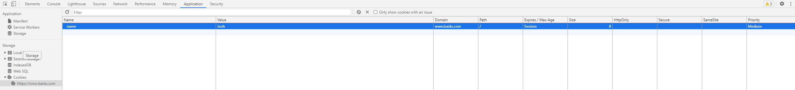

# 聊聊 cookie
::: tip 将会学到
1. Cookie 是怎么工作的
2. Cookie 的格式
3. 如何设置 Cookie
4. 如何修改、删除 Cookie
5. Cookie 编码
:::

`Cookie` 是一些数据, 存储于你电脑上的文本文件中。

当 `web` 服务器向浏览器发送 `web` 页面时，在连接关闭后，服务端不会记录用户的信息。

`Cookie` 的作用就是用于解决 "如何记录客户端的用户信息":
- 当用户访问 `web` 页面时，他的名字可以记录在 `cookie` 中。
- 在用户下一次访问该页面时，可以在 `cookie` 中读取用户访问记录。


## 1. Cookie 是怎么工作的
- 存储 `cookie` 是浏览器提供的功能。
- `cookie` 其实是存储在浏览器中的纯文本，
- 浏览器的安装目录下会专门有一个 `cookie` 文件夹来存放各个域下设置的 `cookie`

当网页要发 `http` 请求时，浏览器会先检查是否有相应的`cookie`，有则自动添加在`request header`中的`cookie`字段中。这些是浏览器自动帮我们做的，而且每一次http请求浏览器都会自动帮我们做。所以对于那设置“每次请求都要携带的信息（最典型的就是身份认证信息）”就特别适合放在cookie中，其他类型的数据就不适合了。

每个域名下的 `cookie` 的大小最大为`4KB`，每个域名下的 `cookie` 数量最多为`20`个（但很多浏览器厂商在具体实现时支持大于20个）

## 2. Cookie 的格式
### document.cookie
`JS` 原生的 `API` 提供了获取`cookie`的方法：`document.cookie`（注意，这个方法只能获取非 HttpOnly 类型的cookie）。在 `console` 中执行这段代码可以看到结果如下图：


### cookie 的属性选项
- **expires**
    - `expires` 选项用来设置 `cookie` 什么时间内有效
    > 如果没有设置该选项，则默认有效期为session，即会话cookie。这种cookie在浏览器关闭后就没有了

- **domain 和 path**
    - `domain`是域名，`path` 是路径，两者加起来就构成了 `URL`，`domain` 和 `path` 一起来限制 `cookie` 能被哪些 `URL` 访问

- **secure**
    - `secure` 选项用来设置 `cookie` 只在确保安全的请求中才会发送，当请求是 `HTTPS` 或者其他安全协议时，包含 `secure` 选项的 `cookie` 才能被发送至服务器。

- **httpOnly**
    - 这个选项用来设置 `cookie` 是否能通过 `js` 去访问
    > 默认情况下，`cookie` 不会带 `httpOnly` 选项(即为空)，所以默认情况下，客户端是可以通过 `js` 代码去访问（包括读取、修改、删除等）这个 `cookie` 的。当 `cookie` 带 `httpOnly` 选项时，客户端则无法通过 `js` 代码去访问（包括读取、修改、删除等）这个 `cookie`


## 3. 如何设置 cookie？

### 服务端设置 Cookie
服务端会在 `response header` 中的 `set-cookie` 字段来设置 `Cookie` 

一个 `set-Cookie` 字段只能设置一个 `cookie`，当你要想设置多个 `cookie`，需要添加同样多的 `set-Cookie` 字段

### 客户端设置 Cookie
在客户端中我们也可以通过 `JS` 代码来设置 `Cookie`， 在浏览器控制台中我们执行下面代码
```js
document.cookie = "name=Jonh; ";
```


## 4. 如何修改、删除 Cookie

### 修改 cookie
要想修改一个 `cookie`，只需要重新赋值就行，旧的值会被新的值覆盖。但要注意一点，在设置新 `cookie` 时，`path/domain` 这几个选项一定要旧 `cookie` 保持一样。否则不会修改旧值，而是添加了一个新的 `cookie`

### 删除 cookie
删除一个 `cookie` 也挺简单，也是重新赋值，只要将这个新cookie的expires 选项设置为一个过去的时间点就行了。但同样要注意，path/domain/这几个选项一定要旧cookie 保持一样

## 5. cookie 编码
`cookie` 其实是个字符串，但这个字符串中逗号、分号、空格被当做了特殊符号。所以当 `cookie` 的 `key` 和 `value` 中含有这3个特殊字符时，需要对其进行额外编码，一般会用 `escape` 进行编码，读取时用 `unescape` 进行解码

```js
var key = escape("name;value");
var value = escape("this is a value contain , and ;");
document.cookie= key + "=" + value + "; expires=Thu, 26 Feb 2116 11:50:25 GMT; domain=sankuai.com; path=/";
```


