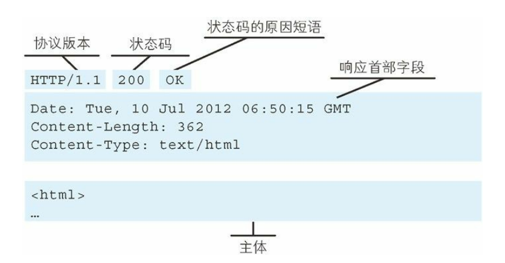

# 图解 HTTP
## Web 及网络基础
通过发送请求获取服务器资源的 Web 浏览器等等，称为 **客户端(client)**，Web 是建立在 HTTP 协议上通信的

### 1. HTTP 的诞生
借助多文档之间相互关联形成的超文本（HyperText），连成可相互参阅的 WWW（World Wide Web，万维网）。

### 2. 网络基础 TCP/IP

#### ● TCP/IP 协议族

 **TCP/IP**：互联网相关的各类协议族的总称

通常使用的网络(包括互联网) 是在 `TCP/IP` 协议族的基础上运作的，而 `HTTP` 属于它内部的一个子集。

> 计算机与网络设备要相互通信，双方就必须基于相同的方法。比如，
如何探测到通信目标、由哪一边先发起通信、使用哪种语言进行通
信、怎样结束通信等规则都需要事先确定。不同的硬件、操作系统之
间的通信，所有的这一切都需要一种规则。而我们就把这种规则称为
**协议（protocol）**

#### ● TCP/IP 的分层管理
TCP/IP 协议族按层次分别分为以下 4 层：
- 应用层：决定了向用户提供 **应用服务** 时通信的活动，**HTTP 协议也处于该层**
    - 应用服务：`FTP（FileTransfer Protocol，文件传输协议）`和 `DNS（Domain Name System，域名系统）`服务就是其中两类。
- 传输层：对上层应用层，提供处于网络连接中的两台计算机之间的数据传输
    - 性质不同的协议：`TCP（Transmission ControlProtocol，传输控制协议）` 和 `UDP（User Data Protocol，用户数据报协议）`
- 网络层：用来处理在网络上流动的数据包
    - 该层规定了通过怎样的路径（所谓的传输路线）到达对方计算机，并把数据包传送给对方
    - 数据包是网络传输的最小数据单位
- 数据链路层：用来处理连接网络的硬件部分
    - 包括控制操作系统、硬件的设备驱动、NIC（Network Interface Card，网络适配器，即网卡），及光纤等物理可见部分（还包括连接器等一切传输媒介）。

#### ● TCP/IP 通信传输流

发送端在层与层之间传输数据时，每经过一层时必定会被打上一个该层所属的首部信息。反之，接收端在层与层传输数据时，每经过一层时会把对应的首部消去

这种把数据信息包装起来的做法称为 **封装（encapsulate）**。

### 3. IP、TCP 和 DNS 协议
下面对在 `TCP/IP` 协议族中与 `HTTP` 密不可分的 3 个协议`IP`、`TCP` 和 `DNS` 进行说明

#### ● 负责传输的 IP 协议
`IP` 和 `IP 地址` 不是一样的东西，`IP` 其实是一种协议的名称

`IP 协议` 的作用是 **把各种数据包传送给对方**，而要保证确实传送到对方，则需要满足两个重要条件：
1. IP 地址：节点被分配到的地址
2. MAC 地址：网卡所属的固定地址

`IP 地址`可以和 `MAC 地址`进行配对。`IP 地址` 可变换，但 `MAC 地址` 基本上不会更改。

:::tip ARP 协议
通常通信是经过多台计算机和网络设备中转才能连接到对方。而在进行中转时，会利用下一站中转设备的 `MAC地址` 来搜索下一个中转目标。这时，会采用 `ARP 协议`（Address Resolution Protocol）

**`ARP` 是一种用以解析地址的协议，根据通信方的 `IP 地址` 就可以反查出对应的 `MAC 地址`**
:::

#### ● 确保可靠性的 TCP 协议
按层次分，`TCP` 位于传输层，提供**可靠**的**字节流服务**

也就是说，`TCP 协议` 为了更容易传送大数据才把数据分割，而且 `TCP 协议` 能够确认数据最终是否送达到对方

##### 可靠的传输服务
能够把数据准确可靠地传给对方，为了准确无误地将数据送达目标处，`TCP 协议` 采用了三次握手
1. 发送端首先发送一个带 `SYN 标志` 的数据包给接收端
2. 接收端收到后，回传一个带有 `SYN/ACK 标志` 的数据包以示传达确认信息
3. 最后，发送端再回传一个带 `ACK 标志` 的数据包，代表握手结束。
 

##### 字节流服务
为了方便传输，将大块数据分割成以 `报文段（segment）` 为单位的数据包进行管理

#### ● 负责域名解析的 DNS 服务
`DNS（Domain Name System）服务` 位于应用层的协议，它提供 `域名` 到 `IP 地址` 之间的解析服务

#### ● 各种协议与 HTTP 协议的关系
 

### 4. URI 和 URL

#### ● URI(统一资源标识符)
`URI` 就是 **某个协议方案表示的资源的定位标识符**，协议方案:是指 **访问资源所使用的协议类型名称**
:::tip 采用 HTTP 协议
协议方案就是 `http` ，除此之外，还有 `ftp`、`mailto`、`telnet`、`file` 等
:::

`URI` 是 Uniform Resource Identifier 的缩写。RFC2396 分别对这 3 个单词进行了如下定义。
- Uniform
    - 规定统一的格式可方便处理多种不同类型的资源，而不用根据上下文环境来识别资源指定的访问方式

- Resource: 
    - 资源的定义是 `可标识的任何东西`
    - 除了文档文件、图像或服务（例如当天的天气预报）等能够区别于其他类型的，全都可作为资源
    - 资源不仅可以是单一的，也可以是多数的集合体

- Identifier: 
    - 表示可标识的对象。也称为标识符


**`URI` 用字符串标识某一互联网资源，而 `URL` 表示资源的地点（互联网上所处的位置）可见 `URL` 是 `URI` 的子集**

<br/>

#### ● URI 格式


- **协议方案名**：使用` http:` 或 `https:` 等协议方案名获取访问资源时要指定协议类型。不区分字母大小写，最后附一个冒号（:），也可使用 data: 或 javascript: 这类指定数据或脚本程序的方案名。
- **登录信息（认证）**：指定用户名和密码作为从服务器端获取资源时必要的登录信息（身份认证）。此项是可选项
- **服务器地址**：使用绝对 URI 必须指定待访问的服务器地址，地址可以是：
    - 类似 `hackr.jp` 这种 `DNS` 可解析的名称
    - `192.168.1.1` 这类 `IPv4 地址名`
    - `[0:0:0:0:0:0:0:1]` 这样的 `IPv6 地址名`
- **服务端口号**：服务器连接的网络端口号。此项也是可选项，若用户省略则自动使用默认端口号。
- **带层次的文件路径**：指定服务器上的文件路径来定位特指的资源。这与 `UNIX 系统` 的文件目录结构相似。
- **查询字符串**：针对已指定的文件路径内的资源，可以使用查询字符串传入任意参数。此项可选。
- **片段标识符**：使用片段标识符通常可标记出已获取资源中的子资源（文档内的某个位置）

## 简单的 HTTP 协议

### 1. HTTP 协议用于客户端和服务器端之间的通信

`HTTP 协议` 和 `TCP/IP 协议族` 内的其他众多的协议相同：**用于客户端和服务器之间的通信**

请求访问文本或图像等资源的一端称为**客户端**，而提供资源响应的一端称为**服务器端**，按实际情况：
- 两台计算机作为客户端和服务器端的角色有可能会互换
- 就仅从一条通信路线来说，服务器端和客户端的角色是确定的
- 而用 HTTP 协议能够明确区分哪端是客户端，哪端是服务器端

### 2. 通过请求和响应的交换达成通信
HTTP 协议规定，请求从客户端发出，最后服务器端响应该请求并返回

**请求报文**：是由`请求方法`、`请求 URI`、`协议版本`、`可选的请求首部字段` 和 `内容实体` 构成的。


**响应报文**：基本上由`协议版本`、`状态码（表示请求成功或失败的数字代码）`、`用以解释状态码的原因短语`、`可选的响应首部字段`以及`实体主体`构成


### 3. HTTP 是不保存状态的协议
`HTTP` 是一种不保存状态，即 `无状态（stateless）协议`。`HTTP` 这个级别，也就是说，协议对于发送过的请求或响应都不做持久化处理。这是为了**更快地处理大量事务，确保协议的可伸缩性**

`HTTP/1.1` 虽然是无状态协议，但为了实现期望的保持状态功能，于是引入了 `Cookie` 技术。有了 `Cookie` 再用 HTTP 协议通信，就可以管理状态了。有关 `Cookie` 的详细内容稍后讲解。

### 4. 请求 URI 定位资源
`HTTP` 协议使用 `URI` 让客户端定位到资源

当客户端请求访问资源而发送请求时，`URI` 需要将作为请求报文中的请求 `URI` 包含在内


### 5. 告知服务器意图的 HTTP 方法
下面，我们介绍 HTTP/1.1 中可使用的方法:

#### GET ：获取资源
`GET` 方法用来请求访问已被 `URI` 识别的资源。指定的资源经服务器端解析后返回响应内容。

#### POST：传输实体主体
`POST` 方法用来传输实体的主体。

#### PUT：传输文件
`PUT` 方法用来传输文件。就像 FTP 协议的文件上传一样，要求在请求报文的主体中包含文件内容，然后保存到请求 URI 指定的位置。

但是，鉴于 `HTTP/1.1` 的 `PUT` 方法自身不带验证机制，任何人都可以上传文件 , 存在安全性问题，因此一般的 Web 网站不使用该方法。

#### HEAD：获得报文首部
`HEAD` 方法和 `GET` 方法一样，只是不返回报文主体部分。用于确认 `URI` 的有效性及资源更新的日期时间等。

#### DELETE：删除文件
`DELETE` 方法用来删除文件，是与 `PUT` 相反的方法。DELETE 方法按请求 `URI` 删除指定的资源。

但是，`HTTP/1.1` 的 `DELETE` 方法本身和 `PUT` 方法一样不带验证机制

#### OPTIONS：询问支持的方法
`OPTIONS` 方法用来查询针对请求 `URI` 指定的资源支持的方法。

#### TRACE：追踪路径
`TRACE` 方法是让 Web 服务器端将之前的请求通信还回给客户端的方法。

但是，`TRACE` 方法本来就不怎么常用，再加上它容易引发 `XST（Cross-Site Tracing，跨站追踪）`攻击，通常就更不会用到了。

#### CONNECT：要求用隧道协议连接代理
`CONNECT` 方法要求在与代理服务器通信时建立隧道，实现用隧道协议进行 `TCP` 通信。主要使用 `SSL（Secure Sockets Layer，安全套接层）`和 `TLS（Transport Layer Security，传输层安全）`协议把通信内容加 密后经网络隧道传输。

### 6. 使用方法下达命令
向请求 `URI` 指定的资源发送请求报文时，采用称为 **方法** 的命令。

方法的作用在于: **可以指定请求的资源按期望产生某种行为**。方法中有 `GET`、`POST` 和 `HEAD` 等。


### 7. 持久连接节省通信量
`HTTP` 协议的初始版本中，每进行一次 `HTTP` 通信就要断开一次 `TCP` 连接。当文档需要请求大量的资源时，每次的请求都会造成无谓的 `TCP` 连接建立和断开，增加通信量的开销。

#### 持久连接
为解决上述 `TCP` 连接的问题，`HTTP/1.1` 和一部分的 `HTTP/1.0` 想出了持久连接（`HTTP Persistent Connections`，也称为` HTTP keep-alive` 或 `HTTP connection reuse`）的方法。

- 特点：**只要任意一端没有明确提出断开连接，则保持 TCP 连接状态**
- 好处：**减少了 TCP 连接的重复建立和断开所造成的额外开销，减轻了服务器端的负载**

但是，服务器端和客户端都需要支持持久连接

#### 管线化
持久连接使得多数请求以 **管线化（pipelining）方式** 发送成为可能

从前发送请求后需等待并收到响应，才能发送下一个请求。管线化技术出现后，不用等待响应亦可直接发送下一个请求。

> 比如，当请求一个包含 10 张图片的 HTMLWeb 页面，与挨个连接相比，用持久连接可以让请求更快结束。而管线化技术则比持久连接还要快。请求数越多，时间差就越明显。

### 8. 使用 Cookie 的状态管理
`HTTP` 是无状态协议，无法根据之前的状态进行本次的请求处理，

无状态协议当然也有它的优点。由于不必保存状态，自然可减少服务器的 CPU 及内存资源的消耗，

保留无状态协议这个特征的同时又要解决类似的矛盾问题，于是引入了 `Cookie` 技术：


:::tip Cookie
通过在请求和响应报文中写入 `Cookie` 信息来控制客户端的状态

`Cookie` 会根据从服务器端发送的响应报文内的一个叫做 `Set-Cookie` 的首部字段信息，通知客户端保存 `Cookie`。当下次客户端再往该服务器发送请求时，客户端会自动在请求报文中加入 `Cookie` 值后发送出去。

服务器端发现客户端发送过来的 `Cookie` 后，会去检查究竟是从哪一个客户端发来的连接请求，然后对比服务器上的记录，最后得到之前的状态信息。
:::


## HTTP 报文内的 HTTP 信息
`HTTP` 通信过程包括从客户端发往服务器端的请求及从服务器端返回客户端的响应，下面来了解一下请求和响应是怎样运作的

### 1. HTTP 报文
用于 HTTP 协议交互的信息被称为 HTTP 报文。
- 请求端（客户端）的HTTP 报文叫做 **请求报文**，
- 响应端（服务器端）的叫做 **响应报文**。

`HTTP 报文` 大致可分为 **报文首部** 和 **报文主体** 两块。两者由最初出现的 `空行（CR+LF）来` 划分。通常，并不一定要有报文主体。

### 2. 请求报文及响应报文的结构

请求报文和响应报文的 **首部内容** 由以下数据组成:
- 请求行：包含用于请求的方法，请求 `URI` 和 `HTTP` 版本
- 状态行：包含表明响应结果的状态码，原因短语和 `HTTP` 版本
- 首部字段：包含表示请求和响应的各种条件和属性的各类首部

一般有 4 种首部，分别是：`通用首部`、`请求首部`、`响应首部` 和 `实体首部`。

### 3. 编码提升传输速率
1. `HTTP` 在传输数据时可以按照数据原貌直接传输
2. 但也可以在传输过程中通过编码提升传输速率
3. 通过在传输时编码，能有效地处理大量的访问请求
4. 但是，编码的操作需要计算机来完成，因此会消耗更多的 `CPU` 等资源

#### 报文主体和实体主体的差异
- 报文（message）
    - 是 HTTP 通信中的基本单位，由 8 位组字节流（octet sequence，其中 octet 为 8 个比特）组成，通过 HTTP 通信传输。

- 实体（entity）
    - 作为请求或响应的有效载荷数据（补充项）被传输，其内容由实体首部和实体主体组成。

通常，报文主体等于实体主体。只有当传输中进行编码操作时，实体主体的内容发生变化，才导致它和报文主体产生差异。

#### ● 压缩传输的 `内容编码`
**内容编码**：指明应用在实体内容上的编码格式，并保持实体信息原样压缩。内容编码后的实体由客户端接收并负责解码。

常用的内容编码有以下几种：
- gzip（GNU zip）
- compress（UNIX 系统的标准压缩）
- deflate（zlib）
- identity（不进行编码）

#### ● 分割发送的 `分块传输编码`
**分块传输编码**：把实体主体分块，会将实体主体分成多个部分（块），每一块都会用十六进制来标记块的大小，而实体主体的最后一块会使用 `0(CR+LF)` 来标记。

使用分块传输编码的实体主体会由接收的客户端负责解码，恢复到编码前的实体主体。

### 4. 发送多种数据的 `多部分对象集合`
**多部分对象集合**：MIME 扩展中会使用一种称为 `多部分对象集合(Multipart)` 的方法，来容纳多份不同类型的数据

多部分对象集合包含的对象如下:
- multipart/form-data
    - 在 Web 表单文件上传时使用


- multipart/byteranges
    - 状态码 206（Partial Content，部分内容）响应报文包含了多个范围的内容时使用


- 在 `HTTP` 报文中使用多部分对象集合时，需要在首部字段里加上 `Content-type`

- 使用 `boundary` 字符串来划分 `多部分对象集合` 指明的各类实体，各个实体的起始行和最后插入 `--` 标记(例如：--AaB03x--)

### 5. 获取部分内容的 `范围请求`
**范围请求（Range Request）**：指定范围发送的请求
- **范围请求**：响应会返回状态码为 `206 Partial Content` 的响应报文
- **多重范围的范围请求**：响应会在首部字段 `Content-Type` 标明 `multipart/byteranges` 后返回响应报文

如果服务器端无法响应范围请求，则会返回状态码 `200 OK` 和完整的实体内容。

执行范围请求时，会用到首部字段 `Range` 来指定资源的 `byte` 范围，`byte` 范围的指定形式如下：

- 5001~10 000 字节
    ```http
    Range: bytes=5001-10000
    ```
- 从 5001 字节之后全部的
    ```http
    Range: bytes=5001-
    ```
- 从一开始到 3000 字节和 5000~7000 字节的多重范围
    ```http
    Range: bytes=-3000, 5000-7000
    ```


### 6. 内容协商返回最合适的内容
**内容协商（Content Negotiation）**：指客户端和服务器端就响应的资源内容进行交涉，然后提供给客户端最为适合的资源，内容协商会以响应资源的`语言`、`字符集`、`编码方式`等作为判断的基准。

例如，当浏览器的默认语言为英语或中文，访问相同 URI 的 Web 页面时，则会显示对应的英语版或中文版的 Web 页面。

<br/>

请求报文中的某些首部字段就是判断的基准：
- Accept
- Accept-Charset
- Accept-Encoding
- Accept-Language
- Content-Language

<br/>

内容协商技术有以下 3 种类型：
- 服务器驱动协商（Server-driven Negotiation）
    - **由服务器端进行内容协商**。以请求的首部字段为参考，在服务器端自动处理。但对用户来说，以浏览器发送的信息作为判定的依据，并不一定能筛选出最优内容。

- 客户端驱动协商（Agent-driven Negotiation）
    - **由客户端进行内容协商的方式**。用户从浏览器显示的可选项列表中手动选择。还可以利用 JavaScript 脚本在 Web 页面上自动进行上述选择。比如按 OS 的类型或浏览器类型，自行切换成 PC 版页面或手机版页面。

- 透明协商（Transparent Negotiation）
    - **是服务器驱动和客户端驱动的结合体**，是由服务器端和客户端各自进行内容协商的一种方法。

## 返回结果的 HTTP 状态码
HTTP 状态码负责表示 **客户端 HTTP 请求的返回结果**、**标记服务器端的处理是否正常**、**通知出现的错误** 等工作。

### 1. 状态码告知从服务器端返回的请求结果
**状态码**：以3位数字和原因短语组成，数字中的第一位指定了响应类型，后两位无分类。响应类型有以下5种：


### 2. 2XX 成功
`2XX` 的响应结果表明请求被正常处理了

在响应报文内，随状态码一起返回的信息会因方法的不同而发生改变

#### ● 200 OK
表示从客户端发来的请求在服务器端被正常处理了


#### ● 204 No Content
该状态码代表服务器接收的请求已成功处理，但在返回的响应报文中不含实体的主体部分

一般在只需要从客户端往服务器发送信息，而对客户端不需要发送新信息内容的情况下使用

#### ● 206 Partial Content
该状态码表示客户端进行了范围请求，而服务器成功执行了这部分的 `GET` 请求。响应报文中包含由 `Content-Range` 指定范围的实体内容。

### 3. 3XX 重定向
`3XX` 响应结果表明浏览器需要执行某些特殊的处理以正确处理请求

#### ● 301 Moved Permanently
**永久性重定向**。该状态码表示请求的资源已被分配了新的 `URI`，以后应使用资源现在所指的 `URI`

如果已经把资源对应的 `URI` 保存为书签了，这时应该按 `Location` 首部字段提示的 `URI` 重新保存

#### ● 302 Found
**临时性重定向**。该状态码表示请求的资源已被分配了新的 URI，希望用户（本次）能使用新的 URI 访问。

和 `301 Moved Permanently` 状态码相似，但 `302` 状态码代表的资源不是被永久移动，只是临时性质的。换句话说，已移动的资源对应的 `URI` 将来还有可能发生改变

#### ● 303 See Other
**该状态码表示由于请求对应的资源存在着另一个 `URI`，应使用 `GET` 方法定向获取请求的资源**

`303 状态码` 和 `302 Found 状态码` 有着相同的功能，但 `303 状态码` 明确表示客户端应当 **采用 `GET` 方法获取资源**，这点与 `302 状态码` 有区别。

#### ● 304 Not Modified
该状态码表示客户端发送 **附带条件的请求** 时，服务器端允许请求访问资源，但未满足条件的情况。`304 状态码`返回时，不包含任何响应的主体部分。`304` 虽然被划分在 `3XX` 类别中，但是和重定向没有关系。
- 附带条件的请求：是指采用 `GET` 方法的请求报文中包含 `If-Match`，`If-Modified-Since`，`If-None-Match`，`If-Range`，`If-Unmodified-Since` 中任一首部。
#### ● 307 Temporary Redirect
**临时重定向**。该状态码与 `302 Found` 有着相同的含义，`307` 会遵照浏览器标准，不会从 `POST` 变成 `GET`。但是，对于处理响应时的行为，每种浏览器有可能出现不同的情况。

### 4. 4XX 客户端错误
4XX 的响应结果表明客户端是发生错误的原因所在。

#### ● 400 Bad Request
**该状态码表示请求报文中存在语法错误**

#### ● 401 Unauthorized
**该状态码表示发送的请求需要有通过 `HTTP 认证（BASIC 认证、DIGEST 认证）`的认证信息**。另外若之前已进行过 1 次请求，则表示用户认证失败

返回含有 `401` 的响应必须包含一个适用于被请求资源的 `WWW-Authenticate 首部`用以质询（challenge）用户信息。当浏览器初次接收到 `401` 响应，会弹出认证用的对话窗口。

#### ● 403 Forbidden
**该状态码表明对请求资源的访问被服务器拒绝了**

未获得文件系统的访问授权，访问权限出现某些问题（从未授权的发送源 IP 地址试图访问）等列举的情况都可能是发生 403 的原因。

#### ● 404 Not Found
**该状态码表明服务器上无法找到请求的资源**

除此之外，也可以在服务器端拒绝请求且不想说明理由时使用

### 5. 5XX 服务器错误
`5XX` 的响应结果表明服务器本身发生错误。

#### 500 Internal Server Error
**该状态码表明服务器端在执行请求时发生了错误**。也有可能是 Web应用存在的 bug 或某些临时的故障。

#### 503 Service Unavailable
**该状态码表明服务器暂时处于超负载或正在进行停机维护，现在无法处理请求**

如果事先得知解除以上状况需要的时间，最好写入 `RetryAfter` 首部字段再返回给客户端。

## 与 HTTP 协作的 Web 服务器
一台 Web 服务器可搭建多个独立域名的 Web 网站，也可作为通信路径上的中转服务器提升传输效率

### 1. 用单台虚拟主机实现多个域名
`HTTP/1.1` 规范允许一台 HTTP 服务器搭建多个 `Web` 站点

**虚拟主机的功能**：即使物理层面只有一台服务器，使用虚拟机的功能，则可以假想已具有多台服务器

相同的 IP 地址下，由于虚拟主机可以寄存多个不同主机名和域名的 Web 网站，因此在发送 HTTP 请求时，

**必须在 `Host` 首部内完整指定主机名或域名的 `URI`**。

### 2. 通信数据转发程序
`HTTP` 通信时，除客户端和服务器以外，还有一些用于通信数据转发的应用程序，例如`代理`、`网关和隧道`。它们可以配合服务器工作。

这些应用程序和服务器可以将 **请求转发** 给通信线路上的下一站服务器，并且能接收从那台服务器发送的 **响应再转发** 给客户端。

#### ● 代理
是一种有转发功能的应用程序，基本行为就是接收客户端发送的请求后转发给其他服务器
- 代理不改变请求 `URI`，会直接发送给前方持有资源的目标服务器
- 持有资源实体的服务器被称为 **源服务器**。从源服务器返回的响应经过代理服务器后再传给客户端。


在 HTTP 通信过程中，可级联多台代理服务器。请求和响应的转发会经过数台类似锁链一样连接起来的代理服务器，每次通过代理服务器转发请求或响应时，会追加写入 `Via 首部信息`

##### 使用代理服务器的好处
利用缓存技术（稍后讲解）减少网络带宽的流量，组织内部针对特定网站的访问控制，以获取访问日志为主要目的，等等。

##### 代理服务器使用方法，按两种基准分类
:::tip 缓存代理
代理转发响应时，缓存代理（Caching Proxy）会预先将资源的副本（缓存）保存在代理服务器上。当代理再次接收到对相同资源的请求时，就可以不从源服务器那里获取资源，而是将之前缓存的资源作为响应返回。
:::

:::tip 透明代理
转发请求或响应时，不对报文做任何加工的代理类型被称为透明代理（Transparent Proxy）。反之，对报文内容进行加工的代理被称为非透明代理。
:::

#### ● 网关
是转发其他服务器通信数据的服务器，接收从客户端发送来的请求时，它就像 **自己拥有资源的源服务器一样对请求进行处理**
- 利用网关能提高通信的安全性，因为可以在客户端与网关之间的通信线路上加密以确保连接的安全，例如
    - 网关可以连接数据库，使用`SQL语句`查询数据
    - 网关可以和信用卡结算系统联动


利用网关可以由 **HTTP 请求转化为其他协议通信**


#### ● 隧道
隧道的目的：**是确保客户端能与服务器进行安全的通信**
- 隧道可按要求建立起一条与其他服务器的通信线路，届时使用 `SSL` 等加密手段进行通信
- 隧道本身不会去解析 `HTTP` 请求。也就是说，请求保持原样中转给之后的服务器。隧道会在通信双方断开连接时结束。


通过隧道的传输，可以和远距离的服务器安全通信。隧道本身是透明的，客户端不用在意隧道的存在

### 3. 保存资源的缓存
缓存：是指代理服务器或客户端本地磁盘内保存的资源副本。
- 利用缓存可减少对源服务器的访问，因此也就节省了通信流量和通信时间。

#### ● 缓存的有效期限
即使存在缓存，也会因为客户端的要求、缓存的有效期等因素，向源服务器确认资源的有效性。若判断缓存失效，缓存服务器将会再次从源服务器上获取“新”资源。


#### ● 客户端的缓存
缓存不仅可以存在于缓存服务器内，还可以存在客户端浏览器中。以 Internet Explorer 程序为例，把客户端缓存称为 `临时网络文件（Temporary Internet File）`。
- 浏览器缓存如果有效，就不必再向服务器请求相同的资源了，可以直接从本地磁盘内读取。
- 和缓存服务器相同的一点是，当判定缓存过期后，会向源服务器确认资源的有效性。若判断浏览器缓存失效，浏览器会再次请求新资源。


## HTTP 首部
HTTP 协议的请求和响应报文中必定包含 HTTP 首部，首部内容为客户端和服务器分别处理请求和响应提供所需要的信息

下面一起来学习 `HTTP 首部`的**结构**，以及**首部中各字段的用法**。

### 1. HTTP 报文首部


图：HTTP 报文的结构

#### ● HTTP 请求报文
在请求中，`HTTP` 报文由`方法`、`URI`、`HTTP 版本`、`HTTP 首部字段`等部分构成。


访问 [http://hackr.jp/](http://hackr.jp/) 时，请求报文的首部信息
```http
GET / HTTP/1.1
Host: hackr.jp
User-Agent: Mozilla/5.0 (Windows NT 6.1; WOW64; rv:13.0) Gecko/20100101 Firefox/13.0
Accept: text/html,application/xhtml+xml,application/xml;q=0.9,
*/*; q=0.8
Accept-Language: ja,en-us;q=0.7,en;q=0.3
Accept-Encoding: gzip, deflate
DNT: 1
Connection: keep-alive
If-Modified-Since: Fri, 31 Aug 2007 02:02:20 GMT
If-None-Match: "45bae1-16a-46d776ac"
Cache-Control: max-age=0
```

#### ● HTTP 响应报文
在响应中，HTTP 报文由 `HTTP 版本`、`状态码（数字和原因短语）`、`HTTP 首部字段` 3 部分构成。


请求访问 [http://hackr.jp/](http://hackr.jp/) 时，返回的响应报文的首部信息
```http
HTTP/1.1 304 Not Modified
Date: Thu, 07 Jun 2012 07:21:36 GMT
Server: Apache
Connection: close
Etag: "45bae1-16a-46d776ac"
```

### 2. HTTP 首部字段

#### ● HTTP 首部字段传递重要信息
使用首部字段是为了给浏览器和服务器提供报文主体大小、所使用的语言、认证信息等内容。

#### ● HTTP 首部字段结构
HTTP 首部字段是由首部字段名和字段值构成的，中间用冒号 `:` 分隔：`首部字段名: 字段值`

```http
Content-Type: text/html
```
#### ● 4 种 HTTP 首部字段类型
1. 通用首部字段（General Header Fields）
    - 请求报文和响应报文两方都会使用的首部。
2. 请求首部字段（Request Header Fields）
    - 从客户端向服务器端发送请求报文时使用的首部。补充了请求的`附加内容`、`客户端信息`、`响应内容相关优先级`等信息。
3. 响应首部字段（Response Header Fields）
    - 从服务器端向客户端返回响应报文时使用的首部。补充了响应的`附加内容`，也会要求`客户端附加额外的内容信息`。
4. 实体首部字段（Entity Header Fields）
    - 针对请求报文和响应报文的实体部分使用的首部。补充了`资源内容更新时间`等与实体有关的信息。

#### ● HTTP/1.1 首部字段一览
1. **通用首部字段**


<br/>

2. **请求首部字段**


<br/>

3. **响应首部字段**


<br/>

4. **实体首部字段**


#### ● 非 HTTP/1.1 首部字段
在 HTTP 协议通信交互中使用到的首部字段，不限于 `RFC2616` 中定义的 `47` 种首部字段。

还有 `Cookie`、`Set-Cookie` 和 `Content-Disposition` 等在其他 `RFC` 中定义的首部字段，它们的使用频率也很高。

#### ● End-to-end 首部和 Hop-by-hop 首部
HTTP 首部字段将定义成缓存代理和非缓存代理的行为，分成 2 种类型。

- 端到端首部（End-to-end Header）
    - 分在此类别中的首部会转发给请求 / 响应对应的最终接收目标，且必须保存在由缓存生成的响应中，另外规定它必须被转发
- 逐跳首部（Hop-by-hop Header）
    - 分在此类别中的首部只对单次转发有效，会因通过缓存或代理而不再转发。`HTTP/1.1` 和之后版本中，如果要使用 `hop-by-hop` 首部，需提供 `Connection` 首部字段。

下面列举了 HTTP/1.1 中的逐跳首部字段。除这 8 个首部字段之外，其他所有字段都属于端到端首部。
- Connection
- Keep-Alive
- Proxy-Authenticate
- Proxy-Authorization
- Trailer
- TE
- Transfer-Encoding
- Upgrade

### 3. HTTP/1.1 通用首部字段
通用首部字段是指，请求报文和响应报文双方都会使用的首部

#### Cache-Control
通过指定首部字段 `Cache-Control` 的指令，就能操作缓存的工作机制。

指令的参数是可选的，多个指令之间通过`,`分隔
```http
Cache-Control: private, max-age=0, no-cache
```
- 缓存请求指令


- 缓存响应指令


#### 表示缓存的指令
- public 指令
    - 当指定使用 public 指令时，则明确表明其他用户也可利用缓存
    ```http
    Cache-Control: public
    ```

- private 指令
    - 当指定 `private` 指令后，响应只以特定的用户作为对象，对于其他用户发送过来的请求，代理服务器则不会返回缓存。这与 `public` 指令的行为相反。
    ```http
    Cache-Control: private
    ```

- no-cache 指令
    - 使用 no-cache 指令的目的是为了防止从缓存中返回过期的资源。
    - 客户端将不会接收缓存过的响应
    - 缓存服务器不能对资源进行缓存
    - 源服务器以后也将不再对缓存服务器请求中提出的资源有效性进行确认，且禁止其对响应资源进行缓存操作。
    ```http
    Cache-Control: no-cache
    ```
#### 控制可执行缓存的对象的指令
- no-store 指令
    - 当使用 no-store 指令时，暗示请求（和对应的响应）或响应中包含机密信息。该指令规定缓存不能在本地存储请求或响应的任一部分。
    ```http
    Cache-Control: no-store
    ```

#### 指定缓存期限和认证的指令
- s-maxage 指令
    - 指令只适用于供多位用户使用的公共缓存服务器(代理)。也就是说，对于向同一用户重复返回响应的服务器来说，这个指令没有任何作用。
    - 当使用 `s-maxage `指令后，则直接忽略对 `Expires` 首部字段及 `max-age` 指令的处理。
    ```http
    Cache-Control: s-maxage=604800（单位 ：秒）
    ```
- max-age 指令
    - 客户端发送的请求中包含 `max-age` 指令时，如果判定缓存资源的缓存时间数值比指定时间的数值更小，那么客户端就接收缓存的资源。当指定 `max-age` 值为 `0`，那么缓存服务器通常需要将请求转发给源服务器
    - 服务器返回的响应中包含 `max-age` 指令时，缓存服务器将不对资源的有效性再作确认，而 `max-age` 数值代表资源保存为缓存的最长时
    ```http
    Cache-Control: max-age=604800（单位：秒）
    ```
- min-fresh 指令
    - 指令要求缓存服务器返回至少还未过指定时间的缓存资源
    > 比如，当指定 min-fresh 为 60 秒后，过了 60 秒的资源都无法作为响应返回了。
    ```http
    Cache-Control: min-fresh=60（单位：秒）
    ```
- max-stale 指令
    - 使用 `max-stale` 可指示缓存资源，即使过期也照常接收。
    > 如果指令未指定参数值，那么无论经过多久，客户端都会接收响应；如果指令中指定了具体数值，那么即使过期，只要仍处于 max-stale指定的时间内，仍旧会被客户端接收。
    ```http
    Cache-Control: max-stale=3600（单位：秒）
    ```
- only-if-cached 指令
    - 表示客户端仅在缓存服务器本地缓存目标资源的情况下才会要求其返回
    > 该指令要求缓存服务器不重新加载响应，也不会再次确认资源有效性。若发生请求缓存服务器的本地缓存无响应，则返回状态码 `504 Gateway Timeout`。
    ```http
    Cache-Control: only-if-cached
    ```
- must-revalidate 指令
    - 代理会向源服务器再次验证即将返回的响应缓存目前是否仍然有效。
    > 若代理无法连通源服务器再次获取有效资源的话，缓存必须给客户端一条 `504（Gateway Timeout）`状态码。另外，使用 `must-revalidate` 指令会忽略请求的 `max-stale` 指令（即使已经在首部使用了 `max-stale`，也不会再有效果）。
    ```http
    Cache-Control: must-revalidate
    ```
- proxy-revalidate 指令
    - 指令要求所有的缓存服务器在接收到客户端带有该指令的请求返回响应之前，必须再次验证缓存的有效性。
    ```http
    Cache-Control: proxy-revalidate
    ```
- no-transform 指令
    - 规定无论是在请求还是响应中，缓存都不能改变实体主体的媒体类型。
    > 这样做可防止缓存或代理压缩图片等类似操作。
    ```http
    Cache-Control: no-transform
    ```

#### Cache-Control 扩展
- cache-extension token
    - 通过 `cache-extension` 标记（token），可以扩展 `Cache-Control` 首部字段内的指令。
    > 如下例，`Cache-Control` 首部字段本身没有 `community` 这个指令。借助 `extension tokens` 实现了该指令的添加。如果缓存服务器不能理解 `community` 这个新指令，就会直接忽略。因此，`extension tokens` 仅对能理解它的缓存服务器来说是有意义的。
    ```http
    Cache-Control: private, community="UCI"
    ```


#### Connection
该首部字段具备如下两个作用
- 控制不再转发给代理的首部字段
    - 在客户端发送请求和服务器返回响应内，使用 Connection 首部字段，可控制不再转发给代理的首部字段（即 Hop-by-hop 首部）
    ```http
    Connection: 不再转发的首部字段名
    ```

    


- 管理持久连接
    - 当服务器端想明确断开连接时，则指定 `Connection` 首部字段的值为 `Close`。
    > `HTTP/1.1` 版本的默认连接都是持久连接。为此，客户端会在持久连接上连续发送请求。
    ```http
    Connection: close
    ```

    

    - `HTTP/1.1` 之前的 `HTTP` 版本的默认连接都是非持久连接。为此，如果想在旧版本的 `HTTP` 协议上维持持续连接，则需要指定 `Connection` 首部字段的值为 `Keep-Alive`。
    ```http
    Connection: Keep-Alive
    ```
    

#### Date


