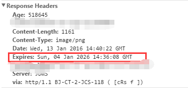
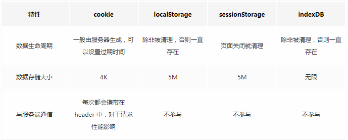
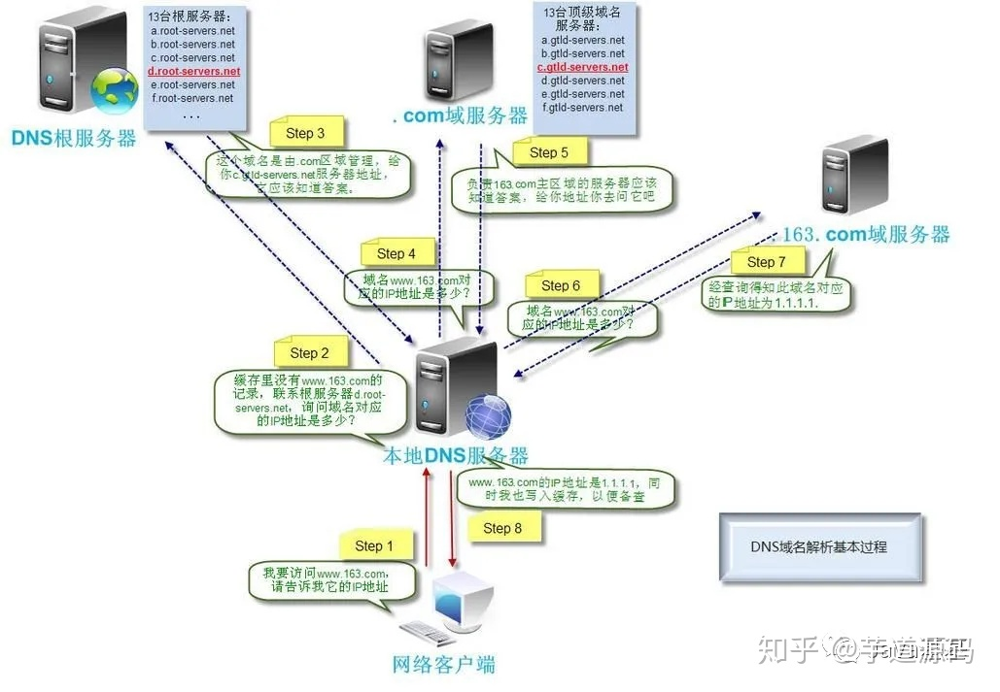
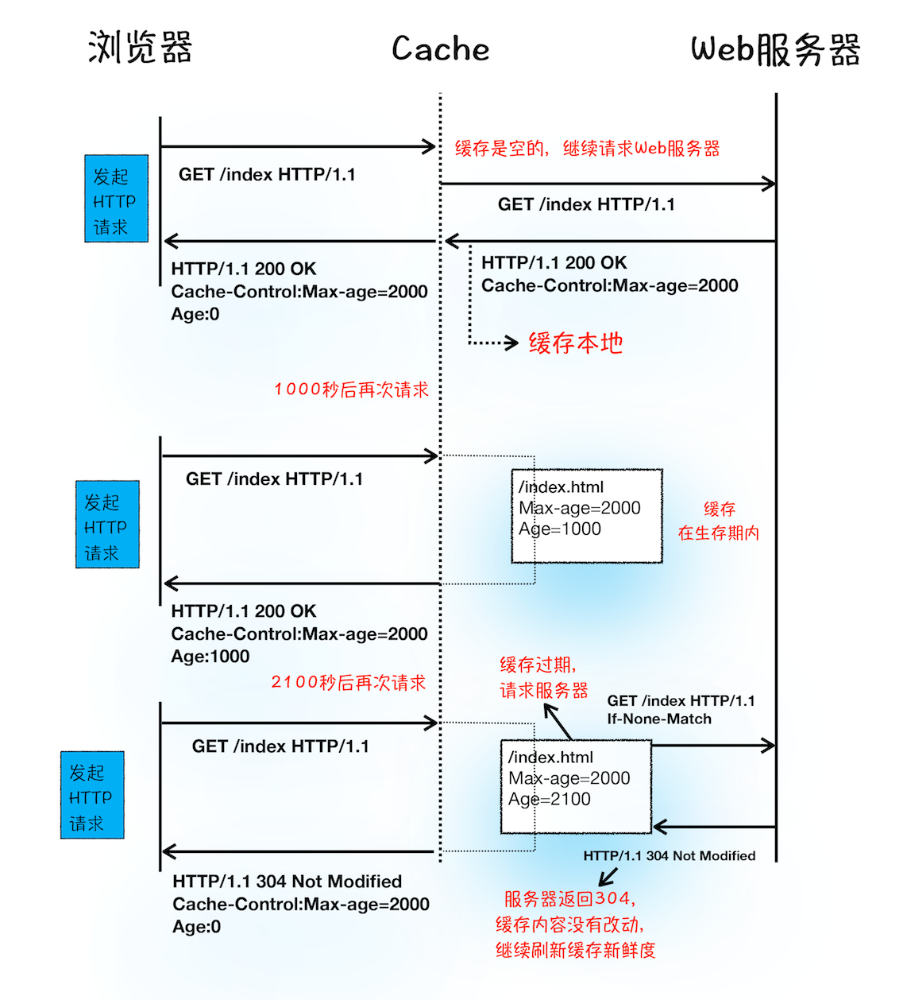

# 浏览器基础知识
[[toc]]

## 浏览器缓存机制
缓存是一种简单高效的性能优化方式，它可以 **减少网络传输所带来的损耗**
> 对于一个数据请求来说，可以分为发起网络请求、后端处理、浏览器响应三个步骤。浏览器缓存可以帮助我们在第一和第三步骤中优化性能。比如说直接使用缓存而不发起请求，或者发起了请求但后端存储的数据和前端一致，那么就没有必要再将数据回传回来，这样就减少了响应数据。

### 1. 浏览器缓存基本认识
缓存策略分为两种：**强缓存** 和 **协商缓存**:

- 浏览器在加载资源时，先根据这个资源的一些`http header`判断它是否命中强缓存，强缓存如果命中，浏览器直接从自己的缓存中读取资源，不会发请求到服务器。比如某个css文件，如果浏览器在加载它所在的网页时，这个css文件的缓存配置命中了强缓存，浏览器就直接从缓存中加载这个css，连请求都不会发送到网页所在服务器

- 当强缓存没有命中的时候，浏览器一定会发送一个请求到服务器，通过服务器端依据资源的另外一些http header验证这个资源是否命中协商缓存，如果协商缓存命中，服务器会将这个请求返回，但是不会返回这个资源的数据，而是告诉客户端可以直接从缓存中加载这个资源，于是浏览器就又会从自己的缓存中去加载这个资源；

- 强缓存与协商缓存的共同点是：如果命中，都是从客户端缓存中加载资源，而不是从服务器加载资源数据；区别是：强缓存不发请求到服务器，协商缓存会发请求到服务器。

- 当协商缓存也没有命中的时候，浏览器直接从服务器加载资源数据。


### 3. 强缓存
强缓存利用 `Expires` 或者 `Cache-Control` 这两个`http response header`实现的。强缓存表示在缓存期间不需要请求，`state code` 为 200。

缓存原理：
1. 浏览器第一次跟服务器请求一个资源，服务器返回这个资源的同时，在 `respone` 的 `header` 加上 `Expires` 的 `header` ，如：



2. 浏览器在接收到这个资源后，会把这个资源连同所有response header一起缓存下来（所以缓存命中的请求返回的header并不是来自服务器，而是来自之前缓存的header）

3. 浏览器再请求这个资源时，先从缓存中寻找，找到这个资源后，拿出它的Expires跟当前的请求时间比较，如果请求时间在Expires指定的时间之前，就能命中缓存，否则就不行

4. 如果缓存没有命中，浏览器直接从服务器加载资源时，Expires Header在重新加载的时候会被更新

Expires是较老的强缓存管理header，由于它是服务器返回的一个绝对时间，在服务器时间与客户端时间相差较大时，缓存管理容易出现问题，比如随意修改下客户端时间，就能影响缓存命中的结果。所以在http1.1的时候，提出了一个新的header，就是Cache-Control，这是一个相对时间，在配置缓存的时候，以秒为单位，用数值表示，如：Cache-Control:max-age=315360000

`Cache-Control`的缓存原理与 `Expires` 基本相同，不同的是：
- `Cache-Control` 第一次的请求时间和`Cache-Control`设定的有效期，计算出一个资源过期时间，再拿这个过期时间跟当前的请求时间比较，就是这一点不同

### 4. 协商缓存
当浏览器对某个资源的请求没有命中强缓存，就会发一个请求到服务器，验证协商缓存是否命中，如果协商缓存命中，请求响应返回的http状态为304并且会显示一个Not Modified的字符串

协商缓存利用的是 `Last-Modified`，`If-Modified-Since` 和 `ETag`、`If-None-Match` 这两对`Header` 来管理的

`Last-Modified`，`If-Modified-Since` 的控制缓存的原理是：
1. 浏览器第一次跟服务器请求一个资源，服务器在返回这个资源的同时，在 `respone` 的 `header` 加上 `Last-Modified` 的 `header` ，这个 `header` 表示这个资源在服务器上的最后修改时间

2. 浏览器再次跟服务器请求这个资源时，在请求头加上`If-Modified-Since`，这个 `header` 的值就是上一次请求时返回的`Last-Modified`的值

3. 服务器再次收到资源请求时，根据浏览器传过来 `If-Modified-Since` 和资源在服务器上的最后修改时间判断资源是否有变化，如果没有变化则返回`304 Not Modified`，但是不会返回资源内容；如果有变化，就正常返回资源内容

> 有时候也会服务器上资源其实有变化，但是最后修改时间却没有变化的情况，而这种问题又很不容易被定位出来，而当这种情况出现的时候，就会影响协商缓存的可靠性。所以就有了另外一对header来管理协商缓存，这对header就是`ETag`、`If-None-Match`。

它们的缓存管理的方式是：

1. 浏览器第一次跟服务器请求一个资源，服务器在返回这个资源的同时，在响应头加上ETag，这个header是服务器根据当前请求的资源生成的一个唯一标识，这个唯一标识是一个字符串，只要资源有变化这个串就不同，跟最后修改时间没有关系，所以能很好的补充Last-Modified的问题

2. 浏览器再次跟服务器请求这个资源时，在request的header上加上If-None-Match的header，这个header的值就是上一次请求时返回的ETag的值

3. 服务器再次收到资源请求时，根据浏览器传过来`If-None-Match`和然后再根据资源生成一个新的`ETag`，如果这两个值相同就说明资源没有变化，否则就是有变化；如果没有变化则返回`304 Not Modified`，但是不会返回资源内容；如果有变化，就正常返回资源内容。与`Last-Modified`不一样的是，当服务器返回`304 Not Modified`的响应时，由于 `ETag` 重新生成过，`response header`中还会把这个 `ETag` 返回，即使这个 `ETag` 跟之前的没有变化：

### 5. 浏览器行为对缓存的影响
如果资源已经被浏览器缓存下来，在缓存失效之前，再次请求时，默认会先检查是否命中强缓存，如果强缓存命中则直接读取缓存，如果强缓存没有命中则发请求到服务器检查是否命中协商缓存，如果协商缓存命中，则告诉浏览器还是可以从缓存读取，否则才从服务器返回最新的资源。这是默认的处理方式，这个方式可能被浏览器的行为改变：
1. 当`ctrl+f5`强制刷新网页时，直接从服务器加载，跳过强缓存和协商缓存
2. 当`f5`刷新网页时，跳过强缓存，但是会检查协商缓存

## ● 事件机制
:::tip 注册事件
注册事件，我们一般使用 `addEventListener(name, callback, boolean)` 函数，该函数支持三个参数，参数说明如下：
- `name`：代表待注册事件的名字，例如：`click` 或者 `mouseover`
- `callback`：代表注册事件的回调函数
- `boolean`：一个 `boolean` 值，为 `true` 代表事件捕获时触发，为 `false` 时代表事件冒泡时触发。参数缺省时默认为 `false`
:::
```js
// 一个注册事件的案例
// 点击DOM元素时。顺序打印出：捕获时触发 冒泡时触发
var box = document.getElementById('box');
box.addEventListener('click', () => {
  console.log('捕获时触发');
}, true);
box.addEventListener('click',() => {
  console.log('冒泡时触发');
}, false);
```

### 事件触发顺序
在浏览器中，事件的触发顺序一般而言依据：**捕获->目标阶段->冒泡**三个顺序。但事件的触发顺序并不总是按以上顺序执行，当我们给同一个DOM元素同时注册捕获和冒泡事件时，事件的触发顺序是按你注册事件的顺序来执行的。
```js
// 点击DOM元素时。顺序打印出：冒泡时触发 捕获时触发
var box = document.getElementById('box');
box.addEventListener('click',() => {
  console.log('冒泡时触发');
}, false);
box.addEventListener('click', () => {
  console.log('捕获时触发');
}, true);
```
**阻止事件冒泡：** stopPropagation()和stopImmediaPropagation()方法都能阻止事件的向上冒泡，但这两者是有区别的：stopImmediaPropagation()还能阻止目标执行别的注册事件。
```js
// 阻止事件冒泡
// 1. 当不阻止冒泡时，window的click会触发
// 2. 当使用stopPropagation()时，window的click不会被触发
// 3. 当使用stopImmediatePropagation()时，DOM的捕获事件不会触发，window的click不会触发
var box = document.getElementById('box');
box.addEventListener('click',(event) => {
  console.log('冒泡时触发');
  // event.stopPropagation();
  // event.stopImmediatePropagation();
}, false);
box.addEventListener('click', (event) => {
  console.log('捕获时触发');
}, true);
window.addEventListener('click', (event) => {
  console.log('子元素点击事件向上冒泡时触发');
})
```

## ● 跨域
:::tip 同源策略
同源策略是指，一个源的客户端脚本在没有明确授权的情况下，不能访问另一个源的客户端脚本。当一个URL和另一个URL，只要协议、域名或者端口号有一个不同，则就会不支持跨域。 解决跨域常用方法有：
1. JSONP
2. CORS
3. Hash
4. postMessage
5. WebSocket
:::

### 1. JSONP实现跨域

:::tip 原理
JSONP实现跨域的原理是利用 `script` 标签没有跨域限制，通过 `src` 指向一个 `ajax` 的URL，最后跟一个回调函数 `callback`
:::
```js
// 一个JSONP跨域的案例
<script src="http://www.baidu.com/getUserInfo?name=张三&callback=jsonp"></script>
function jsonp() {
  console.log('JSONP实现跨域');
}
```
```js
// 实现自己的JSONP
var jsonp = function (url, data, callback) {
  var cbName = 'callback_' + new Date().getTime();
  var queryString = url.indexOf('?') == -1 ? '?' : '&';
  for (var k in data) {
    queryString += k + '=' + data[k] + '&';
  }
  queryString += 'callback=' + cbName;
  var script = document.createElement('script');
  script.src = url + queryString;
  window[cbName] = function (data) {
    callback(data);
    document.body.removeChild(script);
  };
  document.body.appendChild(script);
}
// 实测
jsonp('http://api.douban.com/v2/movie/in_theaters', {'count': 1}, function (data) {
  console.log(data)
})
```

### 2. CORS实现跨域
`CORS(跨域资源共享)` 需要浏览器和服务器同时支持，整个 `CORS` 通信过程，都是浏览器自动完成，不需要用户参与。对于开发者来说，`CORS` 通信与同源的 `AJAX` 通信没有差别，代码完全一样。浏览器一旦发现 `AJAX` 请求跨源，就会自动添加一些附加的头信息，有时还会多出一次附加的请求，但用户不会有感觉。

因此，实现CORS通信的关键是服务器。只要服务器实现了CORS接口，就可以跨源通信。

- **CORS简单请求：** 当请求方式为`get`、`head`、`post`之一，并且`Content-Type`为 `text/plain` 、`multipart/form-data`、`application/x-www-form-urlencoded`三种之一时，就是简单请求。
- **CORS复杂请求：**  当不符合简单请求时，就是复杂请求，对于复杂请求来说，首先会发送一个option请求，用于知道服务器是否允许跨域请求

CORS的详细介绍请看：[跨域资源共享 CORS 详解](http://www.ruanyifeng.com/blog/2016/04/cors.html)

### 3. document.domain实现跨域
:::tip 
`document.domain`只能用于二级域名相同的情况下
:::
```js
// 域名a.test.com 和域名b.test.com
// 设置如下代码后，二级域名为test.com的网站都能实现跨域
document.domain = 'test.com'
```

### 4. postMessage
:::tip 
`postMessage` 一般用于获取嵌套在页面中的第三方页面的数据，一个页面发送请求，另外一个页面判断来源并接受请求。
:::
```html
<body>
  <iframe src="https://www.baidu.com" frameborder="0"></iframe>
</body>
```

```js
// 父页面发送请求
window.frames[0].postMessage('getcolor','*');
// 父页面接受请求
window.addEventListener('message',function(e){
  console.log(e.data); // 打印red
},false);

// 子页面发送请求
window.addEventListener('message',function(e){
  window.parent.postMessage('red','*');
},false);
```

### 5. WebSocket


## ● 浏览器存储
:::tip 
浏览器存储有如下四种方法，每种方法都有不同支持，具体特性请参考表格
1. cookie
2. localStorage
3. sessionStorage
4. indexDB
:::


### 1. Cookie
#### 设置cookie
```js
function setCookie(cname, cvalue, exdays) {
  var d = new Date();
  d.setTime(d.getTime() + (exdays*24*60*60*1000));
  var expires = "expires="+d.toUTCString();
  document.cookie = cname + "=" + cvalue + "; " + expires;
}
setCookie('name', 'why', 30);
```

#### 获取cookie
```js
function getCookie(name) {
  var arr, reg = new RegExp("(^| )" + name + "=([^;]*)(;|$)");
  if (arr = document.cookie.match(reg))
    return unescape(arr[2]);
  else
    return null;
}
setCookie('name', 'why', 30);
console.log(getCookie('name')); // 打印why
```

### 2. localStorage 和 sessionStorage
#### 设置localStorage和sessionStorage
```js
localStorage.setItem('name','why');
sessionStorage.setItem('age',23);
```

#### 获取localStorage和sessionStorage
```js
localStorage.setItem('name','why');
console.log(localStorage.getItem('name')); // 打印why
sessionStorage.setItem('age',23);
console.log(sessionStorage.getItem('age'));// 打印23
```

### 3. indexDB
`IndexedDB` 就是浏览器提供的本地数据库，它可以被网页脚本创建和操作。`IndexedDB` 允许储存大量数据，提供查找接口，还能建立索引
:::tip 对象接口
- 数据库：IDBDatabase 对象
- 对象仓库：IDBObjectStore 对象
- 索引： IDBIndex 对象
- 事务： IDBTransaction 对象
- 操作请求：IDBRequest 对象
- 指针： IDBCursor 对象
- 主键集合：IDBKeyRange 对象
:::
详细内容参考：[阮一峰--浏览器数据库 IndexedDB 入门教程](http://www.ruanyifeng.com/blog/2018/07/indexeddb.html)

## ● cookie、sessionStorage和localStorage的区别
存储时效来说：
- `cookie` 可以手动设置失效期，默认为会话级
- `sessionStorage` 的存储时长是会话级
- `localStorage` 的存储时长是永久，除非用户手动利用浏览器的工具删除

<br/>

访问的局限性：
- `cookie` 可以设置路径 `path`，所有他要比另外两个多了一层访问限制
- `localStorage`和 `sessionStorage` 的访问限制是文档源级别，即协议、主机名和端口
- 还要注意的是，`cookie` 可以通过设置 `domain` 属性值，可以不同二级域名下共享`cookie`，而 `Storage` 不可以，
    > 比如http://image.baidu.com的cookie http://map.baidu.com是可以访问的，前提是Cookie的domain设置为".http://baidu.com"，而Storage是不可以的（这个很容易实验，就不细说了）

<br/>

存储大小限制：
- `cookie` 适合存储少量数据，他的大小限制是个数进行限制，每个浏览器的限制数量不同
- `Storage` 的可以存储数据的量较大，此外他是通过占用空间大小来做限制的，每个浏览器的实现也是不同的

<br/>

操作方法：
- `cookie` 是作为 `document` 的属性存在，并没有提供标准的方法来直接操作`cookie`
- `Storage` 提供了 `setItem()` 和 `getItem()` 还有 `removeItem()` 方法，操作方便不易出错

<br/>

其他：
- `cookie` 在发送 `http` 请求时，会将本地的 `cookie` 作为 `http` 头部信息传递给服务器
- `cookie` 可以由服务器通过 `http` 来设定
 
## ● cookie由哪些部分组成？

除了基础的键值对外，`cookie` 还有下面的属性：
- Expires ：`cookie` 最长有效期
- Max-Age：在 `cookie` 失效之前需要经过的秒数
    > 当 `Expires` 和 `Max-Age` 同时存在时，文档中给出的是已 `Max-Age` 为准，可是我自己用`Chrome`实验的结果是取二者中最长有效期的值
- Domain：指定 `cookie` 可以送达的主机名。
- Path：指定一个 `URL` 路径，这个路径必须出现在要请求的资源的路径中才可以发送 `Cookie` 首部
- Secure：一个带有安全属性的 `cookie` 只有在请求使用`SSL`和`HTTPS`协议的时候才会被发送到服务器。
- HttpOnly：设置了 `HttpOnly` 属性的 `cookie` 不能使用 `JavaScript` 经由 `Document.cookie` 属性、`XMLHttpRequest` 和 `Request APIs` 进行访问，以防范跨站脚本攻击（XSS）。


## ● Service Worler
`Service Worker` 是运行在浏览器背后的独立线程，一般可以用来实现缓存功能。使用 `Service Worker` 的话，传输协议必须为 HTTPS。因为 `Service Worker` 中涉及到请求拦截，所以必须使用 `HTTPS` 协议来保障安全。

`Service Worker` 实现缓存功能一般分为三个步骤：
- 首先需要先注册 `Service Worker`
- 监听到 `install` 事件以后就可以缓存需要的文件


## ● 网页从输入网址到渲染完成经历了哪些过程？
### Chrome 架构
目前 `Chrome` 采用的是多进程的架构模式，可分为主要的五类进程，分别是：`浏览器（Browser）主进程`、 `GPU 进程`、`网络（NetWork）进程`、`多个渲染进程` 和 `多个插件进程`
- **浏览器进程**: 主要负责界面显示、用户交互、子进程管理，同时提供存储等功能。
- **渲染进程**：核心任务是将 `HTML`、`CSS` 和 `JavaScript` 转换为用户可以与之交互的网页，排版引擎 `Blink` 和 `JavaScript` 引擎 `V8` 都是运行在该进程中，默认情况下，`Chrome` 会为每个 `Tab` 标签创建一个渲染进程。出于安全考虑，渲染进程都是运行在沙箱模式下
- **GPU进程**：其实，`Chrome` 刚开始发布的时候是没有 `GPU` 进程的。而 `GPU` 的使用初衷是为了实现`3D CSS`的效果，只是随后`网页`、`Chrome的UI界面` 都选择采用 `GPU` 来绘制，这使得 `GPU` 成为浏览器普遍的需求。最后，`Chrome` 在其多进程架构上也引入了 `GPU` 进程。
- **网络进程**：主要负责页面的网络资源加载，之前是作为一个模块运行在浏览器进程里面的，直至最近才独立出来，成为一个单独的进程。
- **插件进程**：主要是负责插件的运行，因插件易崩溃，所以需要通过插件进程来隔离，以保证插件进程崩溃不会对浏览器和页面造成影响

### 导航阶段


#### 1. 用户输入URL
- 1. 浏览器进程检查 `url`，组装协议，构成完整的 `url`；
- 2. 浏览器进程通过进程间通信（IPC）把 `url` 请求发送给网络进程；


#### 2. URL 请求过程
- 3. 网络进程接收到 `url` 后检查本地缓存是否缓存了该请求资源，如果有则将该资源返回给浏览器进程；
- 4. 否则查找是否存在 `DNS` 缓存，如果没有，先进行 `DNS` 解析，获取到请求域名对应的服务器 `IP` 地址；
- 5. 判断请求协议是否为 `HTTPS` ，如果是，则建立 `TLS` 连接；
- 6. 否则，建立 `TCP` 连接，客户端通过三次握手与服务端建立连接；
- 7. 浏览器向服务器发送 `HTTP` 请求；
- 8. 服务器接收到请求信息后，根据请求信息生成响应数据，发给网络进程；
- 9. 网络进程解析响应数据；
    - 如果是 `301/302` 表示服务器已更换域名需要重定向，这时网络进程会从响应头的 `Location` 字段里面读取重定向的地址，然后再发起新的 `HTTP` 或者 `HTTPS` 请求；
    - 如果是 `200`，就检查`Content-Type`字段，值为 `text/html` 说明是 `HTML` 文档，那么浏览器则会继续进行导航流程；是 `application/octet-stream` 说明是文件下载，那么该请求会被提交给浏览器的下载管理器，同时该 `URL` 请求的导航流程就此结束；
- 10. 准备渲染进程，浏览器进程检查当前 `url` 是否与之前打开了渲染进程的页面属于同一站点，如果相同，则复用原来的进程，如果不同，则开启新的渲染进程；
- 11. 浏览器进程向渲染进程发出`提交文档`的消息，渲染进程接收后，和网络进程建立传输数据的“管道”
- 12. 渲染进程接收完数据后，向浏览器进程发送“确认提交”
- 13. 浏览器进程接收到确认消息后更新浏览器界面状态：`安全状态`、`地址栏url`、`前进后退的历史状态`、`更新web页面`

#### 3. 渲染阶段
- 1. 构建 `DOM` 树：先将请求回来的数据解压，`HTML 解析器`将数据解析成浏览器能识别的 `DOM` 树结构
- 2. 构建 `CSSOM` 树：`CSS解析器` 将 `CSS` 转换为浏览器能识别的 `styleSheets`，也就是 `CSSOM`
- 3. 创建布局树，并计算元素的布局信息
- 4. 对布局树进行分层，并生成分层树
- 5. 为每个图层生成绘制列表，并将其提交到合成线程
- 6. 合成线程将图层分成图块，并在光栅化线程池中将图块转换成位图
- 7. 合成线程发送绘制图块命令 DrawQuad 给浏览器进程
- 8. 浏览器进程根据 DrawQuad 消息生成页面，并显示到显示器上

## ● 浏览器查找域名的 IP 地址
DNS 域名解析基本过程如下图所示：


1. 请求一旦发起，浏览器首先要做的事情就是解析这个域名，一般来说，浏览器会首先**查看本地硬盘的 `hosts` 文件，看看其中有没有和这个域名对应的规则**，如果有的话就直接使用 `hosts` 文件里面的 `ip` 地址

2. 如果在本地的 `hosts` 文件没有能够找到对应的 `ip` 地址，浏览器会发出一个 `DNS` 请求到 `本地 DNS 服务器` 。`本地 DNS 服务器`一般都是你的网络接入服务器商提供，比如中国电信，中国移动

3.  `DNS` 请求到达 `本地 DNS 服务器` 之后，`本地 DNS 服务器`会首先查询它的缓存记录，如果缓存中有此条记录，就可以直接返回结果，此过程是递归的方式进行查询。如果没有，`本地DNS服务器` 还要向 `DNS 根服务器` 进行查询

4. `根 DNS 服务器` 没有记录具体的域名和 `IP` 地址的对应关系，而是告诉`本地 DNS 服务器`，你可以到 `域服务器` 上去继续查询，并给出`域服务器`的地址。这种过程是迭代的过程

5. `本地 DNS 服务器` 继续向`域服务器`发出请求，在这个例子中，请求的对象是`.com 域服务器`。`.com 域服务器`收到请求之后，也不会直接返回`域名`和`IP地址`的对应关系，而是告诉`本地DNS服务器`，你的域名的 `解析服务器` 的地址

6. 最后，`本地DNS服务器` 向域名的 `解析服务器` 发出请求，这时就能收到一个`域名`和`IP地址`对应关系，`本地 DNS 服务器` 不仅要把 `IP地址` 返回给用户电脑，还要把这个对应关系保存在缓存中，以备下次别的用户查询时，可以直接返回结果，加快网络访问

## ● 浏览器端发起 HTTP 请求流程
### 1. 构建请求
首先，浏览器构建请求行信息，构建好后，浏览器准备发起网络请求

### 2. 查找缓存
在真正发起网络请求之前，浏览器会先在浏览器缓存中查询是否有要请求的文件

### 3. 准备 IP 地址和端口
进行 `DNS` 解析，获取到请求域名对应的服务器 `IP` 地址；在解析之前还会检查有没有 `DNS 数据缓存`，如果某个域名已经解析过了，那么浏览器会缓存解析的结果，以供下次查询时直接使用，这样也会减少一次网络请求

### 4. 等待 TCP 队列
同一个域名同时最多只能建立 `6` 个 `TCP` 连接，超过的请求会进入排队等待状态，直至进行中的请求完成

### 5. 建立 TCP 连接
`HTTP` 工作开始之前，浏览器通过 `TCP` 与服务器建立连接

### 6. 发送 HTTP 请求
一旦建立了 `TCP` 连接，浏览器就可以和服务器进行通信了。而 `HTTP` 中的数据正是在这个通信过程中传输的。

## ● 为什么很多站点第二次打开速度会很快
原因：
### 1. 第一次加载页面，缓存了一些耗时的数据
缓存方式包括： `DNS 缓存` 和 `页面缓存`

#### 1-1. DNS 缓存
就是浏览器本地把对应的 `IP` 和域名关联起来，进行缓存，省去了 `DNS` 查询环节

#### 1-2. 页面资源缓存
看下面缓存处理的过程：

从上图的第一次请求可以看出，当服务器返回 `HTTP` 响应头给浏览器时，浏览器是**通过响应头中的 `Cache-Control` 字段来设置是否缓存该资源**

通常，我们还需要为这个资源设置一个缓存过期时长，而这个时长是通过 Cache-Control 中的 Max-age 参数来设置的，比如上图设置的缓存过期时间是 2000 秒。
```http
Cache-Control:Max-age=2000
```

### 2. 登录状态是如何保持的
1. 用户打开登录页面，在登录框里填入用户名和密码，点击确定按钮，然后调用 `POST` 方法提交用户登录信息给服务器
2. 服务器接收到浏览器提交的信息之后，查询后台，验证用户登录信息是否正确，如果正确的话，会生成一段表示用户身份的字符串，并把该字符串写到响应头的 `Set-Cookie` 字段里，然后把响应头发送给浏览器
3. 浏览器在接收到服务器的响应头后，开始解析响应头，如果遇到响应头里含有 `Set-Cookie` 字段的情况，浏览器就会把这个字段信息保存到本地

## ● 


