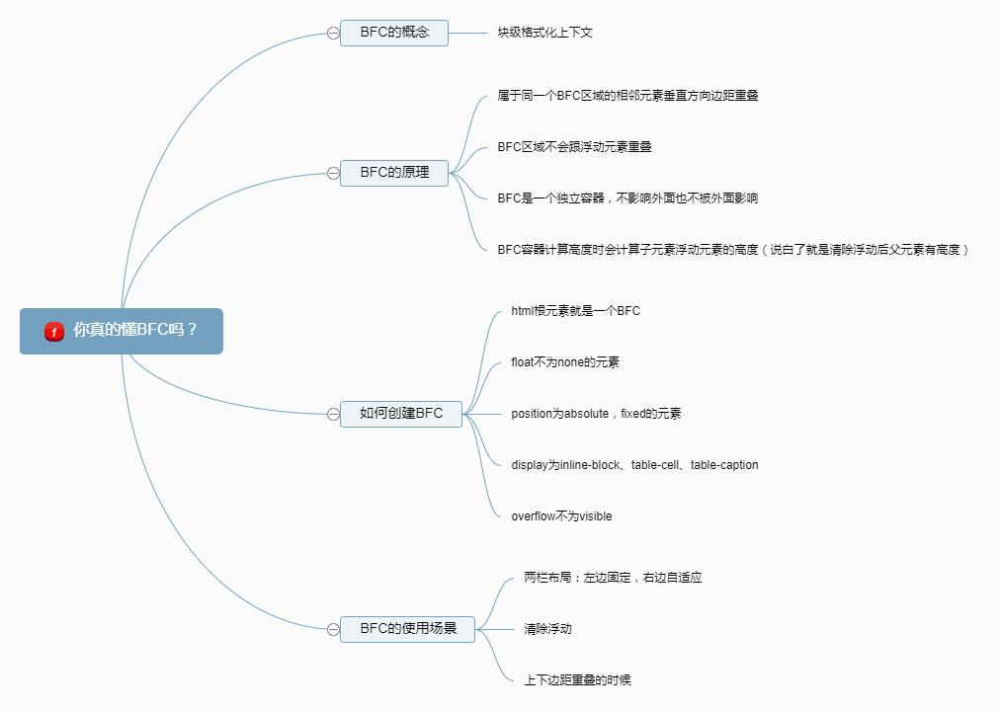
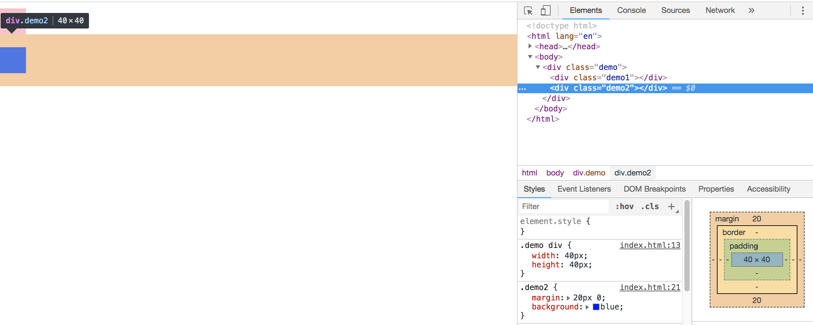
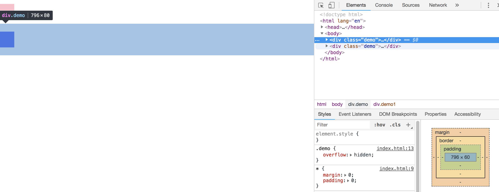
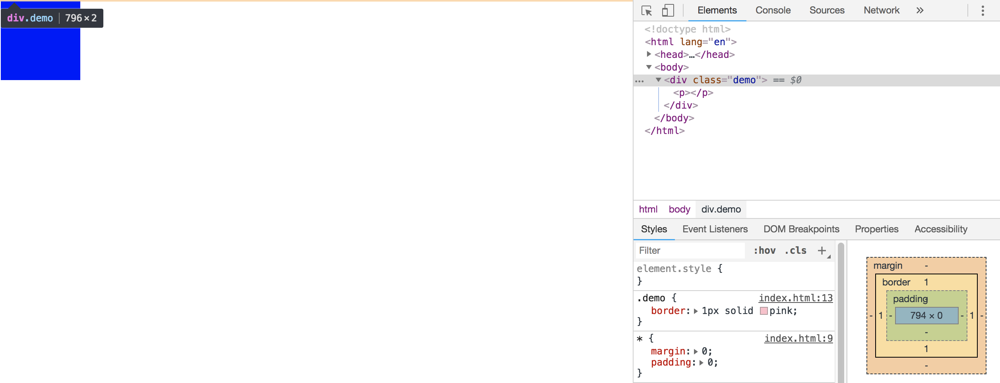
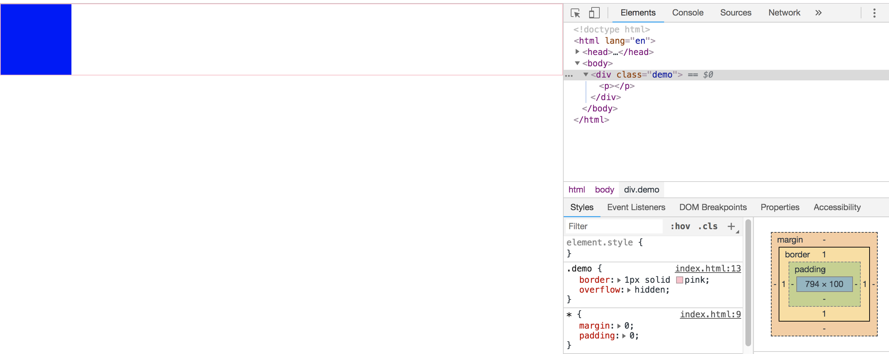
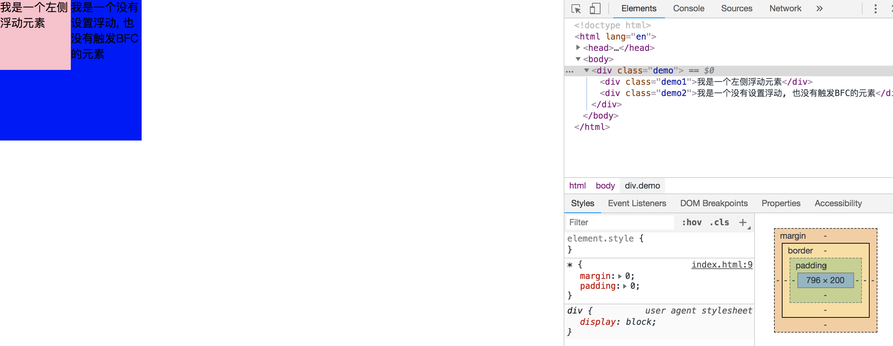
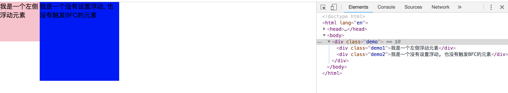
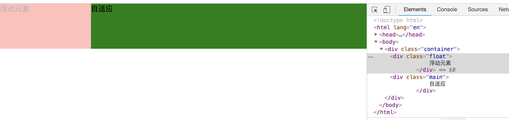

# css 面试题
## ● 水平垂直居中
### 水平居中
使用绝对定位居中，可以用
::: details 点击看代码
```css
.container{
  width: 300px;
  height: 200px;
  background: pink;
  position: relative;
}
.inner{
  width: 100px;
  height: 50px;
  position: absolute;
  top: 50%;
  left: 50%;
  margin-top: -25px;
  margin-left: -50px;
  background: #fff;
} 
```
```css
.container{
  width: 300px;
  height: 200px;
  background: pink;
  position: relative;
}
.inner{
  width: 100px;
  height: 50px;
  position: absolute;
  top: 50%;
  left: 50%;
  transform: translate(-50%, -50%);
  background: #fff;
} 
```
:::
### 垂直居中
使用弹性布局
::: details 点击看代码
```css
.container {
  height: 400px;
  background: pink;
  display: flex;
  align-items: center;
}
.inner {
  width: 100px;
  height: 200px;
  background: #fff;
}
```
:::
## ● BFC 是什么？触发 BFC 的条件是什么？有哪些应⽤场景？


BFC常见应用例子：
### 解决普通文档流块元素的上下边距重叠问题
::: details 点击看代码
```html
 <style>
    * {
        margin: 0;
        padding: 0;
    }
    .demo div {
        width: 40px;
        height: 40px;
    }
    .demo1 {
        margin: 10px 0;
        background: pink;
    }
    .demo2 {
        margin: 20px 0;
        background: blue;
    }
</style>
<div class="demo">
    <div class="demo1"></div>
    <div class="demo2"></div>
</div>
```
:::

可见两个块元素外边距为20px，出现了外边距折叠的问题

解决办法：只需要把两个元素置于不同的BFC中进行隔离
::: details 点击看代码
```html
<style>
    * {
        margin: 0;
        padding: 0;
    }
    .demo {
        overflow: hidden;
    }
    .demo div {
        width: 40px;
        height: 40px;
    }
    .demo1 {
        margin: 10px 0;
        background: pink;
    }
    .demo2 {
        margin: 20px 0;
        background: blue;
    }
</style>

<div class="demo">
    <div class="demo1"></div>
</div>
<div class="demo">
    <div class="demo2"></div>
</div>
```
:::


### BFC清除浮动
::: details 点击看代码
```html
<style>
    * {
        margin: 0;
        padding: 0;
    }
    .demo {
        border: 1px solid pink;
    }
    .demo p {
        float: left;
        width: 100px;
        height: 100px;
        background: blue;
    }
</style>

<div class="demo">
    <p></p>
</div>

```
:::
可见容器元素内子元素浮动,脱离文档流,容器元素高度只有2px


解决办法：
::: details 点击看代码
```css
.demo {
    border: 1px solid pink;
    overflow: hidden;
}
```
:::


### 阻止普通文档流元素被浮动元素覆盖
::: details 点击看代码
```html
<style>
    * {
        margin: 0;
        padding: 0;
    }
    .demo1 {
        width: 100px;
        height: 100px;
        float: left;
        background: pink
    }
    .demo2 {
        width: 200px;
        height: 200px;
        background: blue;
    }
</style>

<div class="demo">
    <div class="demo1">我是一个左侧浮动元素</div>
    <div class="demo2">我是一个没有设置浮动, 也没有触发BFC的元素</div>
</div>
```
:::
`demo2` 部分区域被浮动元素 `demo1` 覆盖, 但是文字没有覆盖, 即文字环绕效果


解决办法：触发demo2的BFC。
::: details 点击看代码
```css
.demo2 {
    width: 200px;
    height: 200px;
    background: blue;
    overflow: hidden;
}
```
:::


### 自适应两栏布局
::: details 点击看代码
```html
<style>
* {
    margin: 0;
    padding: 0;
}
.container {
}
.float {
    width: 200px;
    height: 100px;
    float: left;
    background: red;
    opacity: 0.3;
}

.main {
    background: green;
    height: 100px;
    overflow: hidden;
}
</style>

<div class="container">
    <div class="float">
        浮动元素
    </div>
    <div class="main">
        自适应
    </div>
</div>
```
:::


## ● position: sticky 用过没，有啥效果
单词`sticky`的中文意思是`粘性的`，`position:sticky` 表现也符合这个粘性的表现。基本上，可以看出是 `position:relative` 和 `position:fixed` 的结合体

当元素在屏幕内，表现为`relative`，就要滚出显示器屏幕的时候，表现为`fixed`

- 父级元素不能有任何 `overflow:visible` 以外的 `overflow` 设置，否则没有粘滞效果。因为改变了滚动容器（即使没有出现滚动条）。因此，如果你的 `position:sticky` 无效，看看是不是某一个祖先元素设置了 `overflow:hidden`，移除之即可。
- 父级元素设置和粘性定位元素等高的固定的 `height` 高度值，或者高度计算值和粘性定位元素高度一样，也没有粘滞效果
- 同一个父容器中的sticky元素，如果定位值相等，则会重叠；如果属于不同父元素，且这些父元素正好紧密相连，则会鸠占鹊巢，挤开原来的元素，形成依次占位的效果。至于原因需要理解粘性定位的计算规则

参考文章：[杀了个回马枪，还是说说position:sticky吧](https://www.zhangxinxu.com/wordpress/2018/12/css-position-sticky/)

## ● position 有哪些属性

- `absolute`：绝对定位元素
    - 元素会被移出正常文档流，并不为元素预留空间
    - 通过指定元素相对于最近的非 `static` 定位祖先元素的偏移，来确定元素位置
    - 绝对定位的元素可以设置外边距（margins），且不会与其他边距合并

- `relative`：相对定位元素
    - 元素先放置在未添加定位时的位置，再在不改变页面布局的前提下调整元素位置（因此会在此元素未添加定位时所在位置留下空白）
    - `position: relative` 对 `table-*-group`, `table-row`, `table-column`, `table-cell`, `table-caption` 元素无效。
- `fixed`：
    - 元素会被移出正常文档流，并不为元素预留空间
    - 通过指定元素相对于屏幕视口（viewport）的位置来指定元素位置
- `sticky`：
    - 元素根据正常文档流进行定位

## ● 介绍下重绘和回流（Repaint & Reflow），以及如何进行优化

### 1. 浏览器渲染机制
- 浏览器采用流式布局模型（Flow Based Layout）
- 浏览器会把 `HTML` 解析成 `DOM`，把 `CSS` 解析成 `CSSOM`，`DOM` 和 `CSSOM` 合并就产生了 `渲染树（Render Tree）`。
- 有了`RenderTree`，我们就知道了所有节点的样式，然后计算他们在页面上的大小和位置，最后把节点绘制到页面上。
- 由于浏览器使用流式布局，对Render Tree的计算通常只需要遍历一次就可以完成，但table及其内部元素除外，他们可能需要多次计算，通常要花3倍于同等元素的时间，这也是为什么要避免使用table布局的原因之一。

### 2. 重绘
由于节点的几何属性发生改变或者由于样式发生改变而不会影响布局的，称为重绘

### 3. 回流
布局或者几何属性需要改变就称为回流

### 4. 浏览器的优化
现代浏览器大多都是通过队列机制来批量更新布局，浏览器会把修改操作放在队列中，至少一个浏览器刷新（即16.6ms）才会清空队列，但当你获取布局信息的时候，队列中可能有会影响这些属性或方法返回值的操作，即使没有，浏览器也会强制清空队列，触发回流与重绘来确保返回正确的值。

主要包括以下属性或方法：

- offsetTop、offsetLeft、offsetWidth、offsetHeight
- scrollTop、scrollLeft、scrollWidth、scrollHeight
- clientTop、clientLeft、clientWidth、clientHeight
- width、height
- getComputedStyle()
- getBoundingClientRect()

所以，我们应该避免频繁的使用上述的属性，他们都会强制渲染刷新队列。

### 5. 减少重绘与回流
#### CSS
- **使用 `transform` 替代 `top`**
- **使用 `visibility` 替换 `display: none`**，因为前者只会引起重绘，后者会引发回流改变了布局
- **避免使用 `table` 布局**，可能很小的一个小改动会造成整个 `table` 的重新布局
- **尽可能在 `DOM` 树的最末端改变`class`**，回流是不可避免的，但可以减少其影响。尽可能在 `DOM` 树的最末端改变`class`，可以限制了回流的范围，使其影响尽可能少的节点
- **避免设置多层内联样式**，`CSS` 选择符从右往左匹配查找，避免节点层级过多
- **将动画效果应用到 `position` 属性为 `absolute` 或 fixed 的元素上**，避免影响其他元素的布局，这样只是一个重绘，而不是回流，同时，控制动画速度可以选择 requestAnimationFrame
- **避免使用CSS表达式**，可能会引发回流
- **将频繁重绘或者回流的节点设置为图层**，图层能够阻止该节点的渲染行为影响别的节点，例如`will-change`、`video`、`iframe`等标签，浏览器会自动将该节点变为图层
- **CSS3 硬件加速（GPU加速）**，使用css3硬件加速，可以让transform、opacity、filters这些动画不会引起回流重绘 。但是对于动画的其它属性，比如background-color这些，还是会引起回流重绘的，不过它还是可以提升这些动画的性能。

#### JavaScript
- **避免频繁操作样式**，最好一次性重写style属性，或者将样式列表定义为 `class` 并一次性更改 `class` 属性。
- **避免频繁操作DOM**，创建一个 `documentFragment`，在它上面应用所有 `DOM` 操作，最后再把它添加到文档中。
- **避免频繁读取会引发回流/重绘的属性**，如果确实需要多次使用，就用一个变量缓存起来。
- **对具有复杂动画的元素使用绝对定位**，使它脱离文档流，否则会引起父元素及后续元素频繁回流。


