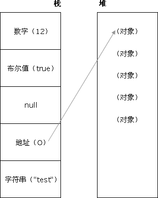
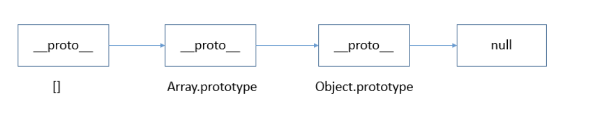

# JavaScript 基础知识面试题

## ● 数据类型和数据结构

最新的 `ECMAScript` 标准定义了 `8` 种数据类型:
- 7 种原始类型:
    - Boolean：布尔表示一个逻辑实体，可以有两个值：`true` 和 `false`
    - Null：
    - Undefined
    - Number
    - BigInt
    - String
    - Symbol 
-  Object

## ● typeof 原理探究
javaScript 最初版本使用低位存储了变量的类型信息
- 000：对象
- 1：整数
- 100：字符串
- 110：布尔值
- undefined：用 - (-2^30) 表示
- null 对应机器码的 NULL 指针，一般是全零
    ```js
    typeof null === 'object'  // true
    ```
typeof 可能的返回值：
- 基础类型：除了 `null` 返回 `object`，其他的都返回自身
- 引用类型
    - 引用类型中的函数
    ::: details 点击看代码
    ```js
    typeof Function; // 'function'
    typeof new Function(); // 'function'
    typeof function() {}; // 'function'
    ```
    :::
    - 引用类型的子类型
    ::: details 点击看代码
    ```js
    typeof Array; // 'function'
    typeof Array(); // 'object'，构造函数 Array(..) 不要求必须带 new 关键字。不带时，它会被自动补上，构造出来的结果是个数组，自然属于引用类型，所以也就打印出了‘object’
    typeof new Array(); // 'object'
    typeof []; // 'object'
    ```
    :::
    - 引用类型中的基本包装类型
    ::: details 点击看代码
    ```js
    typeof Boolean; // "function"
    typeof Boolean(); // "boolean"
    typeof new Boolean(); // "object"，通过构造函数创建出来的是封装了基本类型值的封装对象
    ```
    :::

## ● 对象类型
:::tip
在 `JavaScript` 中，除了原始类型，其他的都是对象类型，对象类型存储的是地址，而原始类型存储的是值。
:::
```js
var a = [];
var b = a;
a.push(1);
console.log(b); // 输出[1]
```
**代码分析：**<br/>

在以上代码中，创建了一个对象类型 `a` (数组)，再把 `a` 的地址赋值给了变量 `b` ，最后改变 `a` 的值，打印 `b` 时，`b` 的值也同步发生了改变，因为它们在内存中使用的是同一个地址，改变其中任何一变量的值，都会影响到其他变量。

### 对象当做函数参数
```js
function testPerson(person) {
  person.age = 52;
  person = {
    name: '李四',
    age: 18
  }
  return person;
}
var p1 = {
  name: '张三',
  age: 23
}
var p2 = testPerson(p1);
console.log(p1.age);  // 输出52
console.log(p2.age);  // 输出18
```
**代码分析：**<br/>

1. `testPerson` 函数中，`person` 传递的是对象 `p1` 的指针副本
2. 在函数内部，改变 `person` 的属性，会同步反映到对象 `p1` 上，`p1` 对象中的 `age` 属性发生了改变，即值为52
3. `testPerson` 函数又返回了一个新的对象，这个对象此时和参数 `person` 没有任何关系，因为它分配了一个新的内存地址

## ● typeof 和 instanceof
:::tip typeof
`typeof` 能准确判断除 `null` 以外的原始类型的值，对于对象类型，除了函数会判断成 `function`，其他对象类型一律返回 `object`
:::
```js
typeof 1            // number
typeof '1'          // string
typeof true         // boolean
typeof undefined    // undefined
typeof Symbol()     // symbol

typeof []           // object
typeof {}           // object
typeof function() {}  // function
```

:::tip instanceof
`instanceof` 通过原型链可以判断出对象的类型，
:::
```js
function Person(name) {
  this.name = name;
}
var p1 = new Person();
console.log(p1 instanceof Person) // true

var str = new String('abc');
console.log(str instanceof String)// true
```

## ● 对象类型
`JavaScript` 中，类型转换只有三种：
1. 转换成数字
2. 转换成布尔值
3. 转换成字符串

### 经典面试题
```js
console.log([]==![])  // true
```

**代码分析**<br/>
1. 左侧是一个对象(数组)
2. 右侧是一个布尔值，对象`[]`转换成布尔值 `true`，因为除了 `null` 所有对象都转换成布尔值，所以 `![]` 结果为false
3. 此时相当于`对象==布尔值`，依据类型转换规则，转换成数字类型进行比较
4. 对象(空数组)转换成 `0`，`0` 转换成布尔值 `false` 
5. 即 `0==0`，返回 `true`

类型转换规则，如下图：


## ● == 和 ===
:::tip === 严格相等
`===` 叫做严格相等，是指：左右两边不仅值要相等，类型也要相等，例如 `'1'===1` 的结果是 `false`，因为一边是 `string`，另一边是 `number`。
:::

```js
console.log('1'===1); // 输出false
```

:::tip == 不严格相等
`==` 只要值相等，就返回 `true`，但 `==` 还涉及一些类型转换，它的转换规则如下：
- 两边的类型是否相同，相同的话就比较值的大小，例如 `1==2`，返回 `false`
- 判断其中一方是否是 `Boolean`，是的话就把 `Boolean` 转换成 `Number`，再进行比较
- 除了 `undefined`、`null`、`false`、`0`、`-0`、`NaN`和 `空字符串` 转换成 `false` 以外，其他所有值都转换成 `true`，包括所有对象。
:::

## ● new构造调用的过程
1. 创建一个全新的对象
2. 新对象会被执行原型连接
3. 这个新对象会绑定到函数调用的this
4. 返回新对象

## ● this全面解析
`JavaScript` 中的 `this` 只有如下几种情况，并按他们的优先级从低到高划分如下：
1. 独立函数调用，例如 `getUserInfo()`，此时 `this` 指向全局对象 `window`
2. 对象调用，例如 `stu.getStudentName()`，此时 `this` 指向调用的对象 `stu`
3. `call()`、`apply()` 和 `bind()` 改变上下文的方法，`this` 指向取决于这些方法的第一个参数，当第一个参数为 `null` 时，`this` 指向全局对象 `window`
4. 箭头函数没有 `this`，箭头函数里面的 `this` 只取决于包裹箭头函数的第一个普通函数的 `this`
5. new构造函数调用，`this`永远指向构造函数返回的实例上，优先级最高。
```js
var name = 'global name';
var foo = function() {
  console.log(this.name);
}
var Person = function(name) {
  this.name = name;
}
Person.prototype.getName = function() {
  console.log(this.name);
}
var obj = {
  name: 'obj name',
  foo: foo
}
var obj1 = {
  name: 'obj1 name'
}

// 独立函数调用，输出：global name
foo();
// 对象调用，输出：obj name
obj.foo();
// apply()，输出：obj1 name
obj.foo.apply(obj1);
// new 构造函数调用，输出：p1 name
var p1 = new Person('p1 name');
p1.getName();
```

## ● 闭包
当一个函数能够记住并访问它所在的词法作用域的时候，就产生了闭包，即使函数式在词法作用域之外执行

:::tip 闭包的几种表现形式
1. 返回一个函数
2. 作为函数参数传递
3. 回调函数
4. 非典型闭包IIFE(立即执行函数表达式)
:::

**返回一个函数：** 这种形式的闭包在JavaScript的代码编写中，是非常常见的一种方式。
```js
var a  = 1;
function foo(){
  var a = 2;
  // 这就是闭包
  return function(){
    console.log(a);
  }
}
var bar = foo();
// 输出2，而不是1
bar();
```
**作为函数参数传递：** 无论通过何种手段将内部函数传递到它所在词法作用域之外，它都会持有对原始作用域的引用，无论在何处执行这个函数，都会产生闭包。
```js
var a = 1;
function foo(){
  var a = 2;
  function baz(){
    console.log(a);
  }
  bar(baz);
}
function bar(fn){
  // 这就是闭包
  fn();
}
// 输出2，而不是1
foo();
```
**回调函数：** 在定时器、事件监听、Ajax请求、跨窗口通信、Web Workers或者任何异步中，只要使用了回调函数，实际上就是在使用闭包。
```js
// 定时器
setTimeout(function timeHandler(){
  console.log('timer');
}，100)

// 事件监听
$('#container').click(function(){
  console.log('DOM Listener');
})
```
**IIFE：** IIFE(立即执行函数表达式)并不是一个典型的闭包，但它确实创建了一个闭包。
```js
var a = 2;
(function IIFE(){
  // 输出2
  console.log(a);
})();
```
代码分析：<br/>
1. `for`循环创建了5个定时器，并且定时器是在循环结束后才开始执行
2. `for` 循环结束后，用 `var i` 定义的变量 `i` 此时等于6
3. 依次执行五个定时器，都打印变量 `i`，所以结果是打印5次6

**第一种改进方法：** 利用 `IIFE(立即执行函数表达式)` 当每次 `for` 循环时，把此时的 `i` 变量传递到定时器中
```js
for(var i=1;i<=5;i++){
  (function(j){
    setTimeout(function timer(){
      console.log(j)
    }, i*1000)
  })(i)
}
```

**第二种方法：** `setTimeout` 函数的第三个参数，可以作为定时器执行时的变量进行使用
```js
for(var i=1;i<=5;i++){
  setTimeout(function timer(j){
    console.log(j)
  }, i*1000, i)
}
```

**第三种方法(推荐)：** 在循环中使用 `let i` 代替 `var i`
```js
for(let i=1;i<=5;i++){
  setTimeout(function timer(){
    console.log(i)
  }, i*1000)
}
```

## ● 浅拷贝与深拷贝
由于 `JavaScript` 中对象是引用类型，保存的是地址，深、浅拷贝的区别是：当拷贝结束后，在一定程度上改变原对象中的某一个引用类型属性的值，新拷贝出来的对象依然受影响的话，就是浅拷贝，反之就是深拷贝。
:::tip 浅拷贝的几种实现方法
1. 利用 `Object.assign()` 方法
2. 利用 `...` 扩展运算符
:::
**第一种方法：** Object.assign()会拷贝原始对象中的所有属性到一个新对象上，如果属性为对象，则拷贝的是对象的地址，改变对象中的属性值，新拷贝出来的对象依然会受影响。
```js
var obj = {
  name: '张三',
  age: 23,
  isStudent: false,
  job: {
    name: 'FE',
    money: 12
  }
}
var newObj = Object.assign({}, obj);
obj.job.money = 21;
console.log(newObj.name);     // 输出张三
console.log(newObj.age);      // 输出23
console.log(newObj.job.money);// 输出21，受影响
```
**第二种方法：** `...` 扩展运算符是 `ES6` 新增加的内容
```js
var obj = {
  name: '张三',
  age: 23,
  isStudent: false,
  job: {
    name: 'FE',
    money: 12
  }
}
var newObj = {...obj};
obj.job.money = 21;
console.log(newObj.name);     // 输出张三
console.log(newObj.age);      // 输出23
console.log(newObj.job.money);// 输出21，受影响
```

:::tip 深拷贝几种实现方式
1. 配合使用 `JSON.parse()` 和 `JSON.stringify()` 两个函数(局限性比较大)
2. 实现自己的简易深拷贝方法
3. `lodash` 第三方库实现深拷贝
:::

**第一种方法：** 利用JSON的序列化和反序列化方法，可以实现简易对象深拷贝，但此种方法有较大的限制：
1. 会忽略属性值为undefined的属性
2. 会忽略属性为Symbol的属性
3. 不会序列化函数
4. 不能解决循环引用的问题，直接报错
```js
var obj = {
  name: '张三',
  age: 23,
  address: undefined,
  sayHello: function() {
    console.log('Hello');
  },
  isStudent: false,
  job: {
    name: 'FE',
    money: 12
  }
}
var newObj = JSON.parse(JSON.stringify(obj));
obj.job.money = 21;
console.log(newObj.name);      // 输出张三
console.log(newObj.age);       // 输出23
console.log(newObj.job.money); // 输出12

console.log(newObj.address);   // 报错
console.log(newObj.sayHello());// 报错
```

**第二种：** 实现自己简易的深拷贝函数
```js
function deepClone(obj) {
  function isObject(o) {
    return (typeof o === 'object' || typeof o === 'function') && o !== null;
  }
  if(!isObject(obj)) {
    throw new Error('非对象');
  }
  var isArray = Array.isArray(obj);
  var newObj = isArray ? [...obj] : {...obj};
  Reflect.ownKeys(newObj).forEach(key => {
    newObj[key] = isObject(newObj[key]) ? deepClone(newObj[key]) : newObj[key];
  })
  return newObj;
}
var obj = {
  name: 'AAA',
  age: 23,
  job: {
    name: 'FE',
    money: 12000
  }
}
var cloneObj = deepClone(obj);
obj.job.money = 13000;
console.log(obj.job.money);     // 输出13000
console.log(cloneObj.job.money);// 输出12000
```

**第三种方法：** 使用[lodash](https://lodash.com/docs#cloneDeep)第三方函数库实现(需要先引入lodash.js)
```js
var obj = {
  name: '张三',
  age: 23,
  isStudent: false,
  job: {
    name: 'FE',
    money: 12
  }
}
var newObj = _.cloneDeep(obj);
obj.job.money = 21;
console.log(newObj.name);     // 输出张三
console.log(newObj.age);      // 输出23
console.log(newObj.job.money);// 输出12，不受影响
```

## ● 继承
在 JavaScript `ES6`之前，实现继承需要依赖原型、原型链和构造函数等等技术手段组合使用，在 `ES6` 之后，可以使用Class类继承(并没有真正的类，只是一个语法糖，实质依然是函数)

:::tip 继承的几种方式
1. 原型链实现继承
2. 借用构造函数实现继承
3. 组合继承
4. 寄生组合继承
5. 类继承
:::

### 1. 原型链继承
:::tip
利用原型让一个引用类型继承另一个引用类型的属性和方法，这种方式实现的继承，创建出来的实例既是子类的实例，又是父类的实例。它有如下几种缺陷：
1. 不能向父类构造函数传参
2. 父类上的引用类型属性会被所有实例共享，其中一个实例改变时，会影响其他实例
:::
```js
function Super() {
  this.colors = ['red','blue'];
}
function Sub(name) {
  this.name = name;
}
Sub.prototype = new Super();

var Sub1 = new Sub('旺财');
var Sub2 = new Sub('钢镚');
Sub2.colors.push('yellow');
console.log(Sub1.colors); // ["red", "blue", "yellow"]
console.log(Sub2.colors); // ["red", "blue", "yellow"]

console.log(Sub1 instanceof Sub);     // true
console.log(Sub1 instanceof Super);   // true
```
继承是通过创建 `Super` 的实例，并将该实例赋给 `Sub.prototype` 实现的。实现的本质是重写原型对象

### 2. 借用构造函数继承
:::tip 
借用构造函数实现继承，通过在子类中使用call()方法，实现借用父类构造函数并向父类构造函数传参的目的。但这种方法的缺陷：
- 无法继承父类原型对象上的属性和方法。
:::
```js
function Super(){ 
 this.colors = ["red", "blue", "green"]; 
} 
function Sub(){ 
 //继承了 Super 
 Super.call(this); 
} 
var instance1 = new Sub(); 
instance1.colors.push("black"); 
console.log(instance1.colors);      //"red,blue,green,black" 
var instance2 = new Sub(); 
console.log(instance2.colors);      //"red,blue,green" 

```

### 3. 组合继承
:::tip 
将原型链和借用构造函数的技术组合到一块，从而发挥二者之长的一种继承模式，缺陷：
- 父类构造函数被调用多次
:::
```js
function Super() {
  this.name = name;
  this.colors = ['red', 'blue', 'green'];
}
Super.prototype.sayName = function() {
  console.log(this.name);
}
function Sub(name, age) {
  // 继承属性
  Super.call(this, name);
  this.age = age;
}

//继承方法
Sub.prototype = new Super();
Sub.prototype = constructor = Subtype;
Sub.prototype.sayAge = function() {
  console.log(this.age);
}
var instance1 = new Sub('Nicholas', 29)
instance1.colors.push("black"); 
alert(instance1.colors); //"red,blue,green,black" 
instance1.sayName(); //"Nicholas"; 
instance1.sayAge(); //29 

var instance2 = new SubType("Greg", 27); 
alert(instance2.colors); //"red,blue,green" 
instance2.sayName(); //"Greg"; 
instance2.sayAge(); //27 
```

### 4. 寄生式继承
:::tip 
创建一个仅用于封装继承过程的函数，该函数在内部以某种方式来增强对象，最后再像真地是它做了所有工作一样返回对象，缺陷：
- 会共享作为新对象基础的对象属性为引用类型的值
:::
```js
function object(o){ 
  function F(){} 
  F.prototype = o; 
  return new F(); 
} 

function createAnother(original){ 
  var clone = object(original); //通过调用函数创建一个新对象
  clone.sayHi = function(){ //以某种方式来增强这个对象
    console.log("hi"); 
  }; 
  return clone; //返回这个对象
} 

var person = { 
  name: "Nicholas", 
  friends: ["Shelby", "Court", "Van"] 
}; 
var anotherPerson = createAnother(person); 
var yetAnotherPerson = createAnother(person);
yetAnotherPerson.friends.push('casa')

console.log(anotherPerson.friends);
console.log(yetAnotherPerson.friends);
anotherPerson.sayHi();  //"hi" 

```

### 5. 寄生组合式继承
:::tip
通过借用构造函数来继承属性，通过原型链的混成形式来继承方法
:::
```js
function object(o){ 
  function F(){} 
  F.prototype = o; 
  return new F(); 
} 

function inheritPrototype(subType, superType){ 
  var prototype = object(superType.prototype); //创建对象
  prototype.constructor = subType; //增强对象
  subType.prototype = prototype; //指定对象
} 

function SuperType(name){ 
  this.name = name; 
  this.colors = ["red", "blue", "green"]; 
} 
SuperType.prototype.sayName = function(){ 
  console.log(this.name); 
}; 
function SubType(name, age){ 
  SuperType.call(this, name); 
  this.age = age; 
} 
inheritPrototype(SubType, SuperType); 
SubType.prototype.sayAge = function(){ 
  console.log(this.age); 
}; 

```

### 6. Class 实现继承
:::tip 
运用 `ES6` 的 `class` 新特性来实现继承
:::
```js
class Animal {
  constructor(name) {
    this.name = name;
    this.colors = ['red','blue'];
  }
  eat() {
    console.log(this.name + ' is eatting');
  }
}
class Dog extends Animal {
  constructor(name) {
    super(name);
  }
}
var dog1 = new Dog('dog1');
var dog2 = new Dog('dog2');
dog1.colors.push('yellow');
console.log(dog1.name);  // 输出dog1
console.log(dog2.colors);// 输出['red','blue']
console.log(dog2.eat()); // 输出dog2 is eatting
```

## ● JavaScript 异步

### 回调函数
回调函数广泛在于我们所编写的 `JavaScript` 代码中，它表现在时间绑定，Ajax请求或者其他情况下，如
```js
ajax(url, () => {
  console.log('这里是回调函数');
})
```
**回调地狱：** 回调函数很好的解决了某些异步情况，但过度滥用回调函数会造成回调地狱，即回调函数过长，嵌套过深。过长或者嵌套过深的回调函数，会让回调函数存在强耦合关系，一旦有一个函数有所改动，那么可能会牵一发而动全身。一个回调地狱可能如下所示：
```js
ajax(firstUrl, () => {
  console.log('这里是首次回调函数');
  ajax(secondUrl, () => {
    console.log('这里是第二次回调函数');
    ajax(threeUrl, () => {
      console.log('这里是第三次回调函数');
      // todo更多
    })
  })
})
```

### Generator
在ES6之前，一个函数一旦执行将不会被中断，一直到函数执行完毕，在ES6之后，由于Generator的存在，函数可以暂停自身，待到合适的机会再次执行。用Generator可以解决回调地狱。
```js
function *fetch() {
  yield ajax(url, () => {console.log('这里是首次回调函数');});
  yield ajax(url, () => {console.log('这里是第二次回调函数');});
  yield ajax(url, () => {console.log('这里是第三次回调函数');});
}
var it = fetch();
var result1 = it.next();
var result2 = it.next();
var result3 = it.next();
```

### Promise
`Promise` 翻译过来就是承诺的意思，`Promise` 一共有三种状态：`pending(等待中)`、`resolve(完成)` 和 `reject(拒绝)`，这个承诺意味着在将来一定会有一个表决，并且只能表决一次，表决的状态一定是 `resolve(完成)` 或者 `reject(拒绝)`，一个 `Promise` 可能会是如下的形式：
```js
// 普通的Promise
function foo() {
  return new Promise((resolve,reject) => {
    // 第一次表决有效，其后无论是resolve()还是reject()都无效
    resolve(true); 
    resolve(false);
  })
}

// Promise解决回调地狱
ajax(url).then(res => {
  console.log('这里是首次回调函数');
}).then(res => {
  console.log('这里是第二次回调函数');
}).then(res => {
  console.log('这里是第三次回调函数');
})
```

**Promise.all()：** `Promise.all()`方法是把一个或者几个 `Promise` 组合在一个数组里，只有当数组中的所有 `Promise` 全部表决完成，才返回
```js
var p1 = Promise.resolve(1);
var p2 = new Promise((resolve) => {
  setTimeout(() => {
    resolve(2);
  }, 100);
})
var p3 = 3;
Promise.all([p1,p2,p3]).then((res) => {
  console.log(res); // 输出[1,2,3]
})
```

**Promise.race()：** `Promise.race()` 方法把一个或者几个 `Promise` 组合在一个数组里，只要数组中有一个表决了，就返回
```js
var p1 = Promise.resolve(1);
var p2 = new Promise((resolve) => {
  setTimeout(() => {
    resolve(2);
  }, 100);
})
var p3 = 3;
Promise.race([p2,p1,p3]).then((res) => {
  console.log(res); // 输出1
})
```

### async/await
如果一个方法前面加上了 `async`，那么这个方法就会返回一个 `Promise`，`async` 就是将函数用 `Promise.resolve()` 包裹了下，并且 `await` 只能配合 `async` 使用，不能单独出现。一个 `async/await` 可能会是如下的形式：
```js
// 普通的async/await
async function foo() {
  let number = await 3; // await自动用promise.resolve()包装
  console.log(number);
}
foo();

// async/await解决回调地狱
async function fetch() {
  var result1 = await ajax(url1);
  var result2 = await ajax(url2);
  var result3 = await ajax(url3);
}
fetch();
```

## ● JavaScript 原生 3 种绑定事件
```html
<!-- 1、直接在标签里绑定 -->
<button id="btn" onclick="handleClick()">
  自定义函数
</button>

<script>
	// 2、利用 DOM0 进行绑定
  var btn = document.getElementById('btn')
  btn.onclick = handleClick()
  
  ///3、利用 DOM3 进行绑定
  btn.addEventListener('click', handleClick)
</script>
```

## ● 创建对象的方式
```js
// 对象字面量
const obj = {}

// 构造函数
function Obj() {}
const obj = new Obj()

// Object.create，此时属性挂载在原型上
const obj = Object.create({name: 'name'})
```

## ● 判断数据类型是否是数组
### 1. instanceof
通过检查该实例是不是 Array 类型
```js
console.log(arr instanceof Array) ;//返回true则表示是数组类型，否则就不是。
```

### 2. Array.isArray(arr)
数组自带方法
```js
var arr = [1, 2, 3];
var obj = {name: 'sb'};
var a = 'a';

console.log(Array.isArray(arr));    // true
console.log(Array.isArray(obj));    // false
console.log(Array.isArray(a));      // false
```

### 3. constructor
判断类型的构造函数是不是 Array
```js
var arr=[1,2,3];
console.log(arr.constructor === Array);//"true" 返回true就是
```

## ● 数组去重
### 1. 利用`ES6` 的 `Set` 去重
不考虑兼容性，这种去重的方法代码最少。这种方法还无法去掉“{}”空对象
```js
function unique (arr) {
  return Array.from(new Set(arr))
}
var arr = [1,2,3,2,3,4,5];
console.log(unique(arr));     // [1, 2, 3, 4, 5]
```
#### 利用 `...` 简化代码
```js
var arr = [1,2,3,2,3,4,5];
console.log([...new Set(arr)])
```

## ● JavScript 有几种类型的值？你能画一下他们的内存图吗？
- 栈：原始数据类型(undefined、null、boolean、number、string)
  - 原始数据类型直接存储在 **栈(stack)** 中的简单数据段
  - 占据空间小、大小固定，属于被频繁使用数据
- 堆：引用数据类型(对象、数组、函数)
  - 占据空间大、大小不固定
  - 引用类型在栈中存储了指针，该指针指向堆中该实体的起始地址



## ● 介绍 JS 有哪些内置对象
js 中的内置对象主要指的是在程序执行前存在全局作用域里的由 js 定义的一些全局值属性、函数和用来实例化其他对象的构造函数对象。一般我们经常用到的如全局变量值 NaN、undefined；全局函数如parseInt()、parseFloat()；用来实例化对象的构造函数 Date、Object 等；还有提供数学计算的单体内置对象 Math 对象

参考：[标准内置对象分类](https://developer.mozilla.org/zh-CN/docs/Web/JavaScript/Reference/Global_Objects)

## ● nul 和 undefined 的区别？
他们都是基础数据类型：
- undefined：
  - 一般变量声明了但还没有定义的时候会返回 undefined；
  - 函数没有使用 return 语句指定返回值，会返回一个 undefined 值；
  - 调用函数没有传递参数值，参数会被初始化为 undefined
- null：主要用于赋值给一些可能返回对象的变量，用于初始化

## ● 模块化开发怎么做?
模块化的开发方式可以提高代码的复用率，方便代码进行管理，通常一个文件就是一个模块，有自己的作用域，只向外暴露特定的变量和函数，原始的写法有 `函数写法`、`对象写法`、`立即函数写法`， 目前流行的 `JS` 模块化开发规范有 `CommonJS`、`AMD`、`CDM`

### 函数写法
由于**函数**具有独立作用域的特点，最原始的写法是几个函数作为一个模块
- 缺点：容易造成全局变量的污染，并且模块间没有联系
```js
function m1(){
  //...
}

function m2(){
  //...
}
```

### 对象写法
把模块写成一个对象，所有的模块成员都放到这个对象里面
- 缺点：会暴露所有模块成员，内部状态可以被外部改写
```js
var module1 = new Object({
  _count : 0,

  m1: function (){
  //...
  },

  m2: function (){
  //...
  }

});

// 内部状态被外部改写
module1._count = 5;
```

### 立即执行函数写法
可以达到不暴露私有成员的目的
```js
var module1 = (function(){

  var _count = 0;

  var m1 = function(){
    //...
  };

  var m2 = function(){
    //...
  };

  return {
    m1 : m1,
    m2 : m2
  };

})();

// 外部代码无法读取内部的_count变量
console.info(module1._count); //undefined
```
### CommonJS
`Node`是`commonJS`规范的主要实践者，它有四个重要的环境变量为模块化的实现提供支持：`module`、`exports`、`require`、`global`。实际使用时，用`module.exports`定义当前模块对外输出的接口（不推荐直接用exports），用`require`加载模块。
```js
// 定义模块math.js
var basicNum = 0;
function add(a, b) {
  return a + b;
}

//在这里写上需要向外暴露的函数、变量
module.exports = { 
  add: add,
  basicNum: basicNum
}
```

### AMD和require.js
`AMD` 规范采用异步方式加载模块，模块的加载不影响他后面的语句运行，所有依赖这个模块的语句，都定义在一个回调函数中，等到加载完成之后，这个回调函数才会运行
> AMD 诞生的背景，同步加载的方式在浏览器环境会出现浏览器 “假死” 状态，因为模块都放在服务器端，等待时间取决于网速的快慢，可能要等很长时间

```js
/** 网页中引入require.js及main.js **/
<script src="js/require.js" data-main="js/main"></script>

/** main.js 入口文件/主模块 **/
// 首先用config()指定各模块路径和引用名
require.config({
  baseUrl: "js/lib",
  paths: {
    "jquery": "jquery.min",  //实际路径为js/lib/jquery.min.js
    "underscore": "underscore.min",
  }
});
// 执行基本操作
require(["jquery","underscore"],function($,_){
  // some code here
});

```

### CMD和sea.js
`CMD` 是另一种js模块化方案，它与AMD很类似，不同点在于：
- AMD 推崇依赖前置、提前执行
- CMD推崇依赖就近、延迟执行。此规范其实是在sea.js推广过程中产生的
```js
/** AMD写法 **/
define(["a", "b", "c", "d", "e", "f"], function(a, b, c, d, e, f) { 
     // 等于在最前面声明并初始化了要用到的所有模块
    a.doSomething();
    if (false) {
        // 即便没用到某个模块 b，但 b 还是提前执行了
        b.doSomething()
    } 
});

/** CMD写法 **/
define(function(require, exports, module) {
    var a = require('./a'); //在需要时申明
    a.doSomething();
    if (false) {
        var b = require('./b');
        b.doSomething();
    }
});

/** sea.js **/
// 定义模块 math.js
define(function(require, exports, module) {
    var $ = require('jquery.js');
    var add = function(a,b){
        return a+b;
    }
    exports.add = add;
});
// 加载模块
seajs.use(['math.js'], function(math){
    var sum = math.add(1+2);
});

```

### ES6 Module
`ES6` 在语言标准的层面上，实现了模块功能，而且实现得相当简单，旨在成为浏览器和服务器通用的模块解决方案。其模块功能主要由两个命令构成：`export` 和 `import`。
- `export` 命令用于规定模块的对外接口
- `import` 命令用于输入其他模块提供的功能。
```js
/** 定义模块 math.js **/
var basicNum = 0;
var add = function (a, b) {
    return a + b;
};
export { basicNum, add };

/** 引用模块 **/
import { basicNum, add } from './math';
function test(ele) {
    ele.textContent = add(99 + basicNum);
}

```

## ● JS 的几种模块规范

### 1. commonJS 方案
- 以同步的方式引入模块，(因为在服务端文件都存储在本地磁盘，所以读取非常快，所以同步的方式加载没有问题)
- 是服务端的解决方案
- 通过 require 来引入模块，通过 module.xports 定义模块的输出接口

### 2. AMD 方案
- 采用异步加载的方式来加载模块
- 所欲依赖这个模块的语句都定义在一个回调函数里，等到加载完成后再执行回调函数(require.js) 实现了AMD 规范

### 3. CMD 方案
- 也采用异步加载的方式来加载模块
- `sea.js` 实现了 `CMD` 规范

### 4. ES6 方案
- 使用 `import` 和 `export` 的形式来导入导出模块 

## ● AMD 和 CMD 规范的区别？
- 依赖的处理不同
  - **AMD** 是依赖前置，在定义模块的时候就要声明其依赖的模块；
  - **CMD** 是依赖后置，只有在用到某个模块的时候在去 `require`；
才执行对应的模块
- 依赖模块的执行机制处理不同
  - **AMD** 依赖的模块加载完成后就直接执行依赖模块
  - **CMD** 依赖模块加载完成后并不执行，只是下载，到所有的依赖模块都加载好后，进入回调函数逻辑，遇到 `require` 语句的时候才执行对应的模块

## ● ES6 模块与 ComonJS 模块、AMD、CMD 的差异

- `CommonJS` 模块输出的是 **值的拷贝** ；`ES6` 模块输出的是 **值的引用**
- `CommonJS` 模块是运行时加载；`ES6` 模块是编译时输出接口

## ● 数组有哪些原生方法，列举一下？

### 一、数组检测

#### 1. instanceof
如果存在两个版本以上的 `Array` 的构造函数，`instanceof` 无法判断
```js
if(value instanceof Array){
    //对数组执行某些操作
}
```

#### 2. Array.isArray(value)
确定某个值到底是不是数组
```js
if(Array.isArray(value)){
    //对数组进行某些操作
}
```

### 二、数组转换

#### 1. toString() 方法
功能：返回数组的每个值的字符串形式拼接而成的一个以逗号分隔的字符串
```js
var colors = ["red","blue","white"];

console.log(colors.toString()); // red,blue,white
```

#### 2. toLocalString() 方法
与 `toString()` 方法类似，区别在于下面两点
```js
var colors = ["red","blue","white"];

console.log(colors.toLocalString()); // red,blue,white
```

:::tip toString 和 toLocalString 的区别
- 当数字是四位数及以上时，`toLocaleString()` 会让数字三位一分隔
```js
var a = 1234

console.log(a.toString())         // '1234'

console.log(a.toLocaleString())   // '1,234'
```
- 当目标是标准时间格式时
```js
var sd = new Date()
 
console.log(sd.toLocaleString())    // 2020/12/22 下午2:56:52

console.log(sd.toString())          // Tue Dec 22 2020 14:56:52 GMT+0800 (中国标准时间)
```
:::

#### 3. join 方法
功能：可以自定义分隔符
```js
var colors = ["red","blue","white"];

console.log(colors.join("||"));   // red||blue||white
```

### 三、添加方法

#### 1. push() 方法
功能：在数组末尾添加数组
```js
var colors = ["red","blue"];
var count = colors.push("green");

console.log(colors); // ["red","blue","green"]
```

#### 2. unshift() 方法
功能：在数组的头部添加元素
```js
var colors = ["red","blue"];
var count = colors.unshift("green"); 

console.log(colors); // ["green", "red", "blue"]
```

#### 3. concat 方法
功能：合并两个数组
```js
var arr1 = ['a', 'b']
var arr2 = ['c', 'd']

var newArr = arr1.concat(arr2)
console.log(newArr)   // ["a", "b", "c", "d"]
```

### 四、删除方法

#### 1. pop() 方法
功能：删除并返回数组的最后一个元素
```js
var colors = ["red","blue"];
var count = colors.pop(); 

console.log(colors);  // ["red"]
console.log(count);   // 'blue'
```

#### 2. shift() 方法
功能：删除并返回数组的第一个元素
```js
var colors = ["red","blue"];
var count = colors.shift(); 

console.log(colors);  // ["blue"]
console.log(count);   // 'red'
```

### 五、操作方法
#### 1. splice()
功能：
- 删除任意数量的项
- 在指定位置插入指定的项
- 替换任意数量的项
```js
// 1. 删除任意数量的项
// 参数1：要删除的起始下标；参数2：要删除的项数
// 返回被删除的项组成的数组，原数组被改变
var arr1 = [1, 2, 3];
console.log(arr1.splice(1,2));
console.log(arr1)

// 2. 在指定位置插入指定的项
// 参数1：起始下标；参数2：0 不删除任何项；参数3：要插入的项
// 返回空数组，原数组被改变
var arr2 = [1, 2, 3];
console.log(arr2.splice(1, 0, 'a'));
console.log(arr2)

// 3. 替换任意数量的项
// 参数1：起始下标；参数2：要删除的项数；参数3：要插入的项
// 返回被删除的项组成的数组，原数组被改变
var arr3 = [1, 2, 3];
console.log(arr3.splice(0, 2, 'a'));
console.log(arr3)
```

#### 2. slice()
功能：从已有数组中选取部分元素构成新数组
```js
var colors = ["red","green","blue","yellow","purple"];
var colors2 = colors.slice(1);
var colors3 = colors.slice(1,4);
var colors4 = colors.slice(-2,-1); // 相当于调用slice(3,4)
```

### 六、数组排序

#### 1. reverse() 方法
功能：颠倒数组中元素的顺序
```js
var arr = [3, 2, 1];
arr.reverse();    // [1, 2, 3]
```

#### 2. sort() 方法
功能：对字符串或数字数组进行排序
```js
// sort()方法可以接收一个比较函数作为参数，以便我们指定哪个值位于哪个值的前面
var numbers = [0,1,5,10,15];

numbers.sort(compare);

console.log(numbers); // [15,10,5,1,0]

function compare(value1,value2){
    retrun value2 - value1
}
```


### 七、位置方法

#### 1. indexOf() 方法
功能：从数组的起始位置开始查找

返回要查找的项在数组中第一次匹配到的位置，或者在没有找到的情况下返回 -1
```js
var numbers = [1,2,3,4,5,4,3,2,1];

console.log(numbers.indexOf(4)); // 3 
console.log(nmbers.indexOf(4,4)); // 从位置4开始向后匹配

```

#### 2. lastIndexOf() 方法
功能：从数组的结束位置开始查找

返回要查找的项在数组中第一次匹配到的位置，或者在没有找到的情况下返回 -1
```js
var numbers = [1,2,3,4,5,4,3,2,1];

console.log(numbers.lastIndexOf(4)); // 5
console.log(numbers.lastIndexOf(4,4)) // 从位置4开始向前匹配
```

### 八、迭代方法

#### 1. every() 方法
如果该函数对每一项都返回 `true`，这返回 `true`

#### 2. some() 方法
有任意一项返回 `true`，这返回 `true`

#### 3. filter() 方法
返回值为 `true` 的所有数组成员

#### 4. forEach() 方法
无返回值

#### 5. map() 
返回每次函数调用的结果数组

### 九、缩小方法

#### 1. reduce() 方法
从数组起始位开始遍历

`reduce()` 方法接收一个函数作为累加器，数组中的每个值（从左到右）开始缩减，最终计算为一个值。
```js
var numbers = [65, 44, 12, 4];
 
function getSum(total, num) {
	return total + num;
}

console.log(numbers.reduce(getSum));  // 125
```

#### 2. reduceRight() 方法
从数组末尾位开始遍历，其他特性与 `reduce()` 方法一致

## ● 判断一个 Object 对象是否为空

### 1. `for...in...` 遍历属性
```js
var obj = {a:1}
function fn() {
    for (var i in obj) { // 如果不为空，则会执行到这一步，返回true
        return true
    }
    return false // 如果为空,返回false
}
fn()
```

### 2. `JSON.stringify()` 方法
```js
var obj = {}
function fn() {
    if (JSON.stringify(obj) === '{}') {
        return false // 如果为空,返回false
    }
    return true // 如果不为空，则会执行到这一步，返回true
}
fn()
```

### 3. `Object.keys()` 方法
```js
var obj = {}
function fn() {
    if (Object.keys(obj).length === 0) {
        return false // 如果为空,返回false
    }
    return true // 如果不为空，则会执行到这一步，返回true
}
fn()
```

## ● 使用闭包实现每隔一秒打印 1,2,3,4
### 立即执行函数方式
```js
for(var i = 1; i < 5; i++) {
	(function(i) {
		setTimeout(function() {
			console.log(i);
		}, i*1000)
	})(i)
}
```

### let 声明变量方式
```js
for(let i = 1; i < 5; i++) {
	setTimeout(function() {
		console.log(i)
	}, i * 1000)
}
```

## ● javascript 有哪几种方法定义函数
[详解](https://developer.mozilla.org/zh-CN/docs/Web/JavaScript/Reference/Functions)

### 1. 函数声明
```js
// name: 函数名
// param: 传递给函数的参数的名称，一个函数最多可以有255个参数
// statements: 组成函数体的声明语句
function name([param[, param[, ... param]]]) { statements }
```
### 2. 函数表达式
函数表达式不会提升，所以不能在定义之前调用
```js
var myFunction = function name([param[, param[, ... param]]]) { statements }
```

### 3. 函数生成器声明
[详解](https://developer.mozilla.org/zh-CN/docs/Web/JavaScript/Reference/Statements/function*)
```js
function* name([param[, param[, ...param]]]) { statements }
```

### 4. 箭头函数表达式
[详解](https://developer.mozilla.org/zh-CN/docs/Web/JavaScript/Reference/Functions/Arrow_functions)
```js
(param1, param2, …, paramN) => { statements }
(param1, param2, …, paramN) => expression
//相当于：(param1, param2, …, paramN) =>{ return expression; }

// 当只有一个参数时，圆括号是可选的：
(singleParam) => { statements }
singleParam => { statements }

// 没有参数的函数应该写成一对圆括号。
() => { statements }
```

###  5. Function构造函数

## ● 如何判断数据类型
### 1. typeof
- 返回数据类型，包含这7种： `number`、`boolean`、`symbol`、`string`、`object`、`undefined`、`function`
- typeof null，返回 `object`
- 引用类型，除了 `function` 返回 `function` 类型外，其他均返回 `Object`

其中，`null` 有属于自己的数据类型 `Null` ， 引用类型中的 数组、日期、正则 也都有属于自己的具体类型，而 `typeof` 对于这些类型的处理，只返回了处于其原型链最顶端的 `Object` 类型，没有错，但不是我们想要的结果。

### 2. toString
`toString()` 是 `Object` 的原型方法，调用该方法，默认返回当前对象的 [[Class]] 

直接调用 `toString()` 就能返回 `[object Object]` 。而对于其他对象，则需要通过 `call / apply` 来调用才能返回正确的类型信息
```js
Object.prototype.toString.call('') ;                // [object String]
Object.prototype.toString.call(1) ;                 // [object Number]
Object.prototype.toString.call(true) ;              // [object Boolean]
Object.prototype.toString.call(Symbol());           // [object Symbol]
Object.prototype.toString.call(undefined) ;         // [object Undefined]
Object.prototype.toString.call(null) ;              // [object Null]
Object.prototype.toString.call(new Function()) ;    // [object Function]
Object.prototype.toString.call(new Date()) ;        // [object Date]
Object.prototype.toString.call([]) ;                // [object Array]
Object.prototype.toString.call(new RegExp()) ;      // [object RegExp]
Object.prototype.toString.call(new Error()) ;       // [object Error]
Object.prototype.toString.call(document) ;          // [object HTMLDocument]
Object.prototype.toString.call(window) ;            // [object global] window 是全局对象 global 的引用
```

### 3. constructor
1. `null` 和 `undefined` 无 `constructor`，这种方法判断不了。
2. 还有，如果自定义对象，开发者重写 `prototype` 之后，原有的 `constructor` 会丢失，因此，为了规范开发，在重写对象原型时一般都需要重新给 `constructor` 赋值，以保证对象实例的类型不被篡改。

### 4. instanceof


由上图可以看出 `[]` 的原型指向 `Array.prototype`，间接指向 `Object.prototype`, 因此 `[] instanceof Array` 返回 `true`， `[] instanceof Object` 也返回 `true`

`instanceof` 只能用来判断两个对象是否属于实例关系， 而不能判断一个对象实例具体属于哪种类型。

## ● console.log(1+'2')和 console.log(1-'2')的打印结果
`12` 和 `-1`

- 原因，除了加法运算符 `+` 有可能把运算值转为字符串，其他运算符都会把运算值自动转成数值

## ● 举例说明 js 如何实现继承
继承的方式有：
- 原型链继承
- 构造继承
- 组合继承
- 寄生组合继承
- 原型式继承
- 寄生继承
- 混入式继承
- class中的extends继承


### 1. 原型继承
将子类的原型对象指向父类的实例
```js
function Parent () {
    this.name = 'Parent'
    this.sex = 'boy'
}
Parent.prototype.getName = function () {
    console.log(this.name)
}
function Child () {
    this.name = 'child'
}

Child.prototype = new Parent()  // 子类的原型对象指向父类的实例

var child1 = new Child()
child1.getName()
console.log(child1)

```
缺点：
1. 由于所有 `Child` 创建的实例的原型对象都指向同一个 `Parent` 实例，因此某个 `Child` 实例的父类引用类型变量修改会影响所有的 `Child` 实例

### 2. 构造继承
在子类构造函数内部调用父类构造函数，并使用 `apply` 和 `call` 为父类绑定子类的 `this`
```js
function Parent (name) {
    this.name = name
}
function Child () {
    this.sex = 'boy'
    Parent.call(this, 'child')
}
var child1 = new Child()
console.log(child1)
```
> 解决了：原型链继承中子类实例共享父类引用对象的问题，实现多继承，创建子类实例时，可以向父类传递参数
> 缺点：构造继承只能继承父类的实例属性和方法，不能继承父类原型的属性和方法

### 3. 组合式继承
- 使用原型链实现对原型属性和方法的继承
- 通过构造函数来实现对实例属性的继承
```js
function Parent(name) {
    this.name = name;
    this.colors = ['red', 'blue', 'green'];
}

Parent.prototype.sayName = function() {
    console.log(this.name);
}

function Child(name, age) {
    // 继承属性
    Parent.call(this, name);    // 第二次调用
    this.age = age
}

Child.prototype = new Parent(); // 第一次调用
Child.prototype.constructor = Child;
Child.prototype.sayAge = function() {
    console.log(this.age);
}

var instance1 = new Child('instance1', 29)
instance1.colors.push("black"); 
console.log(instance1.colors); // ["red,blue,green,black"] 
instance1.sayName(); // "instance1"; 
instance1.sayAge(); // 29 

var instance2 = new Child("instance2", 27); 
console.log(instance2.colors); // ["red,blue,green"]
instance2.sayName(); // "Greg"; 
instance2.sayAge(); // 27 

```
> 缺点：使用组合继承时，父类构造函数会被调用两次，一次是在创建子类型原型的时候，另一次是在子类型构造函数内部，这样父类中的属性和方法会有两组，一组在实例上，一组在子构造函数的原型中

### 4. 原型式继承
该方法的原理是创建一个构造函数，构造函数的原型指向对象，然后调用 new 操作符创建实例，并返回这个实例

```js
function object(o) {
    function F() {};
    F.prototype = o;
    return new F();
}

var person = { 
 name: "Nicholas", 
 friends: ["Shelby", "Court", "Van"] 
}; 
var child1 = object(person); 
child1.name = "Greg"; 
child1.friends.push("Rob"); 
var child2 = object(person); 
child2.name = "Linda"; 
child2.friends.push("Barbie"); 
alert(person.friends); //"Shelby,Court,Van,Rob,Barbie" 


```
使用 Object.create() 方法的写法
```js
var person = { 
    name: "Nicholas", 
    friends: ["Shelby", "Court", "Van"] 
}; 
var child1 = Object.create(person); 
child1.name = "Greg"; 
child1.friends.push("Rob"); 
 
var child2 = Object.create(person); 
child2.name = "Linda"; 
child2.friends.push("Barbie"); 
alert(person.friends); //"Shelby,Court,Van,Rob,Barbie" 
```

### 5. 寄生式继承
就是在原型式继承的基础上再封装一层，来增强对象，之后将这个对象返回。
```js
var person = { 
    name: "Nicholas", 
    friends: ["Shelby", "Court", "Van"] 
}; 

function createAnother (original) {
    var clone = Object.create(original);; // 通过调用 Object.create() 函数创建一个新对象
    // 以某种方式来增强对象
    clone.sayHi = function () {
        console.log('hi')
    }; 
    return clone; // 返回这个对象
}

var anotherPerson = createAnother(person); 
anotherPerson.sayHi(); //"hi" 
```

### 6. 寄生组合式继承
通过借用构造函数来继承属性，通过原型链的混成形式来继承方法

寄生组合式继承的基本思路：不必为了指定子类型的原型而调用超类型的构造函数，而是将子类的原型指向父类原型的副本
```js
function inheritPrototype(Child, Parent){ 
    var prototype = Object.create(Parent.prototype); //创建对象
    prototype.constructor = Child; //增强对象
    Child.prototype = prototype; //指定对象
} 


function Parent(name) {
    this.name = name;
    this.colors = ['red', 'blue', 'green'];
}
Parent.prototype.sayName = function() {
    console.log(this.name)
}
function Child(name, age) {
    Parent.call(this, name); 
    this.age = age; 

}
inheritPrototype(Child, Parent)


Child.prototype.sayAge = function(){ 
    console.log(this.age); 
}; 
var instance1 = new Child('instance1', 29)
console.log(instance1.name)
console.log(instance1.colors)

var instance1 = new Child('instance1', 29)
console.log(instance1.name)
console.log(instance1.colors)
```


