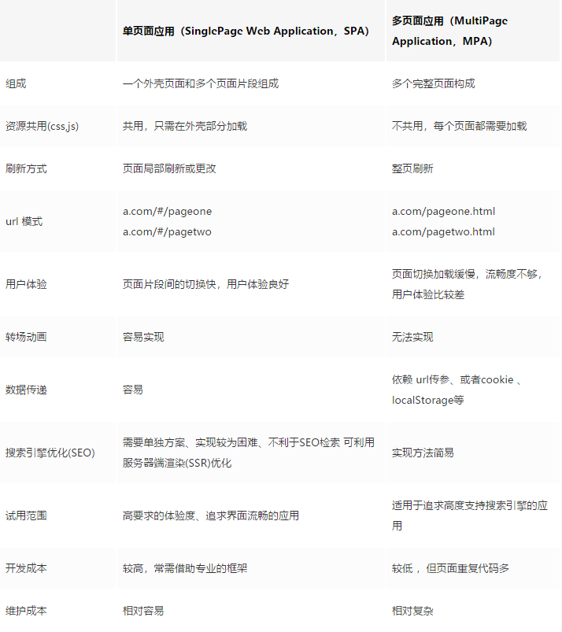

## ● 说说你对 SPA 单页面的理解，它的优缺点分别是什么？
SPA（ single-page application ）仅在 Web 页面初始化时加载相应的 HTML、JavaScript 和 CSS。一旦页面加载完成，SPA 不会因为用户的操作而进行页面的重新加载或跳转；取而代之的是利用路由机制实现 HTML 内容的变换，用户与 UI 的交互，避免页面的重新加载。
### 优点
- 用户体验好、快，内容的改变不需要重新加载整个页面，避免了不必要的跳转和重复渲染；
- 基于上面一点，SPA 相对对服务器压力小；
- 前后端职责分离，架构清晰，前端进行交互逻辑，后端负责数据处理；
### 缺点
- **初次加载耗时多：** 为实现单页 Web 应用功能及显示效果，需要在加载页面的时候将 JavaScript、CSS 统一加载，部分页面按需加载；
- **前进后退路由管理：** 由于单页应用在一个页面中显示所有的内容，所以不能使用浏览器的前进后退功能，所有的页面切换需要自己建立堆栈管理；
- **SEO 难度较大：** 由于所有的内容都在一个页面中动态替换显示，所以在 SEO 上其有着天然的弱势

## ● v-show 与 v-if 有什么区别？
**v-if**：切换过程中条件块内的事件监听器和子组件适当地被销毁和重建

**v-show**：不管初始条件是什么，元素总是会被渲染，并且只是简单地基于 CSS 的 “display” 属性进行切换

所以，`v-if` 适用于在运行时很少改变条件，不需要频繁切换条件的场景；`v-show` 则适用于需要非常频繁切换条件的场景。

## ● Class 与 Style 如何动态绑定？
Class 可以通过对象语法和数组语法进行动态绑定：

**对象语法**
```js
<div v-bind:class="{ active: isActive, 'text-danger': hasError }"></div>

data: {
  isActive: true,
  hasError: false
}
```
**数组语法**
```js
<div v-bind:class="[isActive ? activeClass : '', errorClass]"></div>

data: {
  activeClass: 'active',
  errorClass: 'text-danger'
}
```

Style 也可以通过对象语法和数组语法进行动态绑定：

**对象语法**
```js
<div v-bind:style="{ color: activeColor, fontSize: fontSize + 'px' }"></div>

data: {
  activeColor: 'red',
  fontSize: 30
}
```
**数组语法**
```js
<div v-bind:style="[styleColor, styleSize]"></div>

data: {
  styleColor: {
     color: 'red'
   },
  styleSize:{
     fontSize:'23px'
  }
}
```

## ● 怎样理解 Vue 的单向数据流？
所有的 prop 都使得其父子 prop 之间形成了一个单向下行绑定：父级 prop 的更新会向下流动到子组件中，但是反过来则不行。这样会防止从子组件意外改变父级组件的状态，从而导致你的应用的数据流向难以理解。

额外的，每次父级组件发生更新时，子组件中所有的 prop 都将会刷新为最新的值。这意味着你不应该在一个子组件内部改变 prop。如果你这样做了，Vue 会在浏览器的控制台中发出警告。子组件想修改时，只能通过 $emit 派发一个自定义事件，父组件接收到后，由父组件修改。

有两种常见的试图改变一个 prop 的情形:
- **prop作为子组件的初始值使用**
在这种情况下，最好定义一个本地的 data 属性并将这个 prop 用作其初始值：
```js
props: ['initialCounter'],
data: function () {
  return {
    counter: this.initialCounter
  }
}
```

- **prop进行转换**
在这种情况下，最好使用这个 prop 的值来定义一个计算属性
```js
props: ['size'],
computed: {
  normalizedSize: function () {
    return this.size.trim().toLowerCase()
  }
}
```

## ● computed 和 watch 的区别和运用的场景？
- **computed**：是计算属性：
  - 名称不能与 data 里的对象重复
  - 依赖于其他值，是多个值变化引起一个值变化，是多对一 
  - 并且可以进行缓存，当依赖的值发生改变时，在下一次获取 `computed` 时，才会重新计算 `computed` 值
  - 必须有 return
  - 只能是同步
- **watch**：类似于数据监听的回调：
  - 名称必须和 data 里对象一样
  - 监听一个值，一个值变化引起多个值的变化
  - 没有 return
  - 可以异步
### 运用场景：
- **computed**：当我们需要数值计算、依赖于其他数据时，应该使用computed，因为可以利用 computed 的缓存特性，避免每次获取值时，都要重新计算；
- **watch**：当我们需要在数据变化时执行异步或开销较大的操作时，应该使用 watch，使用 watch 选项允许我们执行异步操作

## ● 直接给一个数组项赋值，Vue 能检测到变化吗？
Vue 不能检测到以下数组的变动：
- 当你利用索引直接设置一个数组项时，例如：`vm.items[indexOfItem] = newValue`
- 当你修改数组的长度时，例如：`vm.items.length = newLength`
为了解决第一个问题，Vue 提供了以下操作方法：
```js
// Vue.set
Vue.set(vm.items, indexOfItem, newValue)
// vm.$set，Vue.set的一个别名
vm.$set(vm.items, indexOfItem, newValue)
// Array.prototype.splice
vm.items.splice(indexOfItem, 1, newValue)
```
为了解决第二个问题，Vue 提供了以下操作方法：
```js
// Array.prototype.splice
vm.items.splice(newLength)
```

## ● 谈谈你对 Vue 生命周期的理解？
### 1. 生命周期是什么？
Vue 实例有一个完整的生命周期，也就是从开始创建、初始化数据、编译模版、挂载 Dom -> 渲染、更新 -> 渲染、卸载等一系列过程，我们称这是 Vue 的生命周期。
| 生命周期    | 描述    |
| -------    | :-----  |
| beforeCreate   | 组件实例被创建之初，组件的属性生效之前 |
| created        | 组件实例已经完全创建，属性也绑定，但真实 dom 还没有生成，$el 还不可用 |
| beforeMount    | 在挂载开始之前被调用：相关的 render 函数首次被调用 |
| mounted        | vm.$el 挂载到实例上去之后调用该钩子 |
| beforeUpdate   | 组件数据更新之前调用，发生在虚拟 DOM 打补丁之前 |
| update         | 组件数据更新之后 |
| activated      | keep-alive 专属，组件被激活时调用 |
| deactivated    | keep-alive 专属，组件被销毁时调用 |
| beforeDestroy  | 组件销毁前调用 |
| destroyed      | 组件销毁后调用 |

## ● Vue 的父组件和子组件生命周期钩子函数执行顺序？
Vue 的父组件和子组件生命周期钩子函数执行顺序可以归类为以下 4 部分：
- 加载渲染过程
父 beforeCreate -> 父 created -> 父 beforeMount -> 子 beforeCreate -> 子 created -> 子 beforeMount -> 子 mounted -> 父 mounted

- 子组件更新过程
父 beforeUpdate -> 子 beforeUpdate -> 子 updated -> 父 updated

- 父组件更新过程
父 beforeUpdate -> 父 updated

- 销毁过程
父 beforeDestroy -> 子 beforeDestroy -> 子 destroyed -> 父 destroyed

## ● 在哪个生命周期内调用异步请求？
可以在钩子函数 created、beforeMount、mounted 中进行调用，因为在这三个钩子函数中，data 已经创建，可以将服务端端返回的数据进行赋值。但是本人推荐在 created 钩子函数中调用异步请求，因为在 **created 钩子函数**中调用异步请求有以下优点：
- 能更快获取到服务端数据，减少页面 loading 时间；
- ssr 不支持 beforeMount 、mounted 钩子函数，所以放在 created 中有助于一致性

## ● 在什么阶段才能访问操作DOM？
在钩子函数 `mounted` 被调用前，Vue 已经将编译好的模板挂载到页面上，所以在 `mounted` 中可以访问操作 `DOM`。

## ● 父组件可以监听到子组件的生命周期吗？
### $emit
通过 `$emit` 实例方法在子组件的生命周期钩子函数中向父组件派发一个事件来实现 
```js
// Parent.vue
<Child @mounted="doSomething"/>
    
// Child.vue
mounted() {
  this.$emit("mounted");
}
```
### @hook
```js
//  Parent.vue
<Child @hook:mounted="doSomething" ></Child>

doSomething() {
   console.log('父组件监听到 mounted 钩子函数 ...');
},
    
//  Child.vue
mounted(){
   console.log('子组件触发 mounted 钩子函数 ...');
},    
    
// 以上输出顺序为：
// 子组件触发 mounted 钩子函数 ...
// 父组件监听到 mounted 钩子函数 ...     
```
当然 `@hook` 方法不仅仅是可以监听 `mounted`，其它的生命周期事件，例如：`created`，`updated` 等都可以监听

## ● 谈谈你对 keep-alive 的了解？
keep-alive 是 Vue 内置的一个组件，可以使被包含的组件保留状态，防止多次渲染 ，其有以下特性：
- 一般结合路由和动态组件一起使用，用于缓存组件；
- 提供 `include` 和 `exclude` 属性，两者都支持字符串或正则表达式， `include` 表示只有名称匹配的组件会被缓存，`exclude` 表示任何名称匹配的组件都不会被缓存 ，其中 `exclude` 的优先级比 `include` 高；
- 对应两个钩子函数 `activated` 和 `deactivated` ，当组件被激活时，触发钩子函数 `activated`，当组件被移除时，触发钩子函数 `deactivated`

## ● 组件中 data 为什么是一个函数？
> 为什么组件中的 data 必须是一个函数，然后 return 一个对象，而 new Vue 实例里，data 可以直接是一个对象？
```js
// data
data() {
  return {
	message: "子组件",
	childName:this.name
  }
}

// new Vue
new Vue({
  el: '#app',
  router,
  template: '<App/>',
  components: {App}
})

```
因为组件是用来复用的，且 JS 里对象是引用关系，如果组件中 data 是一个对象，那么这样作用域没有隔离，子组件中的 data 属性值会相互影响，如果组件中 data 选项是一个函数，那么每个实例可以维护一份独立的对象拷贝，组件实例之间的 data 属性不会互相影响；而 new Vue 的实例，是不会被复用的，因此不存在引用对象的问题

## ● v-model 的原理？
我们在 vue 项目中使用 v-model 在表单元素`input`、`textarea`、`select`实现双向数据绑定，可以看成是 `value + input` 方法的语法糖，v-model 在内部对不同的元素使用不同的属性并抛出不同的事件 
- `text` 和 `textarea` 元素使用 `value` 属性 和 `input` 事件
- `checkbox` 和 `radio` 使用 `check` 属性 和 `change` 事件
- `select` 字段将 `value` 作为 `prop` 并将 `change` 作为事件

## ● Vue 组件间通信有哪几种方式？
### 1. props/$emit
父组件通过 props 向子组件传递数据，子组件通过 $emit 向父组件派发一个事件，并且可以传递数据

### 2. $emit/$on
通过创建一个空的vue实例作为事件中心，用来触发监听事件和触发事件，$on监听事件；$emit触发事件

### 3. $attrs/$listeners
`$attrs` 里存放的是父组件中绑定的非 props 属性，`$listeners` 存放的是父组件中绑定的非原生事件，一般配合inheritAttrs

### 4. provide/inject
父组件通过 provide 提供变量，子组件 通过 inject 注入变量

### 5. $parent/$children
`$parent` 可以访问父组件的实例，`children` 可以访问子组件的实例

## 16、你使用过 Vuex 吗？
`Vuex` 是一个专为 Vue 应用程序开发的状态管理模式，每一个 `Vuex` 应用的核心就是 `store` (仓库)，`store` 基本上就是一个容器，它包含着你的应用中大部分的状态 ( state )
- `Vuex` 的状态存储是响应式的。当 `Vue` 组件从 `store` 中读取状态的时候，若 `store` 中的状态发生变化，那么相应的组件也会相应地得到高效更新
- 改变 `store` 中的状态的唯一途径就是显式地提交 (commit) mutation。这样使得我们可以方便地跟踪每一个状态的变化

主要包括以下几个模块：
- State：定义了应用状态的数据结构，可以在这里设置默认的初始状态
- Getter：可以依赖 state 中的数据计算出一些状态，类似 vue 中的计算属性
- Mutation：是唯一更改 store 中状态的方法，且必须是同步函数
- Action：用于提交 mutation，不可以直接变更 state，可以包含任意异步操作
- Module：允许将单一的 Store 拆分为多个 store 且同时保存在单一的状态树中

## ● 使用过 Vue SSR 吗？说说 SSR？
SSR大致的意思就是 vue 在客户端将标签渲染成的整个 html 片段的工作在服务端完成，服务端形成的html 片段直接返回给客户端这个过程就叫做服务端渲染。
1. 服务端渲染的优点
- **更好的 SEO**：因为 SPA 页面的内容是通过 Ajax 获取，而搜索引擎爬取工具并不会等待 Ajax 异步完成后再抓取页面内容，所以在 SPA 中是抓取不到页面通过 Ajax 获取到的内容；而 SSR 是直接由服务端返回已经渲染好的页面（数据已经包含在页面中），所以搜索引擎爬取工具可以抓取渲染好的页面；
- **首屏加载更快**：SPA 会等待所有 Vue 编译后的 js 文件都下载完成后，才开始进行页面的渲染，文件下载等需要一定的时间等，所以首屏渲染需要一定的时间；SSR 直接由服务端渲染好页面直接返回显示，无需等待下载 js 文件及再去渲染等，所以 SSR 首屏加载更快

2. 服务端渲染的缺点
- **开发条件限制**：服务端渲染只支持 beforCreate 和 created 两个钩子函数，这会导致一些外部扩展库需要特殊处理，才能在服务端渲染应用程序中运行
- **服务器负载问题**：在 Node.js 中渲染完整的应用程序，显然会比仅仅提供静态文件的 server 更加大量占用 CPU 资源，因此如果应用是在高流量环境下使用，需要准备相应的服务器负载

如果没有 SSR 开发经验的同学，可以参考本文作者的另一篇 SSR 的实践文章[《Vue SSR 踩坑之旅》](https://juejin.im/post/6844903824956588040)，里面 SSR 项目搭建以及附有项目源码。


## ● 什么是 MVVM？
Model–View–ViewModel （MVVM） 是一个软件架构设计模式，由微软 WPF 和 Silverlight 的架构师 Ken Cooper 和 Ted Peters 开发，是一种简化用户界面的事件驱动编程方式。由 John Gossman（同样也是 WPF 和 Silverlight 的架构师）于2005年在他的博客上发表

MVVM源于经典的 MVC (Model-view-controller) 模式，MVVM的出现促进了前端开发和后端业务逻辑的分离，极大地提高了前端的开发效率，MVVM 的核心是 ViewModel 层，它就是一个中转站(value converter)，该层向上与view层进行双向数据绑定，向下与 model 层通过接口请求进行数据交互，起到承上启下的作用


### view 层
View 是视图层，也就是用户界面，前端主要用 HTML 和 css 构建

### Model 层
Model 是指数据模型，泛指后端进行的各种业务逻辑处理和数据操控，对于前端来说就是后端提供的 API 接口

### ViewModel 层
ViewModel 是由前端开发人员组织生成和维护的视图数据层，在这一层，前端开发人员从后端获取到 Model 数据进行转换处理，做二次封装，生成 View 层预期使用的视图数据模型，ViewModel 所封装出来的数据模型包括了视图的状态和行为，而 Model 层的数据模型只包含了视图的状态，比如页面的这一块展示什么，而页面加载进来发生什么，点击发生什么，滚动发生什么，这些都属于视图的行为(交互)，视图的状态和行为都封装在了 ViewModel 层，这样的封装让 ViewModel 可以完整地描述 View 层

## ● 说说 vue 的组件封装
在我用 vue 开发项目的时候，一般我都会用到组件封装，采用组件化的思想进行项目开发，我会创建不同的目录来放不同的组件
- `views` 目录：放页面级的组件
- `common` 目录：放公共组件，例如，head(公共头组件)、foot(公共底部组件)等
- `feature` 目录：放功能组件，例如 swiper(轮播功能组件)、tabbar(切换功能组件)、list(上拉加载功能组件)等等

## ● Vue 是如何实现数据双向绑定的？
Vue 数据双向绑定主要是指：数据变化更新视图，视图变化更新数据：

其中，View 变化更新 Data ，可以通过事件监听的方式来实现，所以 Vue 的数据双向绑定的工作主要是如何根据 Data 变化更新 View。

Vue 主要通过以下 4 个步骤来实现数据双向绑定的：
- 实现一个监听器 Observer：对数据对象进行遍历，包括子属性对象的属性，利用 Object.defineProperty() 对属性都加上 setter 和 getter。这样的话，给这个对象的某个值赋值，就会触发 setter，那么就能监听到了数据变化。

- 实现一个解析器 Compile：解析 Vue 模板指令，将模板中的变量都替换成数据，然后初始化渲染页面视图，并将对应指令的节点绑定更新函数，添加监听数据的订阅者 Watcher，一旦数据有变动，收到通知，调用更新函数进行数据更新

- 实现一个订阅者 Watcher：Watcher 订阅者是 Observer 和 Complie 之间的桥梁，主要的任务是订阅 Observer 中的数据变化的消息，当收到数据变化的消息时，触发 Complie 中的对应的更新函数

- 实现一个订阅器 Dep：订阅器采用 发布-订阅 的设计模式，用来收集 Watcher ，对监听器 Observer 和订阅者 Watcher 进行统一的管理

## ● vue 常用的修饰符
- `.prevent`: 提交事件不再重载页面
- `.stop`: 阻止单击事件冒泡
- `.self`: 当事件发生在该元素本身而不是子元素的时候会触发

## ● vue 中 key 值的作用
vue 中 key 值的作用可以分为两种情况来考虑。

### v-if 中使用 key
由于 `vue` 会尽可能高效地渲染元素，通常会复用已有元素而不是从新渲染，因此当我们使用 `v-if` 来实现元素切换的时候，如果切换前后含有相同类型的元素，那么这个元素就会被复用，如果是 `input` 元素，那么切换前后用户的输入不会被清除掉，这样是不符合需求的。因此我们可以通过使用 `key` 标识一个元素，这个情况下，使用 `key` 的元素不会被复用。**这个时候 `key` 的作用是用来标识一个独立的元素**
```html
<template v-if="loginType">
    <label>Username</label>
    <input placeholder="Enter your username" key="username-input">
</template>

<template v-else>
    <label>Email</label>
    <input placeholder="Enter your email address" key="email-input">
</template>
```

### v-for 中使用 key
用 `v-for` 更新已渲染过的元素列表时，它默认使用 **就地复用** 的策略。如果数据项的顺序发生了改变，`Vue` 不会移动 `DOM` 元素来匹配数据项的顺序，而是简单复用此处的每个元素。因此通过为每个列表项提供一个 `key` 值，来以便 `Vue` 跟踪元素，从而高效的实现复用。**这个时候 `key` 的作用是为了高效的更新渲染虚拟 DOM**


## ● vue 中，子组件为何不可以修改父组件传递的 `Prop`
`Vue` 提倡单向数据流，即父级 `props` 的更新会流向子组件，但是反过来则不行，这是为了防止意外的改变父组件状态，使得应用的数据流变得难以理解，
需要特别注意的是:
- 当你从子组件修改的 `prop` 属于基础类型时会触发提示。这种情况下，你是无法修改父组件的数据源的，因为基础类型赋值时是值拷贝
- 当你修改引用类型值(Object、Array)时不会触发提示，并且会修改父组件数据源的数据

## ● vue 2.x 中如何检测数组的变化的
使用函数劫持的方式，重写数组的方法，`Vue` 将 `data` 中的数组进行了原型链重写，指向了自己定义的数组原型方法，这样当调用数组 `api` 时，可以通知依赖更新，如果数组中包含引用类型，会对数组中的引用类型再次递归遍历进行监控，这样就实现了监测数组的变化

## ● nextTick 的实现原理是什么
在 `DOM` 更新结束之后执行回调，`nextTick` 主要使用了宏任务和微任务。

`nextTick` 将传入的函数，push 到数组(callbacks)中，再根据执行环境分别尝试采用
- Promise
- MutationObserver
- setImmediate
- 如果以上都不行则采用 setTimeout

遍历数组执行回调

## ● Vue 事件绑定原理说一下
- 原生事件绑定是通过 `addEventListener` 绑定给真实元素的
- 组件事件绑定是通过 `Vue` 自定义的 `$on` 实现的

## ● Vue 模板编译原理说一下
简单说，`Vue` 的编译过程就是将 `template` 转化为 `render` 函数的过程，会经历以下阶段
- 将 `模板字符串` 生成 `AST` 树(解析器)
    - 使用大量的正则表达式对模板进行解析，遇到标签、文本的时候都会执行对应的钩子进行相关处理
- 对 `AST` 进行静态节点标记，主要用来做虚拟 DOM 的渲染优化(优化器)
- 使用 `AST` 生成 `render` 函数代码字符串(代码生成器)

参考文章：[Vue模板编译原理](https://segmentfault.com/a/1190000013763590)

<!-- ## 28、Vue2.x和Vue3.x渲染器的diff算法分别说一下 -->

## ● vue 中 mixin 和 mixins 区别
- `mixin`: 全局注册一个混入，影响注册之后所有的创建的每个 Vue 实例，
- `mixins`: 选项接受一个混入对象的数组，当组件使用混入对象时，所有混入对象的选项将被 “混合” 进该组件本身的选项
    - 数据发生冲突时以组件数据优先
    - 同名钩子函数将合并为一个数组，因此都将被调用，另外，**混入对象的钩子将在组件自身钩子之前调用**
    - 值为对象的选项(methods、components、directives)，将被合并为同一个对象。两个对象键名冲突时，取 **组件对象** 的键值对。

## ● 如何让 CSS 只在当前组件中起作用
在组件的 `style` 标签加上 `scoped` 属性

## ● 渐进式框架的理解
**主张最少**：在不同的场景，使用 `vue` 中不同的功能
框架做分层设计，每层都是可选，不同层可以灵活接入其他方案，当你都想用官方的实现时，会发现也早已准备好，各层之间包括配套工具都能比接入其他方案更便捷地协同工作。

## ● 单页面应用和多页面应用区别及优缺点


**单页面(SPA)**

只有一个主页面的应用，所有的页面内容都包含在这个所谓的主页面中，用路由动态载入，单页面的页面跳转仅刷新局部资源

- 优点
  - 用户体验好，速度快，内容的改变不需要重新加载整个页面，SPA 对服务器压力较小
- 缺点
  - 不利于SEO
  - 初次加载时相对耗时多

**多页面MPA**

一个应用中有多个页面，页面跳转时是整页刷新

- 优点
  - SEO 实现方法简单
- 缺点
  - 页面重复代码较多
  - 初次加载时相对耗时多

## ● assets 和 static 的区别
区别：`webpack` 处理静态资源的方式不同
相同点：都是存放静态资源的文件夹，比如：图片、字体图标、样式文件
- assets
    - 会走打包流程
    - 要以相对路径的方式引用，`webpack` 会解析成为模板依赖，会使用相应的 `loader` 解析
- static
    - 要以绝对路径的形式引用，该目录下的文件不会被 `webpack` 处理，会直接复制到最终的打包目录下

## ● 如何获取 DOM
1. 直接给相应的元素加 `id`，然后再 document.getElementById('id') 获取，
2. 在 `DOM` 元素或者组件上加 `ref="name"`，通过 `this.$refs.name` 获取到该元素，如果在组件上，会获取到组件实例

## ● 说出几种 vue 当中的指令和它的用法？
- `v-bind`: 绑定元素属性
- `v-on`: 绑定事件监听器
- `v-if`: 根据表达式的真假值，有条件地渲染元素
- `v-show`: 根据表达式的真假值，切换 `css` 的 `display` 属性
- `v-text`: 更新元素的内容
- `v-html`: 更新元素的 `innerHTML`，内容按普通的 `HTML` 插入，不会作为 `Vue` 模板进行编译
- `v-for`: 基于数据源多次渲染元素或模板块
- `v-modul`: 在表单控件或者组件上创建双向数据绑定
- `v-solt`: 提供具名插槽或者需要接收 prop 的插槽
- `v-pre`: 跳过这个元素和它的子元素的编译过程，可以用来显示原始标签，跳过大量没有指令的节点会加快编译
- `v-once`: 只渲染元素和组件一次，随后的重新渲染，元素或组件及其所有的子节点将被视为静态内容并跳过

## ● 请说出 vue.cli 项目中 src 目录每个文件夹和文件的用法？
- `assets` 文件夹是放静态资源
- `components` 是放组件
- `router` 是定义路由相关的配置
- `view` 视图
- `app.vue` 是一个应用主组件
- `main.js` 是入口文件

## ● console.log(1+'2')和 console.log(1-'2')的打印结果
`12` 和 `-1`

- 原因，除了加法运算符 `+` 有可能把运算值转为字符串，其他运算符都会把运算值自动转成数值


