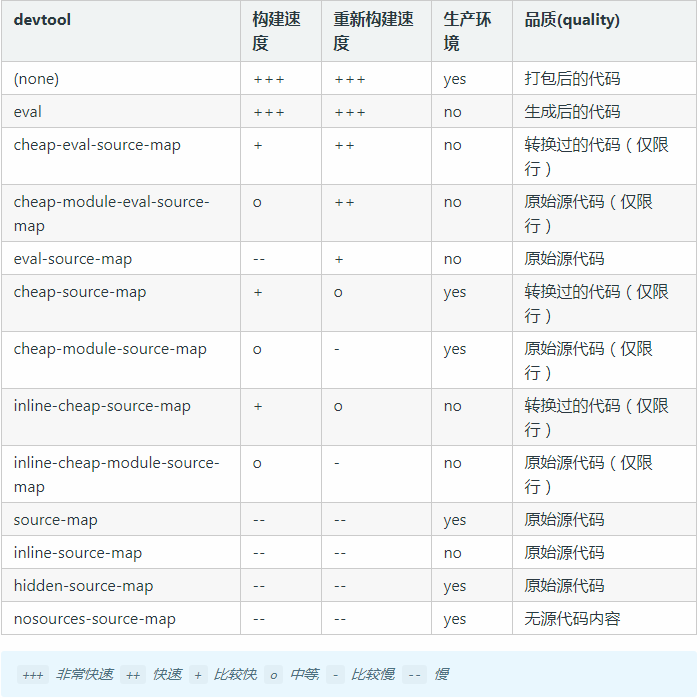
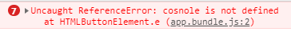
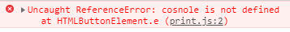
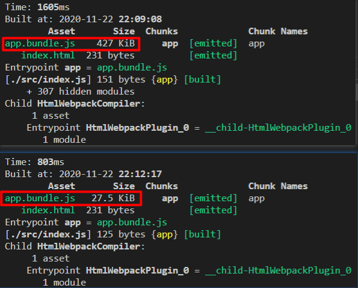

# 管理输出

## 输出多个 bundle
### 创建和修改文件
```sh {7}
  webpack-demo
  |- package.json
  |- webpack.config.js
  |- /dist
    |- index.html
  |- /src
    |- index.js
+   |- print.js
  |- /node_modules
```
在 `src/print.js` 文件中添加一些逻辑
```js
export default function printMe() {
  console.log('I get called from print.js!');
}
```
并且在 `src/index.js` 文件中使用这个函数：
```js
import _ from 'lodash';
import printMe from './print.js';

function component() {
  var element = document.createElement('div');
  var btn = document.createElement('button');

  element.innerHTML = _.join(['Hello', 'webpack'], ' ');

  btn.innerHTML = 'Click me and check the console!';
  btn.onclick = printMe;

  element.appendChild(btn);

  return element;
}

document.body.appendChild(component());
```

更新 `dist/index.html` 文件，来为 `webpack` 分离入口做好准备
```html
<!doctype html>
<html>
  <head>
    <title>起步</title>
    <script src="./print.bundle.js"></script>
  </head>
  <body>
    <script src="./app.bundle.js"></script>
  </body>
</html>
```
在 `webpack.config.js` 调整配置：
- 在 `entry` 添加 `src/print.js` 作为新的入口起点 `print`
- 修改 `output` ，根据入口起点名称动态生成 `bundle` 名称
```js {4-7,9}
const path = require('path');

module.exports = {
  entry: {
    app: './src/index.js',
    print: './src/print.js'
  },
  output: {
    filename: '[name].bundle.js',
    path: path.resolve(__dirname, 'dist')
  }
};
```
`webpack` 生成 `print.bundle.js` 和 `app.bundle.js` 文件
```sh {6-7}
  webpack-demo
  |- package.json
  |- webpack.config.js
  |- /dist
    |- index.html
+   |- print.bundle.js
+   |- app.bundle.js
  |- /src
    |- index.js
    |- print.js
  |- /node_modules
```
有个问题就是：我们更改了一个入口起点的名称，甚至添加了一个新的名称，生成的包将被重命名在一个构建中，但是我们的 `index.html` 文件仍然会引用旧的名字，这个问题用下面即将讲到的 `html-webpack-plugin` 来解决

## webpackPlugin

### html-webpack-plugin
`html-webpack-plugin` 可以让我们使用固定的模板，在每次打包的时候 自动生成 一个 `index.html` 文件，并且它会 自动 帮我们引入我们打包后的`.js`文件

首先安装插件，并且调整 `webpack.config.js` 文件：
```sh
npm install --save-dev html-webpack-plugin
```
```js {2,9-13}
  const path = require('path');
  const HtmlWebpackPlugin = require('html-webpack-plugin');

  module.exports = {
    entry: {
      app: './src/index.js',
      print: './src/print.js'
    },
    plugins: [
      new HtmlWebpackPlugin({
        title: 'src/index.html'
      })
    ],
    output: {
      filename: '[name].bundle.js',
      path: path.resolve(__dirname, 'dist')
    }
  };
```


### clean-webpack-plugin
`clean-webpack-plugin` 的理解是：它能帮我们在打包之前 **自动删除** `dist` 打包目录及其目录下所有文件，不用我们手动进行删除。

我们使用如下命令来安装 `clean-webpack-plugin`，安装完毕以后，我们同样需要在 `webpack.config.js` 中进行配置(改动部分参考高亮代码块)
```sh
$ npm install clean-webpack-plugin -D
```
```js {3,14}
const path = require('path');
const HtmlWebpackPlugin = require('html-webpack-plugin');
const {CleanWebpackPlugin} = require('clean-webpack-plugin')

module.exports = {
  mode: 'development',
  entry: {
    main: './src/index.js'
  },
  plugins: [
    new HtmlWebpackPlugin({
      template: 'src/index.html'
    }),
    new CleanWebpackPlugin()
  ],
  output: {
    filename: 'main.js',
    path: path.resolve(__dirname,'dist')
  }
}
```
我们只介绍了两种常用的 `plugin`，更多 `plugin` 的用法我们将在后续进行讲解，你也可以点击 [Webpack Plugins](https://www.webpackjs.com/plugins/) 来学习更多官网推荐的 `plugin` 用法。

## 配置 SourceMap
`source-map` 的理解：它是一种映射关系，它映射了打包后的代码和源代码之间的对应关系，一般通过 `devtool` 来配置。

以下是官方提供的devtool各个属性的解释以及打包速度对比图：



通过上图我们可以看出，良好的 `source-map` 配置不仅能帮助我们提高打包速度，同时在代码维护和调错方面也能有很大的帮助，一般来说，`source-map` 的最佳实践是下面这样的：
- 开发环境下(development)：推荐将 `devtool` 设置成 `cheap-module-eval-source-map`
- 生产环境下(production)：推荐将 `devtool` 设置成 `cheap-module-source-map`

### 配置 webpack.config.js 
```js
const path = require('path');
const HtmlWebpackPlugin = require('html-webpack-plugin');
const {CleanWebpackPlugin} = require('clean-webpack-plugin')


module.exports = {
  entry: {
    app: './src/index.js',
    print: './src/print.js'
  },
  devtool: 'inline-source-map',
  plugins: [
    new HtmlWebpackPlugin({
      title: 'src/index.html'
    }),
    new CleanWebpackPlugin()
  ],
  output: {
    filename: '[name].bundle.js',
    path: path.resolve(__dirname, 'dist')
  }
};

```

### 修改 src/print.js
```js
  export default function printMe() {
    cosnole.error('I get called from print.js!');
  }
```
:::tip 配置前后对比
- 配置前

  
- 配置后

  

`source map` 功能更容易追踪错误和警告，一个来自 `print.js` 的错误，它能明确告诉你
:::
官方的一个显示所有 `devtool` 效果的[示例](https://github.com/webpack/webpack/tree/master/examples/source-map)


## 使用 webpackDevServer
`webpack-dev-server` 的理解：它能帮助我们在源代码更改的情况下，`自动` 帮我们打包我们的代码并 `启动` 一个小型的服务器。如果与热更新一起使用，它能帮助我们高效的开发。

自动打包的方案，通常来说有如下几种：
- `watch` 参数自动打包：它是在打包命令后面跟了一个 `--watch` 参数，它虽然能帮我们自动打包，但我们任然需要手动刷新浏览器，同时它不能帮我们在本地启动一个小型服务器，一些 `http` 请求不能通过。
- `webpack-dev-server` 插件打包(推荐)：它是我们推荐的一种自动打包方案，在开发环境下使用尤其能帮我们高效的开发，它能解决 `watch` 参数打包中的问题，如果我们与热更新(`HMR`)一起使用，我们将拥有非常良好的开发体验

### watch参数自动打包
使用 `watch` 参数进行打包，我们需要在 `package.json` 中新增一个 `watch` 打包命令，它的配置如下
```json
{
  // 其它配置
  "scripts": {
    "bundle": "webpack",
    "watch": "webpack --watch"
  }
}
```
在配置好上面的打包命令后，我们使用 `npm run watch` 命令进行打包，尝试修改 `src/index.js` 中的代码，改动完毕后，刷新一下浏览器，发现页面内容已经修改

### webpack-dev-server 打包
要使用webpack-dev-server，我们需要使用如下命令进行安装
```sh
$ npm install webpack-dev-server -D
```
安装完毕后，我们和watch参数配置打包命令一样，也需要新增一个打包命令，在 `package.json` 中做如下改动：
```json
// 其它配置
  "scripts": {
    "bundle": "webpack",
    "watch": "webpack --watch",
    "dev": "webpack-dev-server'
  }
```
配置完打包命令后，我们最后需要对 `webpack.config.js` 做一下配置：
```js
module.exports = {
  // 其它配置
  devServer: {
    // 以dist为基础启动一个服务器，服务器运行在4200端口上，每次启动时自动打开浏览器
    contentBase: 'dist',
    open: true,
    port: 4200
  }
}
```
在以上都配置完毕后，我们使用 `npm run dev` 命令进行打包，它会自动帮我们打开浏览器，现在你可以在 `src/index.js` 修改代码，再在浏览器中查看效果

## 模块热更新(HMR)
模块热更新(HMR)的理解：它能够让我们在不刷新浏览器(或自动刷新)的前提下，在运行时帮我们更新最新的代码。

模块热更新(HMR)已内置到 Webpack ,我们只需要在webpack.config.js中像下面这样简单的配置即可，无需安装别的东西。

```js
const webpack = require('webpack');
module.exports = {
  // 其它配置
  devServer: {
    contentBase: 'dist',
    open: true,
    port: 3000,
    hot: true, // 启用模块热更新
    hotOnly: true // 模块热更新启动失败时，重新刷新浏览器
  },
  plugins: [
    // 其它插件
    new webpack.HotModuleReplacementPlugin()
  ]
}
```
## 处理ES6语法
我们在项目中书写的 `ES6` 代码，由于考虑到低版本浏览器的兼容性问题，需要把 `ES6` 代码转换成低版本浏览器能够识别的 `ES5` 代码。使用 `babel-loader` 和`@babel/core` 来进行 `ES6` 和 `ES5` 之间的链接，使用 `@babel/preset-env` 来进行 `ES6` 转 `ES5`

要处理ES6代码，需要我们安装几个npm包，可以使用如下的命令去安装
```sh
// 安装 babel-loader @babel/core
$ npm install babel-loader @babel/core --save-dev

// 安装 @babel/preset-env
$ npm install @babel/preset-env --save-dev

// 安装 @babel/polyfill进行ES5代码补丁
$ npm install @babel/polyfill --save-dev
```
安装完毕后，我们需要改写src/index.js中的代码，可以是下面这个样子：
```js
import '@babel/polyfill';
const arr = [
  new Promise(() => {}),
  new Promise(() => {}),
  new Promise(() => {})
]

arr.map(item => {
  console.log(item);
})
```
处理 `ES6` 代码，需要我们使用 `loader`，所以需要在 `webpack.config.js` 中添加如下的代码：
```js
module.exports = {
  // 其它配置
  module: {
    rules: [
      {
        test: /\.js$/,
        exclude: /node_modules/,
        use: {
          loader: 'babel-loader'
        }
      }
    ]
  }
}
```
`@babel/preset-env` 需要在根目录下有一个 `.babelrc` 文件，所以我们新建一个 `.babelrc` 文件，它的代码如下：
```js
{
  "presets": ["@babel/preset-env"]
}
```
为了让我们的打包变得更加清晰，我们需要在 `webpack.config.js` 中把 `source-map` 配置成 `none` ，像下面这样：
```js
module.exports = {
  // 其他配置
  mode: 'development',
  devtool: 'none'
}
```
针对以上最后一个问题，我们希望，我们使用了哪些 `ES6` 代码，就引入它对应的 `polyfill` 包，达到一种按需引入的目的，要实现这样一个效果，我们需要在 `.babelrc` 文件中做一下小小的改动，像下面这样：
```js
{
  "presets": [["@babel/preset-env", {
    "corejs": 2,
    "useBuiltIns": "usage"
  }]]
}
```
同时需要注意的时，我们使用了 `useBuiltIns:"usage"` 后，在 `index.js` 中就不用使用 `import '@babel/polyfill'`这样的写法了，因为它已经帮我们自动这样做了。

再次使用 `npx webpack` 进行打包，如下图，可以看到此次打包后，`app.bundle.js` 的大小明显变小了。




