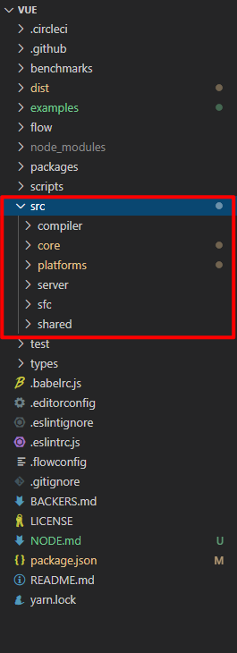

# Vue源码解析准备篇
[[toc]]

读Vue源码所需要的一些知识点，掌握这些知识点之后，相信再阅读源码会较为轻松

## 1. Flow
Flow 是 Javascript 静态类型检查工具，可以实现接近强类型语言的开发体验，可以加入类型的限制，提高代码质量
```js
function sum(a, b) {
  return a + b;
}
```
执行时会得到一些你想不到的结果，例如：
- sum('a', 1) 
- sum(1, [1,2,3])
这样编程未免太不稳定了。那我们看看用了Flow之后的结果：
```js
function sum(a: number, b:number) {
  return a + b;
}
```
我们可以看到多了一个number的限制，标明对a和b只能传递数字类型的，否则的话用Flow工具检测会报错。
### Flow 的基本语法
```js
export function renderList (
  val: any,
  render: (
    val: any,
    keyOrIndex: string | number,
    index?: number
  ) => VNode
): ?Array<VNode>{
  // ...
}
```
- `val` 是 `any` 类型：代表可以传入任意类型
- `keyOrIndex` 是 `string|number` 类型：代表要不是 `string` 类型，要不是 `number`
- `index?:number` 问号在冒号前面代表可以不传；问号是在冒号后面，则代表这个参数必须要传递，但是可以是数字类型也可以是空

如果想学习 Flow 更多的细节， 可以看看下面这篇文章： [Flow学习资料](https://zhuanlan.zhihu.com/p/26204569)


## 2. 原型与原型继承
Vue中的组件相信大家都使用过，并且组件之中可以有子组件，那么这里就涉及到父子组件了。组件其实初始化过程都是一样的，显然有些方法是可以继承的。Vue代码中是使用原型继承的方式实现父子组件共享初始化代码的。所以，要看懂这里，需要了解js中原型的概念；这里不多谈，只是提供几个学习资料供大家参考： [廖雪峰js教程](https://www.liaoxuefeng.com/wiki/1022910821149312/1023021997355072) [js原型理解](https://www.jianshu.com/p/dee9f8b14771)


## 3. Object.defineProperty
先看看 Vue 中定义响应式数据的代码：
```js
export function defineReactive (
  obj: Object,
  key: string,
  val: any,
  customSetter?: ?Function,
  shallow?: boolean
) {
  .....
  Object.defineProperty(obj, key, {
    enumerable: true,
    configurable: true,
    get: function reactiveGetter () {
      const value = getter ? getter.call(obj) : val
      if (Dep.target) {
        dep.depend()
        if (childOb) {
          childOb.dep.depend()
          if (Array.isArray(value)) {
            dependArray(value)
          }
        }
      }
      return value
    },
    set: function reactiveSetter (newVal) {
      const value = getter ? getter.call(obj) : val
      /* eslint-disable no-self-compare */
      if (newVal === value || (newVal !== newVal && value !== value)) {
        return
      }
      /* eslint-enable no-self-compare */
      if (process.env.NODE_ENV !== 'production' && customSetter) {
        customSetter()
      }
      if (setter) {
        setter.call(obj, newVal)
      } else {
        val = newVal
      }
      childOb = !shallow && observe(newVal)
      dep.notify()
    }
  })
}
```
Object.defineProperty这个函数的运用，其中：
- 第一个参数代表要设置的对象
- 第二个参数代表要设置的对象的键值
- 第三个参数是一个配置对象：
    - value: 对应key的值
    - configurable：是否可以删除该 key 或者重新配置该 key
    - enumerable：是否可以遍历该key
    - writable：是否可以修改该key
    - get：获取该key值时调用的函数
    - set：设置该key值时调用的函数

## 4. Vnode概念
Vnode，顾名思义，Virtual node，虚拟节点，首先声明，这不是Vue自己首创的概念，其实Github上早就有一个类似的项目:[Snabbdom](https://github.com/snabbdom/snabbdom)
这个库包含了完整的Vnode以及dom diff算法，甚至实现的具体代码上感觉Vue和这个库也是有点相像的。为啥要用Vnode呢？其实原因主要是原生的dom节点对象太大了，我们运行一下代码：
```js
let dom = document.createElement('div');
for(let key in dom){
      console.log(key)
}
```
打印的结果灰常长！！！说明这个dom对象节点有点重量级，而我们的 html 网页经常数以百计个这种 dom 节点，如果采用之前的 Jquery 这种方式直接操作 dom，会很浪费性能，所以 snabbdom 或者 Vue 中应用了 Vnode，Vnode对象啥样呢？ 看看Vue源码对Vnode的定义：
```js
export default class VNode {
  tag: string | void;
  data: VNodeData | void;
  children: ?Array<VNode>;
  text: string | void;
  elm: Node | void;
  ns: string | void;
  context: Component | void; // rendered in this component's scope
  key: string | number | void;
  componentOptions: VNodeComponentOptions | void;
  componentInstance: Component | void; // component instance
  parent: VNode | void; // component placeholder node

  // strictly internal
  raw: boolean; // contains raw HTML? (server only)
  isStatic: boolean; // hoisted static node
  isRootInsert: boolean; // necessary for enter transition check
  isComment: boolean; // empty comment placeholder?
  isCloned: boolean; // is a cloned node?
  isOnce: boolean; // is a v-once node?
  asyncFactory: Function | void; // async component factory function
  asyncMeta: Object | void;
  isAsyncPlaceholder: boolean;
  ssrContext: Object | void;
  fnContext: Component | void; // real context vm for functional nodes
  fnOptions: ?ComponentOptions; // for SSR caching
  fnScopeId: ?string;
....
}
```

相比之下, Vnode对象的属性确实少了很多；其实光属性少也不见得性能就能高到哪儿去，另一个方面便是针对新旧Vnode的diff算法了

## 5. 函数柯里化
函数柯里化其实就是将多参数的函数化作多个部分函数去调用。举个例子：
```js
function getSum(a,b){
    return a+b;
}
```
这是个两个参数的函数，可以直接getSum(1,2)调用拿到结果；然而，有时候并不会两个参数都能确定，只想先传一个值，另外一个在其他时间点再传入，那我们把函数改为：
```js
function getSum(a){
  return function(b){
    return a + b;
  }
}

let f = getSum(2)
console.log(f(3))

console.log(getSum(2)(3)) //结果同上
```
可见，柯里化的效果便是之前必须同时传入两个参数才能调用成功而现在两个参数可以在不同时间点传入

Vue源码是这么应用这个特性的，Vue源码中有一个platform目录，专门存放和平台相关的源码（Vue可以在多平台上运行 比如Weex）。那这些源码中肯定有些操作是和平台相关的，比如会有些以下伪代码所表示的逻辑:
```js
if(平台A){
  // ....
}else if(平台B){
  // ....
}
```
可是如果这么写会有个小不舒服的地方，那就是其实代码运行时第一次走到这里根据当前平台就已经知道走哪一个分支了，而现在这么写必当导致代码再次运行到这里的时候还会进行平台判断，这样总感觉会多一些无聊的多余判断，因此Vue解决此问题的方式就是应用了函数柯里化技巧，类似声明了以下一个函数:
```js
function ...(平台相关参数){
  return function(平台不相关参数){
    // 处理逻辑
  }
}
```

## 6. Macrotask与Microtask
Vue更新不是数据一改马上同步更新视图的，这样肯定会有性能问题，比如在一个事件处理函数里先this.data = A 然后再this.data=B,如果要渲染两次，想想都感觉很low。Vue源码实际上是将更改都放入到队列中，同一个watcher不会重复（不理解这些概念不要紧，后面源码会重点介绍），然后异步处理更新逻辑。在实现异步的方式时，js实际提供了两种task--Macrotask与Microtask。两种task有什么区别呢？先从一个例子讲起：
```js
console.log('script start');
setTimeout(function() {
    console.log('setTimeout');
    Promise.resolve().then(function() {
        console.log('promise3');
    }).then(function() {
        console.log('promise4');
    });
}, 0);
Promise.resolve().then(function() {
    console.log('promise1');
}).then(function() {
    console.log('promise2');
});
console.log('script end');
```
```js
// 打印结果
script start
script end
promise1
promise2
setTimeout
promise3
promise4
```

## 7. 目录结构
源码位于src目录下，下面对src下的目录进行介绍



### compiler
该目录是编译相关的代码，即将 template 模板转化成 render 函数的代码

### core
这部分代码是 vue 的核心代码
- **components**：内置组件的代码，即 keep-alive 代码
- **global-api**：全局API代码，mixin，extend 等 api 在这里实现
- **instance**：vue实例化相关代码，包括初始化，事件，生命周期，渲染等部分的代码
- **observer**：响应式数据相关代码
- **util**：工具方法
- **vdom**：虚拟 dom 的代码

### platforms
platforms下包含两个子目录，web 和 weex。

分别代表可以打包生成在web端使用的 vue 代码和在native端使用的 weex 代码

### server
该目录下是 SSR 相关的代码。

Vue.js 是构建客户端应用程序的框架。除了可以在浏览器中输出 Vue 组件，也可以将同一个组件渲染为服务器端的 HTML 字符串，将它们直接发送到浏览器，最后将这些静态标记"激活"为客户端上完全可交互的应用程序。

### sfc
我们平时开发时，都是写 .vue 文件。sfc 的代码就是提供一个解析器，把.vue文件代码解析成一个 javascript 对象

### shared
该目录下定义了一些公用的工具方法，提供给上面的几个目录内代码使用


