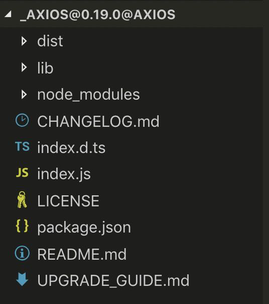
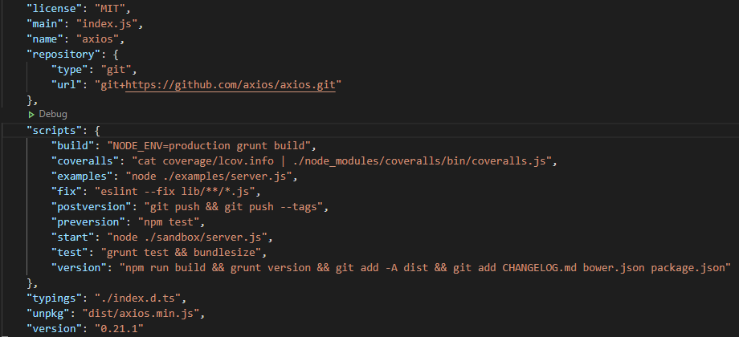
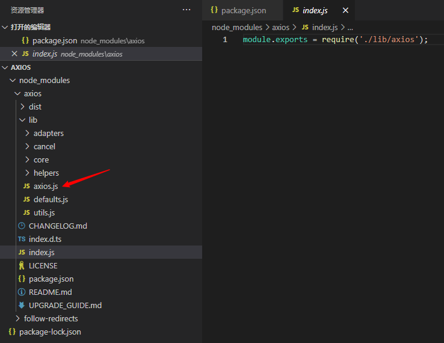

# axios 源码
[[toc]]
## 安装Axios
1. 通过使用 npm 命令安装它
```npm
npm i axios --save
```

2. 安装成功后，进入的axios文件目录下，




## Axios 源码分析

### 源码结构
1. 先看`package.json` 主要关注 `package.json` 中的 `main` 字段，它的值(一个相对路径)代表这个包的入口文件。这里可以看出 `axios` 的包的入口文件是 `index.js` 文件，再看一下包的 `scripts` 执行脚本，然后可以在本地执行脚本进行调试。



2. 进入`index.js`入口文件，可以看出 `axios` 的内部逻辑均在 `lib` 文件夹下。



3. `/lib/axios.js` 最终导出了 `axios`
```js
module.exports.default = axios;
```

::: details 点击看源码
```js
'use strict';

var utils = require('./utils');
var bind = require('./helpers/bind');
var Axios = require('./core/Axios');
var mergeConfig = require('./core/mergeConfig');
var defaults = require('./defaults');

/**
 * Create an instance of Axios
 *
 * @param {Object} defaultConfig The default config for the instance
 * @return {Axios} A new instance of Axios
 */
function createInstance(defaultConfig) {
  var context = new Axios(defaultConfig);
  var instance = bind(Axios.prototype.request, context);

  // Copy axios.prototype to instance
  utils.extend(instance, Axios.prototype, context);

  // Copy context to instance
  utils.extend(instance, context);

  return instance;
}

// Create the default instance to be exported
var axios = createInstance(defaults);

// Expose Axios class to allow class inheritance
axios.Axios = Axios;

// Factory for creating new instances
axios.create = function create(instanceConfig) {
  return createInstance(mergeConfig(axios.defaults, instanceConfig));
};

// Expose Cancel & CancelToken
axios.Cancel = require('./cancel/Cancel');
axios.CancelToken = require('./cancel/CancelToken');
axios.isCancel = require('./cancel/isCancel');

// Expose all/spread
axios.all = function all(promises) {
  return Promise.all(promises);
};
axios.spread = require('./helpers/spread');

// Expose isAxiosError
axios.isAxiosError = require('./helpers/isAxiosError');

module.exports = axios;

// Allow use of default import syntax in TypeScript
module.exports.default = axios;

```
:::

### defaults.js
在上面讲到的`axios.js`中创建 `axios` 实例是通过 `createInstance` 函数传入 `defaults` 参数创建的
```js
var defaults = require('./defaults');

function createInstance(defaultConfig) {
  var context = new Axios(defaultConfig);
  // ...
  return instance;
}

var axios = createInstance(defaults);
```

下面看看这个参数 `defaults` 在 `/lib/defaults.js`
::: details 点击看源码
```js
'use strict';

var utils = require('./utils');
var normalizeHeaderName = require('./helpers/normalizeHeaderName');

var DEFAULT_CONTENT_TYPE = {
  'Content-Type': 'application/x-www-form-urlencoded'
};

function setContentTypeIfUnset(headers, value) {
  if (!utils.isUndefined(headers) && utils.isUndefined(headers['Content-Type'])) {
    headers['Content-Type'] = value;
  }
}

function getDefaultAdapter() {
  var adapter;
  if (typeof XMLHttpRequest !== 'undefined') {
    // For browsers use XHR adapter
    adapter = require('./adapters/xhr');
  } else if (typeof process !== 'undefined' && Object.prototype.toString.call(process) === '[object process]') {
    // For node use HTTP adapter
    adapter = require('./adapters/http');
  }
  return adapter;
}

var defaults = {
  adapter: getDefaultAdapter(),

  transformRequest: [function transformRequest(data, headers) {
    normalizeHeaderName(headers, 'Accept');
    normalizeHeaderName(headers, 'Content-Type');
    if (utils.isFormData(data) ||
      utils.isArrayBuffer(data) ||
      utils.isBuffer(data) ||
      utils.isStream(data) ||
      utils.isFile(data) ||
      utils.isBlob(data)
    ) {
      return data;
    }
    if (utils.isArrayBufferView(data)) {
      return data.buffer;
    }
    if (utils.isURLSearchParams(data)) {
      setContentTypeIfUnset(headers, 'application/x-www-form-urlencoded;charset=utf-8');
      return data.toString();
    }
    if (utils.isObject(data)) {
      setContentTypeIfUnset(headers, 'application/json;charset=utf-8');
      return JSON.stringify(data);
    }
    return data;
  }],

  transformResponse: [function transformResponse(data) {
    /*eslint no-param-reassign:0*/
    if (typeof data === 'string') {
      try {
        data = JSON.parse(data);
      } catch (e) { /* Ignore */ }
    }
    return data;
  }],

  /**
   * A timeout in milliseconds to abort a request. If set to 0 (default) a
   * timeout is not created.
   */
  timeout: 0,

  xsrfCookieName: 'XSRF-TOKEN',
  xsrfHeaderName: 'X-XSRF-TOKEN',

  maxContentLength: -1,
  maxBodyLength: -1,

  validateStatus: function validateStatus(status) {
    return status >= 200 && status < 300;
  }
};

defaults.headers = {
  common: {
    'Accept': 'application/json, text/plain, */*'
  }
};

utils.forEach(['delete', 'get', 'head'], function forEachMethodNoData(method) {
  defaults.headers[method] = {};
});

utils.forEach(['post', 'put', 'patch'], function forEachMethodWithData(method) {
  defaults.headers[method] = utils.merge(DEFAULT_CONTENT_TYPE);
});

module.exports = defaults;

```
:::

从源码可以得到

1. 如何区分`Nodejs`与`浏览器`环境
```js
function getDefaultAdapter() {
    var adapter;
    if (typeof XMLHttpRequest !== 'undefined') {
        // For browsers use XHR adapter
        adapter = require('./adapters/xhr');
    } else if (typeof process !== 'undefined' && Object.prototype.toString.call(process) === '[object process]') {
        // For node use HTTP adapter
        adapter = require('./adapters/http');
    }
    return adapter;
}
```

2. 设置默认值
`axios` 还设置了`timeout`、`Headers信息`、`xsrfCookieName`、`xsrfHeaderName`、`validateStatus` 等一些默认值进去，当我们在使用的时候不传递覆盖这些值时，即走默认的配置
```js
var defaults = {
    adapter: getDefaultAdapter(),
    // ... 
    timeout: 0,

    xsrfCookieName: 'XSRF-TOKEN',
    xsrfHeaderName: 'X-XSRF-TOKEN',

    maxContentLength: -1,
    
    validateStatus: function validateStatus(status) {
        return status >= 200 && status < 300;
    }
};

defaults.headers = {
    common: {
        'Accept': 'application/json, text/plain, */*'
    }
};
```

### 浏览器中 Axios 的实现
一个完整的 `Ajax` 库封装流程，只不过 `axios` 暴露了一个 `Promise` 出去，所以 `axios` 在浏览器端和 `Ajax` 底层的原理是一样的，都是通过浏览器的 `XMLhttpRequest` 这个底层接口进行的一次封装。
```js
//进入./adapters/xhr.js

module.exports = function xhrAdapter(config) {
  return new Promise(function dispatchXhrRequest(resolve, reject) {
    ...
    var request = new XMLHttpRequest();
    ...
    request.open(config.method.toUpperCase(), buildURL(config.url, config.params, config.paramsSerializer), true);
    ...
    request.onreadystatechange = function handleLoad() {
      ...
    };
    ...
    request.onabort = function handleAbort() {...}
    ...
    request.onerror = function handleError() {...}
    ...
    request.ontimeout = function handleTimeout() {...}
    ...
    request.send(requestData);
    ...
  })
}
```
::: details 点击看源码
```js
module.exports = function xhrAdapter(config) {
  return new Promise(function dispatchXhrRequest(resolve, reject) {
    var requestData = config.data;
    var requestHeaders = config.headers;

    if (utils.isFormData(requestData)) {
      delete requestHeaders['Content-Type']; // Let the browser set it
    }

    var request = new XMLHttpRequest();

    // HTTP basic authentication
    if (config.auth) {
      var username = config.auth.username || '';
      var password = config.auth.password ? unescape(encodeURIComponent(config.auth.password)) : '';
      requestHeaders.Authorization = 'Basic ' + btoa(username + ':' + password);
    }

    var fullPath = buildFullPath(config.baseURL, config.url);
    request.open(config.method.toUpperCase(), buildURL(fullPath, config.params, config.paramsSerializer), true);

    // Set the request timeout in MS
    request.timeout = config.timeout;

    // Listen for ready state
    request.onreadystatechange = function handleLoad() {
      if (!request || request.readyState !== 4) {
        return;
      }

      // The request errored out and we didn't get a response, this will be
      // handled by onerror instead
      // With one exception: request that using file: protocol, most browsers
      // will return status as 0 even though it's a successful request
      if (request.status === 0 && !(request.responseURL && request.responseURL.indexOf('file:') === 0)) {
        return;
      }

      // Prepare the response
      var responseHeaders = 'getAllResponseHeaders' in request ? parseHeaders(request.getAllResponseHeaders()) : null;
      var responseData = !config.responseType || config.responseType === 'text' ? request.responseText : request.response;
      var response = {
        data: responseData,
        status: request.status,
        statusText: request.statusText,
        headers: responseHeaders,
        config: config,
        request: request
      };

      settle(resolve, reject, response);

      // Clean up request
      request = null;
    };

    // Handle browser request cancellation (as opposed to a manual cancellation)
    request.onabort = function handleAbort() {
      if (!request) {
        return;
      }

      reject(createError('Request aborted', config, 'ECONNABORTED', request));

      // Clean up request
      request = null;
    };

    // Handle low level network errors
    request.onerror = function handleError() {
      // Real errors are hidden from us by the browser
      // onerror should only fire if it's a network error
      reject(createError('Network Error', config, null, request));

      // Clean up request
      request = null;
    };

    // Handle timeout
    request.ontimeout = function handleTimeout() {
      var timeoutErrorMessage = 'timeout of ' + config.timeout + 'ms exceeded';
      if (config.timeoutErrorMessage) {
        timeoutErrorMessage = config.timeoutErrorMessage;
      }
      reject(createError(timeoutErrorMessage, config, 'ECONNABORTED',
        request));

      // Clean up request
      request = null;
    };

    // Add xsrf header
    // This is only done if running in a standard browser environment.
    // Specifically not if we're in a web worker, or react-native.
    if (utils.isStandardBrowserEnv()) {
      // Add xsrf header
      var xsrfValue = (config.withCredentials || isURLSameOrigin(fullPath)) && config.xsrfCookieName ?
        cookies.read(config.xsrfCookieName) :
        undefined;

      if (xsrfValue) {
        requestHeaders[config.xsrfHeaderName] = xsrfValue;
      }
    }

    // Add headers to the request
    if ('setRequestHeader' in request) {
      utils.forEach(requestHeaders, function setRequestHeader(val, key) {
        if (typeof requestData === 'undefined' && key.toLowerCase() === 'content-type') {
          // Remove Content-Type if data is undefined
          delete requestHeaders[key];
        } else {
          // Otherwise add header to the request
          request.setRequestHeader(key, val);
        }
      });
    }

    // Add withCredentials to request if needed
    if (!utils.isUndefined(config.withCredentials)) {
      request.withCredentials = !!config.withCredentials;
    }

    // Add responseType to request if needed
    if (config.responseType) {
      try {
        request.responseType = config.responseType;
      } catch (e) {
        // Expected DOMException thrown by browsers not compatible XMLHttpRequest Level 2.
        // But, this can be suppressed for 'json' type as it can be parsed by default 'transformResponse' function.
        if (config.responseType !== 'json') {
          throw e;
        }
      }
    }

    // Handle progress if needed
    if (typeof config.onDownloadProgress === 'function') {
      request.addEventListener('progress', config.onDownloadProgress);
    }

    // Not all browsers support upload events
    if (typeof config.onUploadProgress === 'function' && request.upload) {
      request.upload.addEventListener('progress', config.onUploadProgress);
    }

    if (config.cancelToken) {
      // Handle cancellation
      config.cancelToken.promise.then(function onCanceled(cancel) {
        if (!request) {
          return;
        }

        request.abort();
        reject(cancel);
        // Clean up request
        request = null;
      });
    }

    if (!requestData) {
      requestData = null;
    }

    // Send the request
    request.send(requestData);
  });
};

```
:::

### Node 中 Axios 的实现
在Nodejs中，Axios的实现其实是基于nodejs的http或者http模块来发起请求的。
```js
// 进入./adapters/http.js

var http = require('http');
var https = require('https');
...
module.exports = function httpAdapter(config) {
  return new Promise(function dispatchHttpRequest(resolvePromise, rejectPromise) {
    ...
    var req = transport.request(options, function handleResponse(res) {
    ...
    // 处理response后返回
    })
    // req的error处理
    req.on('error', function handleRequestError(err) {
        // ...
    });
    req.end(data);
  })
}
```

### Axios 构造函数
在 Axios 构造函数中:
- 将刚才传入的 `defaultConfig` 参数挂到自己的 `this` 上
- 创建拦截器对象 `interceptors` 
```js
function Axios(instanceConfig) {
    this.defaults = instanceConfig;
    this.interceptors = {
        request: new InterceptorManager(),
        response: new InterceptorManager()
    };
}
```

在 `Axios` 构造函数的原型上挂载`9`个方法
```js

// ...
Axios.prototype.request = function request(config) {...})
Axios.prototype.getUri = function getUri(config) {...})
// ...
utils.forEach(['delete', 'get', 'head', 'options'], function forEachMethodNoData(method) {
  /*eslint func-names:0*/
  Axios.prototype[method] = function(url, config) {
        return this.request(utils.merge(config || {}, {
            method: method,
            url: url
        }));
  };
});
// ...
utils.forEach(['post', 'put', 'patch'], function forEachMethodWithData(method) {
    /*eslint func-names:0*/
    Axios.prototype[method] = function(url, data, config) {
        return this.request(utils.merge(config || {}, {
            method: method,
            url: url,
            data: data
        }));
    };
});
```

### 拦截器构造函数
在上面讲到 `Axios` 构造函数定义了一个拦截器对象 `interceptors` 是通过构造函数 `InterceptorManager` 实现的
```js
function Axios(instanceConfig) {
    this.defaults = instanceConfig;
    this.interceptors = {
        request: new InterceptorManager(),
        response: new InterceptorManager()
    };
}
```

`InterceptorManager` 构造函数在 `/lib/core/InterceptorManager.js` 
```js
// 进入core/InterceptorManager.js
InterceptorManager.prototype.use = function() {...}
InterceptorManager.prototype.eject =  function() {...}
InterceptorManager.prototype.forEach = function forEach(fn) {...}
```
拦截器暴露了三个方法`use`，`eject`，`forEach`三个方法


